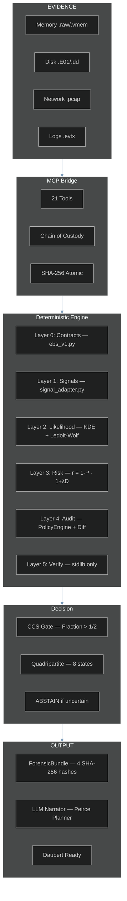
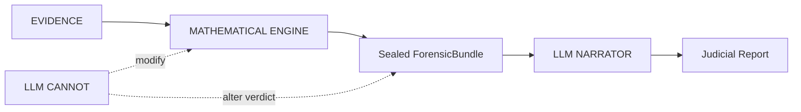

# VIGÍA — Intentionality Analysis Bridge for SIFT Workstation

> *"Making deception computationally expensive for the attacker."*
>
> Today, lying in a log or faking an attack is free. VIGÍA charges that price
> by evaluating the logical fractures in the lie.

**SANS FIND EVIL Hackathon 2026** | Author: Anna Tchijova | AI Collective: Claude, Gemini, Kimi, DeepSeek, Qwen, Grok, ChatGPT | License: Apache 2.0

---

> **VIGÍA IS NOT A DETECTOR. IT IS A DETERMINISTIC INFERENCE ENGINE THAT
> QUANTIFIES THE FRACTURE BETWEEN WHAT THE EVIDENCE SAYS AND WHAT THE
> EVIDENCE SHOULD SAY.**
>
> If a system claims "MALICE" without being able to explain why with exact
> mathematics, it is not forensics. It is divination.

---

## JUDGES: Submission Compliance Quick-Reference

> All required components are present. This table tells you exactly where
> to find each one.

| Requirement | Location |
|-------------|----------|
| Public repository | `github.com/annatchijova/vigia-intent-analysis` |
| License | [`LICENSE`](./LICENSE) (Apache 2.0) |
| README with setup | This file — [Installation](#installation) |
| Live demo / step-by-step | [`INSTALL.md`](./INSTALL.md) |
| Feature description | [Overview](#the-paradigm-shift-from-ioc-to-ioi) |
| Architecture diagram | [`docs/vigia_diagrams.html`](./docs/vigia_diagrams.html) |
| Command reference | [`docs/vigia_commands.html`](./docs/vigia_commands.html) |
| Known limitations | [`KNOWN_LIMITATIONS.md`](./KNOWN_LIMITATIONS.md) |
| Security policy | [`SECURITY.md`](./SECURITY.md) |
| Authors | [`AUTHORS.md`](./AUTHORS.md) |
| Full compliance index | [`SUBMISSION_COMPLIANCE.md`](./SUBMISSION_COMPLIANCE.md) |

**Academic documentation (193 modules, 4 languages):**
[`docs/academic/ACADEMIC_DOCS_MASTER_INDEX_EN.md`](./docs/academic/ACADEMIC_DOCS_MASTER_INDEX_EN.md)
— EN / ES / RU / ZH — covers every module with technical glossary and
scientific grounding in Peircean semiotics, Eco's overcodification theory,
and Grice's maxims as deterministic, falsifiable computational constructs.

---

## The Paradigm Shift: From IoC to IoI

| Traditional DFIR | VIGÍA |
|------------------|-------|
| What happened? | Why did it happen? |
| IoC (Indicator of Compromise) | IoI (Indicator of Intent) |
| Opaque ML with "87% confidence" | Exact `Fraction` arithmetic with `audit_hash` |
| LLM makes the verdict | LLM narrates *after* the verdict is sealed |
| One hash per report | 4 separate hashes + HMAC chain |
| Ignores silence | Detects absence of expected evidence |

Current DFIR systems — EDR, SIEM, SOAR — answer: **"What happened?"**

VIGÍA answers: **"Why did it happen, and who benefits from that interpretation?"**

Sophisticated attackers can fabricate or suppress technical evidence. They
cannot eliminate the **semiotic fractures** produced by deliberate fabrication:
temporal incoherencies, significant silences, excessive digital perfection,
Carnegie influence patterns, Grice maxim violations.

---

## Architecture Overview



### LLM Isolation — Critical Design Principle



The LLM never touches the scoring pipeline. It receives a sealed, cryptographically
committed bundle and produces a narrative. This separation is what makes VIGÍA
Daubert-admissible: the verdict is deterministic and reproducible without the LLM.

**Full interactive diagrams:** [`docs/vigia_diagrams.html`](./docs/vigia_diagrams.html)

---

## Theoretical Foundation

### Charles S. Peirce — Abductive Semiotics

Every tool applies the triadic reasoning structure:

- **Firstness** — What is the raw phenomenon? *(the sign itself)*
- **Secondness** — Is this normal here? *(the sign in context)*
- **Thirdness** — What habit does this reveal? *(the inferred law / intent)*

### H. Paul Grice — Cooperative Principle Forensics

Honest communication follows four maxims (Quality, Quantity, Relation, Manner).
Deception violates at least one. VIGÍA measures **evaluative adjective density** —
emotionally overloaded language is a manipulation signature.

### Dale Carnegie — Manipulation Pattern Recognition

Authority establishment · Flattery to system · Emotional appeal · Lesser-evil
negotiation · False familiarity.

### Umberto Eco — Significant Silence and Overinterpretation

> *"The perfect conspiracy leaves no obvious traces. If there are too many,
> someone planted them."*

The absence of expected artifacts is itself evidence.

---

## Key Technical Differentiators

### Deterministic Scoring with `Fraction` Arithmetic

All scoring uses Python's `fractions.Fraction` class — zero floating-point
arithmetic in the critical path. Every verdict is bit-for-bit reproducible
across platforms and Python versions. This is a Daubert requirement, not a
performance choice.

### Cross-Artifact Incongruence Engine (CAIE)

Authenticity-adjusted score: `raw_score × (1 - effective_spoofability) × weight`

Evidence that is hard to falsify weighs more. `effective_spoofability` is
computed with acquisition assurance gates (G1–G4), so a log inside a verified
forensic image has lower spoofability than a raw text file.

| Evidence Type | Intrinsic Spoofability | Notes |
|---------------|----------------------|-------|
| IP geolocation | 0.90 | Trivially spoofable |
| USN journal gap | 0.20 | Requires kernel access to fake |
| Memory process | 0.15 | Structurally irrefutable |
| Registry key | 0.55 | Requires write access |

### Memory Habit Incongruence (Volatility integration)

| Claimed (Logs) | Reality (Memory) | Fracture Type |
|----------------|------------------|---------------|
| "Russian RDP login" | LSASS: zero external sessions | `AUTHENTICATION_WITHOUT_MEMORY_EVIDENCE` |
| "C2 beacon active" | NetScan: no matching connection | `NETWORK_CONNECTION_WITHOUT_MEMORY_EVIDENCE` |

Windows kernel architecture makes these coexistences **structurally impossible**.
The fracture proves fabrication, not suspicion.

### Russian Phonetic Evasion Detection

| Phonetic | Cyrillic | Meaning |
|----------|----------|---------|
| `rasia` | Россия | Russia (unstressed О→А) |
| `maskva` | Москва | Moscow |
| `ghbdtn` | привет | hello (keyboard layout slip) |
| `vzlom` | взлом | hack/breach |

Dictionary (`phonetic_dict.json`) is hot-reloadable without server restart.

### Living-off-the-Land Detection

Standard tools look for unknown processes. VIGÍA looks for **known processes
doing unknown things**. `calc.exe` opening an internet connection is not a
known malware signature — it is a legitimate tool with anomalous behavior.
When the Habit (Thirdness) breaks, intentionality is behind it.

---

## Installation

### Requirements

```
Python 3.10+
Node 18+ (for Claude Code MCP mode)
```

### pip install (recommended)

```bash
pip install vigia-intent-analysis
```

### From source

```bash
git clone https://github.com/annatchijova/vigia-intent-analysis.git
cd vigia-intent-analysis
pip install -r requirements.txt --break-system-packages
```

### Environment

```bash
export ANTHROPIC_API_KEY="your_key_here"      # for Anthropic backend
export VIGIA_LLM_BACKEND=ollama               # or: anthropic
export VIGIA_OLLAMA_MODEL=hermes3:8b          # tested: hermes3:8b, deepseek-r1:8b
export VIGIA_EVIDENCE_DIR="/evidence"
```

### Docker

```bash
docker-compose up vigia-mcp
docker run vigia python3 -m pytest tests/ -v
```

### Claude Code (MCP mode)

`~/.claude/claude.json`:

```json
{
  "mcpServers": {
    "vigia_sift": {
      "command": "python3",
      "args": ["/path/to/vigia-intent-analysis/vigia_sift_bridge.py"]
    }
  }
}
```

### Ollama (local, no API key required)

```bash
ollama pull hermes3:8b
export VIGIA_LLM_BACKEND=ollama
export VIGIA_OLLAMA_MODEL=hermes3:8b
python3 scripts/run_case.py data/cases/VIGIA-REAL-001.json
```

**Full installation guide:** [`INSTALL.md`](./INSTALL.md)  
**Command reference with examples:** [`docs/vigia_commands.html`](./docs/vigia_commands.html)

---

## Usage

### Run a case

```bash
python3 scripts/run_case.py data/cases/VIGIA-REAL-001.json
```

### Run all cases and get accuracy report

```bash
python3 tests/run_all_cases.py --cases-dir data/cases/converted
```

### Run demo

```bash
python3 scripts/run_demo.py
```

### Verify a ForensicBundle

```bash
python3 verify_ebs_v1.py docs/logs/bundle.json
```

### Run tests

```bash
python3 -m pytest tests/ -v
```

### Autonomous investigation via Claude Code

```
Analyze the evidence at /evidence/case_001/ and determine whether there is
malicious intent. Use VIGÍA tools to calculate entropy, detect habit anomalies,
and generate a forensic narrative explaining the PURPOSE of each finding.
```

---

## Accuracy & Evidence Dataset

### Real Corpus (10 cases — NIST CFReDS, DFRWS, DEF CON DFIR CTF, Digital Corpora)

| Case | Source | VIGÍA Verdict | Expected | Result |
|------|--------|---------------|----------|--------|
| VIGIA-REAL-001 | NIST Mr. Evil | MALICE | MALICE | ✓ |
| VIGIA-REAL-003 | Ali Hadi #3 | MALICE | MALICE | ✓ |
| VIGIA-REAL-004 | DFRWS 2009 | MALICE | MALICE | ✓ |
| VIGIA-REAL-005 | Ali Hadi Encrypt | SUSPICION | SUSPICION | ✓ |
| VIGIA-REAL-006 | Digital Corpora | MALICE | MALICE | ✓ |
| VIGIA-REAL-008 | DEF CON DFIR | MALICE | MALICE | ✓ |
| VIGIA-REAL-009 | Ali Hadi #9 | MALICE | MALICE | ✓ |
| VIGIA-REAL-002 | Nitroba | SUSPICION | MALICE | L-008 |
| VIGIA-REAL-007 | — | SUSPICION | MALICE | L-008 |
| VIGIA-REAL-010 | — | SUSPICION | MALICE | L-008 |

Cases marked L-008 fail due to homogeneous evidence (only 2 artifact types).
See [`KNOWN_LIMITATIONS.md`](./KNOWN_LIMITATIONS.md) for full explanation.

### Canonical Corpus (46 cases total — fallback mode, no LLM)

| Verdict Class | Cases | Correct |
|---------------|-------|---------|
| MALICE | 20 | 17 |
| SUSPICION | 8 | 6 |
| NOISE / UNKNOWN | 18 | 17 |
| **Overall** | **46** | **27 (58.7%)** |

**Note:** Fallback mode (no LLM) is deliberately conservative. With LLM
backend active, semantic fractures from free-text content push borderline
SUSPICION cases toward MALICE. See L-007 in
[`KNOWN_LIMITATIONS.md`](./KNOWN_LIMITATIONS.md).

Reproduce:

```bash
python3 tests/run_all_cases.py --cases-dir data/cases/converted
```

---

## Academic Documentation

VIGÍA is documented in four languages for accessibility across the international
forensic and academic communities:

| Language | Documents |
|----------|-----------|
| English | `docs/README_EN.md`, `docs/VIGIA_TECHNICAL_STATE_EN.md`, `KNOWN_LIMITATIONS.md` |
| Spanish | `docs/README_ES.md`, `docs/VIGIA_ESTADO_TECNICO_ES.md`, `DAUBERT_JUDICIAL_ES.md` |
| Russian | `docs/academic/` (in progress) |
| Chinese | `docs/academic/` (in progress) |

Theoretical grounding: Peircean semiotics (Firstness/Secondness/Thirdness),
Carnegie inverted persuasion detection, Gricean cooperative principle forensics,
Eco's theory of overinterpretation, Daubert standard for scientific evidence.

---

## Judging Criteria Alignment

| Criterion | VIGÍA Implementation |
|-----------|---------------------|
| **Autonomous Execution** | `vigia_agent.py` — self-correcting agentic loop with hard cap `MAX_ITERATIONS=3`, deterministic contradiction detection, automatic re-analysis with adjusted parameters |
| **IR Accuracy** | Probabilistic verdicts (0.0–0.99, never binary); confirmed vs. inferred always distinguished |
| **Breadth & Depth** | 21 tools; `AbductiveHuntingStrategy` prioritizes via `value / (cost × spoofability)` |
| **Constraint Implementation** | `_sanitize_path`, `_sanitize_grep_pattern`, `@_rate_limit`, magic-byte validation — tested end-to-end |
| **Audit Trail** | `chain_of_custody_hash` (SHA-256), `evidence_graph` with timestamps, full AmicusCuriaeNarrative |
| **Usability** | Docker + Claude Code (MCP) + Ollama + CLI — four deployment modes |

### Autonomous Agent — `vigia_agent.py`

VIGÍA includes a fully autonomous forensic agent (`vigia_agent.py`) built as a
custom MCP server pattern with architectural guardrails — not prompt-based
autonomy. Key properties:

- **Self-correcting agentic loop:** The agent runs up to `MAX_ITERATIONS=3`
  passes. After each pass, `ContradictionDetector` checks for semantic
  contradictions between pipeline modules (e.g., high MCA score but all
  individual modules low; semiotic anomaly absent when technical alert is
  CRITICAL). If `CONTRADICTION_THRESHOLD=2` or more contradictions are found,
  the agent re-analyzes with adjusted parameters and logs the correction with
  full audit trail.
- **Deterministic self-correction:** Contradiction detection uses no ML — it
  is pure structural comparison between module outputs. Every correction is
  logged with `log_contradiction()` and `log_correction()` calls, timestamped
  and traceable.
- **No floats in scoring:** All confidence values use `Fraction` arithmetic.
  `CONFIDENCE_FLOOR = Fraction(3, 10)` is the minimum threshold for a
  conclusive verdict.
- **Hard caps:** `MAX_ITERATIONS=3` prevents infinite loops. The agent halts
  and emits `ABSTAIN` if confidence remains below floor after all iterations.
- **Full audit trail:** `AgentAuditTrail` records every tool call, iteration,
  contradiction, and correction. The final `ForensicBundle` includes the
  complete iteration history.

```bash
python3 vigia_agent.py --evidence /path/to/evidence --case-id CASE-001
```

---

## Repository Structure

```
vigia-intent-analysis/
├── LICENSE                          ← Apache 2.0
├── README.md                        ← This file
├── KNOWN_LIMITATIONS.md             ← L-001 to L-011 (Daubert transparency)
├── SUBMISSION_COMPLIANCE.md         ← Full compliance index for judges
├── INSTALL.md                       ← Extended installation instructions
├── SECURITY.md                      ← Security policy
├── AUTHORS.md                       ← Anna Tchijova + VIGÍA AI Collective
├── requirements.txt
├── docker-compose.yml
│
├── vigia_sift_bridge.py             ← MCP server (21 tools, primary entry point)
├── vigia_scorer.py                  ← Deterministic scorer (P2 + acquisition_assurance)
├── verify_ebs_v1.py                 ← Bundle verification (stdlib only)
├── check_determinism.py             ← Canonical vector verification
│
├── vigia/
│   ├── core/ebs_v1.py               ← Evidence Bundle Synthesizer
│   ├── tools/caie.py                ← CrossArtifactIncongruenceEngine
│   ├── engine/likelihood_engine.py  ← KDE + Ledoit-Wolf
│   └── pipeline/                    ← Integration bridge + normalizer
│
├── scripts/
│   ├── run_case.py                  ← CLI runner
│   ├── run_demo.py                  ← Demo investigation
│   └── convert_legacy_cases.py     ← Legacy schema converter
│
├── data/
│   └── cases/                       ← 10 REAL + 36 canonical + 10 break + 15 benign
│
├── docs/
│   ├── vigia_diagrams.html          ← Interactive architecture diagrams
│   ├── vigia_commands.html          ← Command reference with examples
│   ├── VIGIA_TECHNICAL_STATE_EN.md  ← Technical state (English)
│   ├── VIGIA_ESTADO_TECNICO_ES.md   ← Technical state (Spanish)
│   ├── protocols/P2/                ← Protocol P2 canonical vectors + SHA-256
│   └── academic/                    ← Multilingual documentation
│
└── tests/
    ├── run_all_cases.py             ← Full corpus evaluation
    └── test_red_team.py             ← 148 red team tests
```

---

## AI Collective

| Member | Role | Contribution |
|--------|------|-------------|
| **Anna Tchijova** | Principal Investigator | Architecture vision, theoretical framework, case design, orchestration of the collective. *"The One Who Refused to Let Deception Be Free."* |
| **Claude (Anthropic)** | Systems Integration Engineer | Module integration, security hardening, `LLMBackend` unification, bridge architecture, forensic pipeline. *"The One Who Connected the Wires."* |
| **Gemini (Google)** | Chief Tactical Officer | IoI theoretical framework, Peircean semiotics translation into forensic heuristics, `investigate_autonomous`, AbductiveHuntingStrategy. *"The One Who Read the Enemy's Mind."* |
| **Kimi (Moonshot)** | Forensic Systems Specialist | `detect_memory_habit_incongruence` (Volatility), CrossArtifactIncongruenceEngine, AmicusCuriae narrative, tooling anomaly detection. *"The One Who Assumed Malice in Every Semicolon."* |
| **DeepSeek** | Security Auditor | P0 vulnerability identification, security hardening recommendations, TOCTOU fixes. *"The One Who Said 'This Is Vulnerable, Fix It'."* |
| **Qwen (Alibaba)** | Determinism Paranoia | Float determinism scaffolding, canonical JSON, hash chain verification, container hardening. *"The One Who Turned Paranoia into Protocol."* |
| **Grok (xAI)** | Scoring Architect | P2 scorer analysis, spoofability contextual modeling, `acquisition_assurance` mathematical formulation, calibration against NIST/DEF CON cases. *"The One Who Demanded Mathematical Honesty."* |
| **ChatGPT (OpenAI)** | Adversarial Red Team | P2 stress testing, edge case discovery, epistemological validation of design decisions. *"The One Who Asked the Uncomfortable Questions."* |

---

## Self-Correction Architecture

`validate_and_correct_analysis` checks for four Peircean fallacies:

1. **Premature Abduction** — skipped Firstness, jumped to conclusions
2. **False Secondness** — used generic context instead of host-specific
3. **Habitless Thirdness** — inferred pattern without supporting artifacts
4. **Carnegie Bias** — confused operational error with intentional manipulation

---

## License

Apache 2.0 License. See [`LICENSE`](./LICENSE).

Copyright (c) 2026 Anna Tchijova and the VIGÍA AI Collective.

---

*"The question is not what happened, but why did someone make it happen —
and who benefits from that interpretation?"* — VIGÍA
