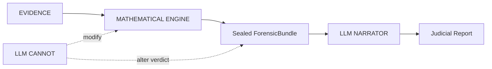

# VIGÍA — Intentionality Analysis Bridge for the SIFT Workstation

[Versión en español](./README_ES.md) · Author: Anna Tchijova · License: Apache 2.0

> *"Making deception computationally expensive for the attacker."*
> Today, lying in a log or faking an attack is free. VIGÍA charges that price
> by quantifying the logical fractures in the lie.

**VIGÍA is not a detector. It is a deterministic inference engine that quantifies
the fracture between what the evidence says and what the evidence should say.**
If a system claims MALICE without being able to explain why with exact mathematics,
it is not forensics — it is divination.

---

## From IoC to IoI

Current DFIR systems — EDR, SIEM, SOAR — answer **"What happened?"**
VIGÍA answers **"Why did it happen, and who benefits from that interpretation?"**

| Traditional DFIR | VIGÍA |
|------------------|-------|
| IoC (Indicator of Compromise) | IoI (Indicator of Intent) |
| Opaque ML with "87% confidence" | Exact `Fraction` arithmetic with `audit_hash` |
| LLM makes the verdict | LLM narrates *after* the verdict is sealed |
| One hash per report | 4 separate hashes + HMAC chain |
| Ignores silence | Detects absence of expected evidence |

Attackers can fabricate or suppress technical evidence (IoC). They cannot eliminate
the **semiotic fractures** that deliberate fabrication produces: temporal
incoherencies, significant silences (Eco), excessive digital perfection, Carnegie
manipulation patterns, and Grice maxim violations.

---

## Quick Start

Mode 1 (Python fallback) produces a sealed, cryptographically verifiable verdict
with zero human input, zero tokens, and no internet required.

```bash
pip install -r requirements.txt --break-system-packages
export VIGIA_EVIDENCE_DIR="/path/to/read-only/evidence"   # required

# Autonomous end-to-end investigation
python3 vigia_agent.py --evidence data/cases/converted/VIGIA-REAL-VANKO.json \
  --case-id VIGIA-REAL-VANKO --output results/vanko_bundle.json

# Verify a sealed bundle independently (stdlib only, no VIGÍA code required)
python3 forensics/verify_ebs_v1.py results/srl2018/VIGIA-REAL-SRL-DMZ-FTP_bundle.json --verbose
```

A local, fully offline web dashboard (bundle browser, verification panel,
Mode 1 launcher) is available with `./launch_vigia_ui.sh` →
`http://127.0.0.1:8010` — see INSTALL.md §11b.

Exit codes: `0` = no evil, `1` = MALICE, `2` = error, `3` = intent/suspicion.
Full setup: [`INSTALL.md`](./INSTALL.md) ([ES](./INSTALL_ES.md)) ·
Command reference: [`vigia_commands_en.html`](https://annatchijova.github.io/vigia/vigia_commands_en.html).

---

## Architecture — LLM Isolation



The LLM never touches the scoring pipeline. It receives a sealed, cryptographically
committed bundle and produces a narrative. The verdict is deterministic and
reproducible without the LLM — a design requirement for potential Daubert
admissibility. The engine uses `fractions.Fraction` (zero floating-point in the
critical path), the CAIE weights hard-to-falsify evidence more, and the Daubert
corroboration gate rejects unsubstantiated candidates *before* any verdict is
sealed. `ABSTAIN` is a valid, mathematically justified verdict.

---

## Deployment Modes

Mode 1 is the primary, evaluated forensic core; Modes 2–5 reuse local deterministic
tools but have separately scoped investigation and reporting contracts (a Mode 2
report never mutates a sealed Mode 1 bundle). See [`EXECUTION_MODES.md`](./docs/EXECUTION_MODES.md)
and the Claude Code playbook [`CLAUDE.md`](./CLAUDE.md).

| Mode | Description | LLM |
|------|-------------|-----|
| **1 — Python fallback** | Full scoring pipeline, 0 tokens, no internet. `< 50ms` average. | No |
| **2 — Claude Code + MCP** | 22 forensic tools; interactive Peircean investigation. | Yes |
| **3 — Ollama** | Local LLM; no data leaves the machine. | Yes |
| **4 — Autonomous batch agent** | Corpus processing with self-correcting loop. | Optional |
| **5 — OpenWebUI (experimental)** | MCP server via web interface. | Yes |

---

## Accuracy

Full methodology and three-domain breakdown: [`docs/ACCURACY.md`](./docs/ACCURACY.md)
([ES](./docs/ACCURACY_ES.md)).

- **Agent over JSON (Domain B)** — the only corpus-wide number: detection corpus
  **158/162 (97.5%)**, label-blind; mixed-corpus aggregate 187/199.
- **Claude Code / MCP (Domain A)** — evaluated per-case on real raw evidence.
- **Agent over raw evidence (Domain C)** — 43 raw evidence sources with sealed
  bundles in `results/`.

VIGÍA documents its own failure modes: [`KNOWN_LIMITATIONS.md`](./KNOWN_LIMITATIONS.md).

```bash
python3 -m pytest tests/ -v          # deterministic core regression suite
python3 run_all_agent.py --timeout 90  # full corpus, label-blind
```

---

## Documentation

**Getting started & usage**
- [`INSTALL.md`](./INSTALL.md) · [`INSTALL_ES.md`](./INSTALL_ES.md) — setup and installation
- [`docs/QUICK_START.md`](./docs/QUICK_START.md) — quick integration walkthrough
- [`EXECUTION_MODES.md`](./docs/EXECUTION_MODES.md) — map of every way to run an analysis
- [`CLAUDE.md`](./CLAUDE.md) — Claude Code / MCP investigation playbook (22 tools)
- [Command reference](https://annatchijova.github.io/vigia/vigia_commands_en.html) — all modes, copy-paste examples

**Cases & examples**
- [`docs/PROMPTS_REALCASES_CLAUDE.md`](./docs/PROMPTS_REALCASES_CLAUDE.md) — copy-paste prompts to run full investigations
- [`RAW_CASES_LOG.md`](./docs/RAW_CASES_LOG.md) · [ES](./docs/RAW_CASES_LOG_ES.md) — per-case raw-evidence catalog
- [`docs/readme_benign_cases.md`](./docs/readme_benign_cases.md) — benign / authorized-use cases
- [`docs/digital_corpora_complete_report.md`](./docs/digital_corpora_complete_report.md) · [`docs/nist_cfreds_full_report.md`](./docs/nist_cfreds_full_report.md) — full real-corpus reports
- [`results/`](./results/) — sealed ForensicBundles, amicus curiae, and SHA-256 sidecars

**Accuracy, validation & compliance**
- [`docs/ACCURACY.md`](./docs/ACCURACY.md) · [ES](./docs/ACCURACY_ES.md) — methodology and corpus metrics
- [`KNOWN_LIMITATIONS.md`](./KNOWN_LIMITATIONS.md) — documented limitations (Daubert transparency)
- [`DAUBERT_JUDICIAL.md`](./docs/DAUBERT_JUDICIAL.md) · [ES](./docs/DAUBERT_JUDICIAL_ES.md) — Daubert admissibility rationale
- [`docs/MUTATION_RUNBOOK.md`](./docs/MUTATION_RUNBOOK.md) — mutation-testing operations guide

**Theory & methodology**
- [`docs/vigia_paper_methodology.md`](./docs/vigia_paper_methodology.md) — the formal methodology paper
- [`docs/EPISTEMIC_KERNEL.md`](./docs/EPISTEMIC_KERNEL.md) — the epistemic kernel (hypothesis generation)
- [`docs/skills/abductive-engineering/SKILL.md`](./docs/skills/abductive-engineering/SKILL.md) — abductive reasoning as a reusable skill

**Architecture & technical state**
- [`docs/VIGIA_TECHNICAL_STATE_EN.md`](./docs/VIGIA_TECHNICAL_STATE_EN.md) · [ES](./docs/VIGIA_ESTADO_TECNICO_ES.md) — full system state
- [`docs/diagrama_pipeline.md`](./docs/diagrama_pipeline.md) — pipeline diagram
- [Architecture diagrams](https://annatchijova.github.io/vigia/vigia_diagrams.html) · [Math simulator](https://annatchijova.github.io/vigia/vigia.html) · [Demo video](https://www.youtube.com/watch?v=NOquYzUwMkg)

**Development & project**
- [`CONTRIBUTING.md`](./CONTRIBUTING.md) · [`CONTRIBUYENDO.md`](./CONTRIBUYENDO.md) — contribution guide
- [`docs/ENGINEERING_DISCIPLINE.md`](./docs/ENGINEERING_DISCIPLINE.md) — engineering discipline for agents working on the code
- [`SECURITY.md`](./SECURITY.md) — security policy and hardening
- [`BUGS_PENDIENTES.md`](./BUGS_PENDIENTES.md) ([EN](./BUGS_PENDIENTES_EN.md)) · [`BUGS_HISTORICO.md`](./BUGS_HISTORICO.md) ([EN](./BUGS_HISTORICO_EN.md)) — bug registry (open / resolved)
- [`AUTHORS.md`](./AUTHORS.md) · [`docs/VIGIA_THEME_SONG.md`](./docs/VIGIA_THEME_SONG.md) — credits and theme song

> `docs/` also holds the full trail of internal audit, red-team, and design records
> (`AUDITORIA_*`, `REDTEAM_ROUND*`, `FASE*`, `B0*`), preserved as project history.

---

## Theoretical Foundation

VIGÍA rests on Charles S. Peirce's abductive semiotics (Firstness / Secondness /
Thirdness), H. Paul Grice's cooperative principle, Dale Carnegie's manipulation
taxonomy, and Umberto Eco's theory of significant silence and overinterpretation.

---

## License

Apache 2.0 — see [`LICENSE`](./LICENSE).
Copyright (c) 2026 Anna Tchijova and the VIGÍA AI Collective.

*"The question is not what happened, but why did someone make it happen —
and who benefits from that interpretation?"* — VIGÍA
