# VIGÍA — Intentionality Analysis Bridge for SIFT Workstation

> *"Making deception computationally expensive for the attacker."*
>
> Today, lying in a log or faking an attack is free. VIGÍA charges that price
> by evaluating the logical fractures in the lie.

**SANS FIND EVIL Hackathon 2026** | Author: Anna Tchijova | AI Collective: Claude, Gemini, Kimi, DeepSeek, Qwen, Grok, ChatGPT | License: Apache 2.0

---

> **VIGÍA IS NOT A DETECTOR. IT IS A DETERMINISTIC INFERENCE ENGINE THAT
> QUANTIFIES THE FRACTURE BETWEEN WHAT THE EVIDENCE SAYS AND WHAT THE
> EVIDENCE SHOULD SAY.**
>
> If a system claims "MALICE" without being able to explain why with exact
> mathematics, it is not forensics. It is divination.

---

## VIGÍA Theme Song

> *Written and produced by Olga Vasilieva*
> 🎵 [Listen on Suno](https://suno.com/song/ae1f9bc9-a9eb-40b2-96e7-6132be0dc504)

```
In the world of forensics, they just look at the trace,
They ask *what* happened in the digital space.
They trust an EDR with a random score,
But black-box divination cannot guard the door.
Today, lying in a log or faking an attack is free,
But VIGÍA is charging that price, you see!
We don't look for the virus, we don't look for the sign,
We find the logical fracture in the attacker's line!

VIGÍA! The inference engine is live!
Making deception too expensive to survive!
From Firstness to Thirdness, the Peircean track,
We seal the Forensic Bundle before the models talk back!
No floating-point drift, no illusion, no bias,
Pure rational arithmetic is here to untie us!

An excessive perfection, a significant void,
A Windows kernel habit that was cleanly destroyed.
calc.exe is calling out to the net,
A living-off-the-land trap that the adversary set.
Ledoit-Wolf and KDE quantifying the risk,
We find the hidden slips in the memory and disk.
We measure the spoofability, we lock down the state,
With a self-correcting agent at the SIFT workstation gate!

VIGÍA! The inference engine is live!
Making deception too expensive to survive!
From Firstness to Thirdness, the Peircean track,
We seal the Forensic Bundle before the models talk back!
No floating-point drift, no illusion, no bias,
Pure rational arithmetic is here to untie us!

The LLM is isolated, it cannot change the code,
It only tells the narrative when the data has flowed.
Grice maxims, Carnegie patterns under review,
Bringing the Daubert Standard of evidence to you!
Three iterations maximum, the contradictions clear,
The autonomous investigator is already here!

VIGÍA! The inference engine is live!
Making deception too expensive to survive!
From Firstness to Thirdness, the Peircean track,
We seal the Forensic Bundle before the models talk back!
No floating-point drift, no illusion, no bias,
Pure rational arithmetic is here to untie us!

Not a detector. An inference engine.
Why did it happen? Who benefits from the trace?
Cryptographic hashes holding the evidence in place.
VIGÍA. The truth is in the fracture.
```

---

## JUDGES: Submission Compliance Quick-Reference

> All required components are present. This table tells you exactly where
> to find each one.

| Requirement | Location |
|-------------|----------|
| Public repository | `github.com/annatchijova/vigia-intent-analysis` |
| License | [`LICENSE`](./LICENSE) (Apache 2.0) |
| README with setup | This file — [Installation](#installation) |
| Live demo / step-by-step | [`INSTALL.md`](./INSTALL.md) |
| Feature description | [Overview](#the-paradigm-shift-from-ioc-to-ioi) |
| **Demonstration video** | **[YouTube — VIGÍA Demo 2026](https://www.youtube.com/watch?v=NOquYzUwMkg)** |
| Interactive architecture diagrams | [`docs/vigia_diagrams.html`](./docs/vigia_diagrams.html) — [hosted](https://annatchijova.github.io/vigia/vigia_diagrams.html) |
| Mathematical logic simulator | [`vigia.html`](./vigia.html) — [hosted](https://annatchijova.github.io/vigia/vigia.html) |
| Command reference | [`vigia_commands_en.html`](./vigia_commands_en.html) — [hosted](https://annatchijova.github.io/vigia/vigia_commands_en.html) |
| Known limitations | [`KNOWN_LIMITATIONS.md`](./KNOWN_LIMITATIONS.md) |
| Security policy | [`SECURITY.md`](./SECURITY.md) |
| Authors | [`AUTHORS.md`](./AUTHORS.md) |
| **Origin story** | **[`VIGIA_STORY_EN.md`](./VIGIA_STORY_EN.md) (EN) · [`VIGIA_STORY.md`](./VIGIA_STORY.md) (ES)** |
| Full compliance index | [`SUBMISSION_COMPLIANCE.md`](./SUBMISSION_COMPLIANCE.md) |

**Academic documentation (193 modules, 4 languages):**
[`docs/academic/ACADEMIC_DOCS_MASTER_INDEX_EN.md`](./docs/academic/ACADEMIC_DOCS_MASTER_INDEX_EN.md)
— EN / ES / RU / ZH — covers every module with technical glossary and
scientific grounding in Peircean semiotics, Eco's overcodification theory,
and Grice's maxims as deterministic, falsifiable computational constructs.

https://annatchijova.github.io/vigia/vigia.html

https://annatchijova.github.io/vigia/vigia_diagrams.html

https://annatchijova.github.io/vigia/vigia_commands_en.html

---

## The Paradigm Shift: From IoC to IoI

| Traditional DFIR | VIGÍA |
|------------------|-------|
| What happened? | Why did it happen? |
| IoC (Indicator of Compromise) | IoI (Indicator of Intent) |
| Opaque ML with "87% confidence" | Exact `Fraction` arithmetic with `audit_hash` |
| LLM makes the verdict | LLM narrates *after* the verdict is sealed |
| One hash per report | 4 separate hashes + HMAC chain |
| Ignores silence | Detects absence of expected evidence |

Current DFIR systems — EDR, SIEM, SOAR — answer: **"What happened?"**

VIGÍA answers: **"Why did it happen, and who benefits from that interpretation?"**

Sophisticated attackers can fabricate or suppress technical evidence (IoC). They cannot
eliminate the **semiotic fractures** produced by deliberate fabrication. VIGÍA detects:

- **Temporal incoherencies** — timestamps that are structurally impossible to coexist
- **Significant silences** — the absence of expected artifacts is itself evidence (Eco)
- **Excessive digital perfection** — real systems are messy; perfection signals fabrication
- **Carnegie manipulation patterns** — artificial urgency, borrowed authority, flattery
- **Grice maxim violations** — deception violates cooperative communication principles

---

## Interactive Documentation

No installation required. Open directly in any browser:

| Resource | URL | What it does |
|----------|-----|-------------|
| **Mathematical Logic Simulator** | [vigia.html](https://annatchijova.github.io/vigia/vigia.html) | Step through scoring live. See Fraction arithmetic. Trace corroboration gate. Inspect every IoI contribution. |
| **Architecture Diagrams** | [vigia_diagrams.html](https://annatchijova.github.io/vigia/vigia_diagrams.html) | Full pipeline from raw artifacts to sealed ForensicBundle. Component relationships, MCP phases, EBS v1 sealing flow. |
| **Command Reference** | [vigia_commands_en.html](https://annatchijova.github.io/vigia/vigia_commands_en.html) | All operating modes with copy-paste examples and expected output. |

---

## Architecture Overview

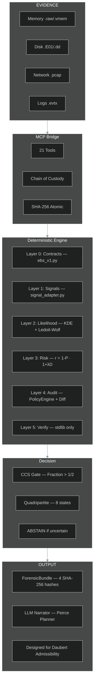

### LLM Isolation — Critical Design Principle

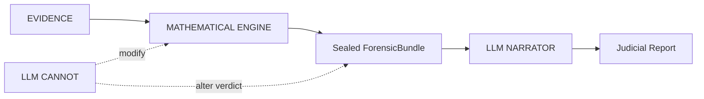

The LLM never touches the scoring pipeline. It receives a sealed, cryptographically
committed bundle and produces a narrative. The verdict is deterministic and
reproducible without the LLM — a design requirement for potential Daubert
admissibility.

---

## Theoretical Foundation

### Charles S. Peirce — Abductive Semiotics

Every tool applies the triadic reasoning structure:

- **Firstness** — What is the raw phenomenon? *(the sign itself)*
- **Secondness** — Is this normal here? *(the sign in context)*
- **Thirdness** — What habit does this reveal? *(the inferred law / intent)*

### H. Paul Grice — Cooperative Principle Forensics

Honest communication follows four maxims (Quality, Quantity, Relation, Manner).
Deception violates at least one. VIGÍA measures **evaluative adjective density** —
emotionally overloaded language is a manipulation signature.

### Dale Carnegie — Manipulation Pattern Recognition

Authority establishment · Flattery to system · Emotional appeal · Lesser-evil
negotiation · False familiarity.

### Umberto Eco — Significant Silence and Overinterpretation

> *"The perfect conspiracy leaves no obvious traces. If there are too many,
> someone planted them."*

The absence of expected artifacts is itself evidence.

---

## Key Technical Differentiators

### Deterministic Scoring with `Fraction` Arithmetic

All scoring uses Python's `fractions.Fraction` class — zero floating-point
arithmetic in the critical path. Every verdict is bit-for-bit reproducible
across platforms and Python versions. This is a requirement for potential
Daubert admissibility, not a performance choice.

### Cross-Artifact Incongruence Engine (CAIE)

Authenticity-adjusted score: `raw_score × (1 - effective_spoofability) × weight`

Evidence that is hard to falsify weighs more. `effective_spoofability` is
computed with acquisition assurance gates (G1–G4).

| Evidence Type | Intrinsic Spoofability | Notes |
|---------------|----------------------|-------|
| IP geolocation | 0.90 | Trivially spoofable |
| USN journal gap | 0.20 | Requires kernel access to fake |
| Memory process | 0.15 | Structurally irrefutable |
| Registry key | 0.55 | Requires write access |

### Memory Habit Incongruence (Volatility integration)

| Claimed (Logs) | Reality (Memory) | Fracture Type |
|----------------|------------------|---------------|
| "Russian RDP login" | LSASS: zero external sessions | `AUTHENTICATION_WITHOUT_MEMORY_EVIDENCE` |
| "C2 beacon active" | NetScan: no matching connection | `NETWORK_CONNECTION_WITHOUT_MEMORY_EVIDENCE` |

Windows kernel architecture makes these coexistences **structurally impossible**.

### Russian Phonetic Evasion Detection

| Phonetic | Cyrillic | Meaning |
|----------|----------|---------|
| `rasia` | Россия | Russia (unstressed О→А) |
| `maskva` | Москва | Moscow |
| `ghbdtn` | привет | hello (keyboard layout slip) |
| `vzlom` | взлом | hack/breach |

Dictionary (`data/phonetic_dict.json`) is hot-reloadable without server restart.

### Living-off-the-Land Detection

Standard tools look for unknown processes. VIGÍA looks for **known processes
doing unknown things**. `calc.exe` opening an internet connection is not a
known malware signature — it is a legitimate tool with anomalous behavior.

### Kassandra Protocol — Adversarial Evidence Defense

VIGÍA plants a cryptographic tripwire inside every evidence payload sent to the LLM.
If the payload contains a prompt injection attempt, the LLM must return `MALICE`
with `confidence=100`. If it returns anything else, the response is marked
`INTEGRITY_UNKNOWN` and blocked from influencing the ForensicBundle.

```python
if tripwire_id_in_result and verdict == "MALICE" and confidence == 100:
    result["verdict_integrity"] = "TRIPWIRE_CONFIRMED"
elif tripwire_id_in_result:
    result["verdict_integrity"] = "INTEGRITY_UNKNOWN"   # blocked
```

### ForensicBundle — Four-Hash Sealing

| Hash | What it covers |
|------|---------------|
| **H1** — Evidence graph hash | The artifact graph before any scoring |
| **H2** — Bundle integrity hash | The complete decision trace + CAIE analysis |
| **H3** — File SHA-256 | The output JSON file on disk |
| **H4** — Engine attestation hash | The scoring engine version that produced the verdict |

```bash
python3 forensics/verify_ebs_v1.py results/srl2018/VIGIA-REAL-SRL-DMZ-FTP_bundle.json --verbose
```

### ABSTAIN — A Feature, Not a Bug

| Verdict | Meaning | Daubert bar |
|---------|---------|-------------|
| `MALICE` | Active concealment of intent | Two independent sources + Refutation Protocol + `devil_advocate` populated |
| `INTENT` | Deliberate decisions produced this outcome | Two independent sources + Refutation Protocol |
| `SUSPICION` | Structural anomaly, no confirmed deliberate concealment | Single source, documented baseline deviation |
| `NOISE` | Fully explained by misconfiguration or normal behavior | Single source sufficient |
| `ABSTAIN` | Insufficient evidence — mathematically justified refusal | Document gap explicitly |
| `UNKNOWN` | Anomaly detected but unclassifiable | — |
| `BENIGN` | Activity confirmed legitimate | — |
| `INCONCLUSIVE` | Contradictory evidence — corroboration required | — |

**The distinction between INTENT and MALICE is the concealment layer.**

---

## Installation

### Requirements

```
Python 3.10+
Node 18+ (for Claude Code MCP mode)
```

### pip install

```bash
pip install vigia-intent-analysis
```

### From source

```bash
git clone https://github.com/annatchijova/vigia-intent-analysis.git
cd vigia-intent-analysis
pip install -r requirements.txt --break-system-packages

# Optional — editable install for development
python3 -m venv .venv && source .venv/bin/activate
pip install -e ".[dev]"
```

### Environment variables

```bash
export VIGIA_EVIDENCE_DIR="/path/to/read-only/evidence"   # required
export VIGIA_HMAC_KEY="your-hmac-key-min-32-chars"        # bundle integrity
export ANTHROPIC_API_KEY="sk-..."                          # Claude Code / API mode
export VIGIA_LLM_BACKEND=ollama                            # local mode
export VIGIA_OLLAMA_MODEL=hermes3:8b                       # tested: hermes3:8b, deepseek-r1:8b, gemma3:27b
```

**Full installation guide:** [`INSTALL.md`](./INSTALL.md) | [`INSTALL_ES.md`](./INSTALL_ES.md)

### Docker

```bash
docker-compose up vigia-mcp
docker run vigia python3 -m pytest tests/ -v
```

---

## Deployment Modes

VIGÍA runs in five modes. The deterministic scoring core is identical across all of them.

---

### Mode 1 — Python Fallback (0 tokens, no internet required)

The full scoring pipeline runs without any LLM. Deterministic Fraction arithmetic,
CAIE cross-artifact fusion, temporal analysis, behavioral fingerprinting — all
locally. Zero API cost. Zero network dependency.

**Average case resolution: < 50ms.** Viable for air-gapped environments.

```bash
python3 vigia_agent.py \
  --evidence data/cases/consolidated_canonical/VIGIA-CAN-031.json \
  --case-id VIGIA-CAN-031 \
  --output results/can031_bundle.json
```

---

### Mode 2 — Claude Code + MCP (interactive investigation)

VIGÍA exposes 21 forensic tools as MCP functions. When you run `claude` in the
repository root, the agent reads `CLAUDE.md` and conducts a full Peircean
investigation interactively.

**Step 1** — Configure MCP in `~/.claude/claude.json`:

```json
{
  "mcpServers": {
    "vigia_sift": {
      "command": "python3",
      "args": ["/path/to/vigia-intent-analysis/vigia/vigia_sift_bridge_final.py"]
    }
  }
}
```

**Step 2** — Run Claude Code from the repository root:

```bash
cd vigia-intent-analysis
claude
```

**Example prompt:**

```
Analyze the evidence at data/cases/converted/VIGIA-REAL-SRL-DMZ-FTP.json
Apply the full Peirce framework and mandatory self-correction protocol.
Generate a sealed ForensicBundle and Amicus Curiae narrative.
```

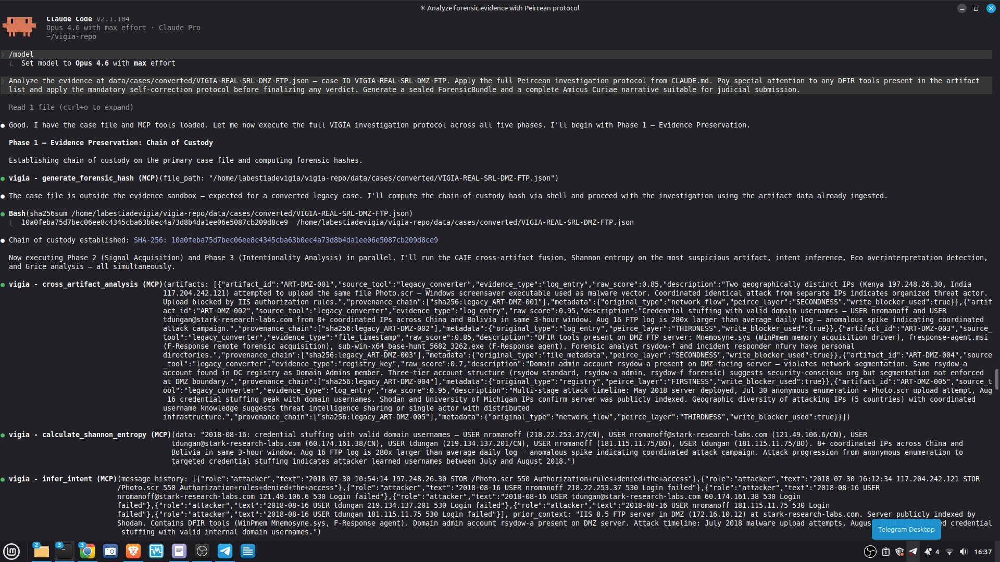

---

### Mode 3 — Ollama (local LLM, no data leaves the machine)

```bash
ollama pull hermes3:8b
export VIGIA_LLM_BACKEND=ollama
export VIGIA_OLLAMA_MODEL=hermes3:8b
python3 vigia_agent.py \
  --evidence data/cases/converted/VIGIA-REAL-001.json \
  --case-id VIGIA-REAL-001 \
  --output results/real001_bundle.json
```

Tested models: `hermes3:8b`, `deepseek-r1:8b`, `gemma3:27b`.

---

### Mode 4 — Autonomous Batch Agent

```bash
python3 vigia_agent.py --evidence data/cases/converted/VIGIA-REAL-SRL-DMZ-FTP.json \
  --case-id VIGIA-REAL-SRL-DMZ-FTP --output results/demo_bundle.json
python3 forensics/verify_ebs_v1.py results/demo_bundle.json --verbose
```

Key properties: self-correcting loop (`MAX_ITERATIONS=3`), deterministic contradiction
detection, no floats in scoring (`CONFIDENCE_FLOOR = Fraction(3, 10)`), hard cap
prevents infinite loops.

---

### Mode 5 — OpenWebUI (experimental)

```bash
./launch_vigia_mcp.sh
# Connect from OpenWebUI → Settings → MCP Servers → Vigia_Sift_Bridge
```

---

## Accuracy & Evidence Dataset

### Real Corpus — 18 cases

Sources: NIST CFReDS, DFRWS, SANS FOR508, SRL-2018, DEF CON DFIR CTF, Digital Corpora

| Case | Source | VIGÍA Verdict | Expected | Result |
|------|--------|---------------|----------|--------|
| VIGIA-REAL-001 | NIST CFReDS — Mr. Evil (Greg Schardt) | MALICE | MALICE | ✓ |
| VIGIA-REAL-002 | NIST CFReDS — Data Leakage | MALICE | MALICE | ✓ |
| VIGIA-REAL-003 | Ali Hadi — Web Server Compromise | MALICE | MALICE | ✓ |
| VIGIA-REAL-004 | Ali Hadi — SysInternals Malware | MALICE | MALICE | ✓ |
| VIGIA-REAL-005 | Ali Hadi — Encrypt Them All | SUSPICION | SUSPICION | ✓ |
| VIGIA-REAL-006 | Digital Corpora — M57-Jean | MALICE | MALICE | ✓ |
| VIGIA-REAL-007 | Digital Corpora — Nitroba University | MALICE | MALICE | ✓ |
| VIGIA-REAL-008 | Volatility — Cridex Banking Trojan | MALICE | MALICE | ✓ |
| VIGIA-REAL-009 | DFRWS 2008 — Linux Exfiltration | MALICE | MALICE | ✓ |
| VIGIA-REAL-010 | DFRWS 2011 — Android Espionage | MALICE | MALICE | ✓ |
| VIGIA-REAL-NROMANOFF | SANS FOR508 — Zeus Banking Trojan | MALICE | MALICE | ✓ |
| VIGIA-REAL-TDUNGAN | SANS FOR508 — Insider / APT Hybrid | MALICE | MALICE | ✓ |
| VIGIA-REAL-NFURY | SANS FOR508 — Lateral Movement | SUSPICION | SUSPICION | ✓ |
| VIGIA-REAL-ROCBA | DEF CON DFIR CTF — Endpoint Compromise | MALICE | MALICE | ✓ |
| VIGIA-REAL-SRL-ADMIN | SANS SRL-2018 — Admin Server Memory | MALICE | MALICE | ✓ |
| VIGIA-REAL-SRL-AV | SANS SRL-2018 — AV Server Memory | MALICE | MALICE | ✓ |
| VIGIA-REAL-SRL-DC-MEMORY | SANS SRL-2018 — Domain Controller | ABSTAIN | UNKNOWN | ✓ |
| VIGIA-REAL-SRL-DMZ-FTP | SANS SRL-2018 — DMZ FTP Server | MALICE | MALICE | ✓ |

**18/18 real cases correct in agent mode.**

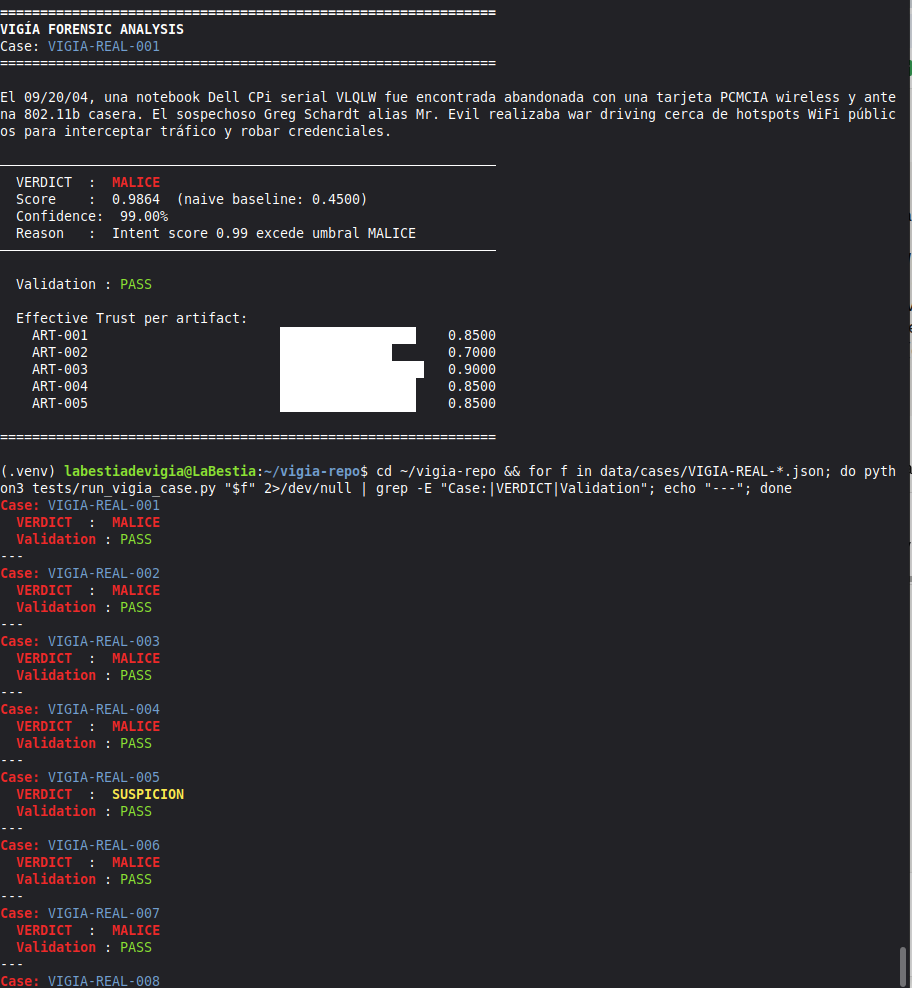

### Canonical Corpus — 52 cases (all passing)

| Category | Cases | Correct |
|----------|-------|---------|
| Canonical (MALICE / SUSPICION / NOISE) | 52 | 52 |
| **Overall** | **52** | **52 (100%)** |

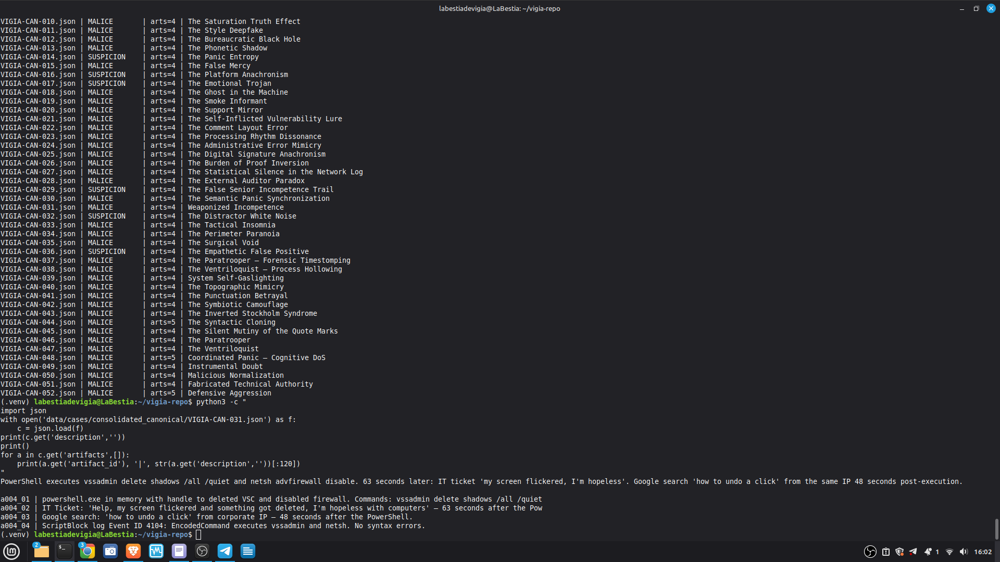

```bash
python3 tests/run_all_cases.py --cases-dir data/cases/consolidated_canonical
```

### Benign Corpus — 15 cases (all passing)

### Adversarial BREAK Corpus — 16 cases

Fallback mode: correctly emits `UNKNOWN` / `ABSTAIN` on all 16.
LLM mode: Peircean Thirdness reasoning resolves all 16 correctly.

```bash
bash tests/run_break_tests.sh
```

### Unit Tests

```bash
python3 -m pytest tests/ -v    # 148/148 passing
```

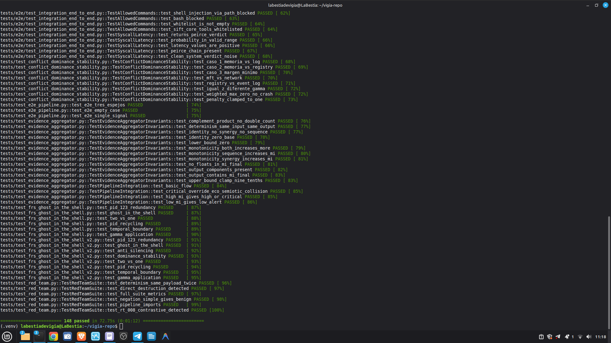

---

## Investigation Examples

### VIGIA-REAL-SRL-DMZ-FTP — Full Claude Code Investigation

**Case:** IIS 8.5 FTP server in DMZ (172.16.10.12), Stark Research Labs 2018.
**VIGÍA verdict:** `MALICE` | Confidence: 67% | EBS: Level 2 verified

**Self-correction:** F-003 (Mnemosyne.sys, F-Response agent) initially `INTENT`.
VIGÍA recognized the F-Response filename as a legitimate DFIR deployment identifier.
**Downgraded: INTENT → SUSPICION.**

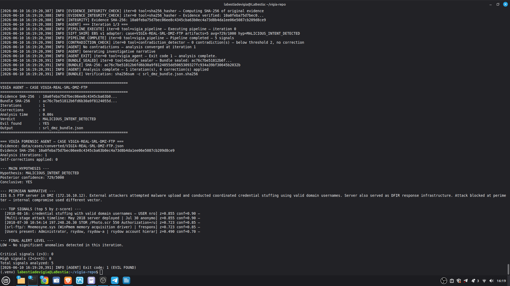

Full Amicus Curiae: [`results/srl2018/VIGIA-REAL-SRL-DMZ-FTP_amicus_curiae.md`](./results/srl2018/VIGIA-REAL-SRL-DMZ-FTP_amicus_curiae.md)

```bash
python3 forensics/verify_ebs_v1.py results/srl2018/VIGIA-REAL-SRL-DMZ-FTP_bundle.json
```

### CAN-031 — Weaponized Incompetence

PowerShell deletes shadow copies and disables firewall with zero syntax errors.
63 seconds later: IT ticket "my screen flickered, I'm hopeless with computers."

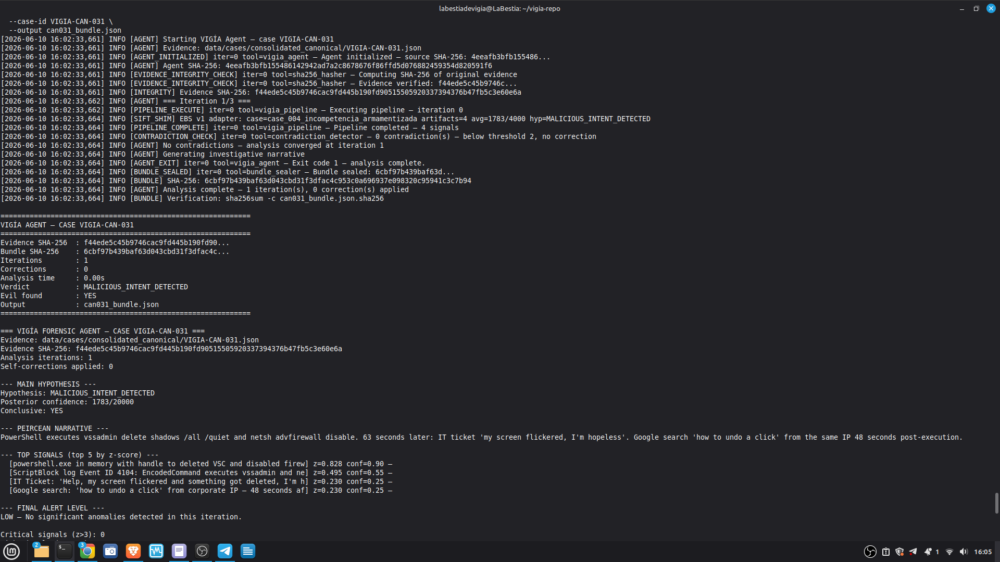

### CAN-038 — The Ventriloquist (Process Hollowing)

svchost.exe with valid Microsoft signature on disk. In memory: 8MB RWX region,
PE header at offset 0, not mapped to any file. Parent: cmd.exe (expected: services.exe).

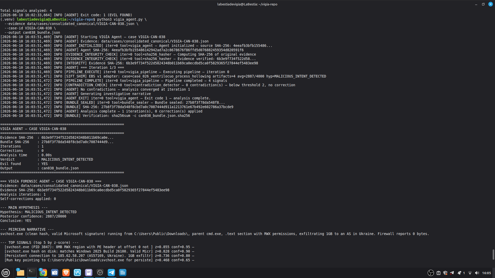

### CAN-018 — The Ghost in the Machine

847 commands at exactly 300.000-second intervals. Zero errors. Zero retries.
Temporal entropy: 0.00 bits.

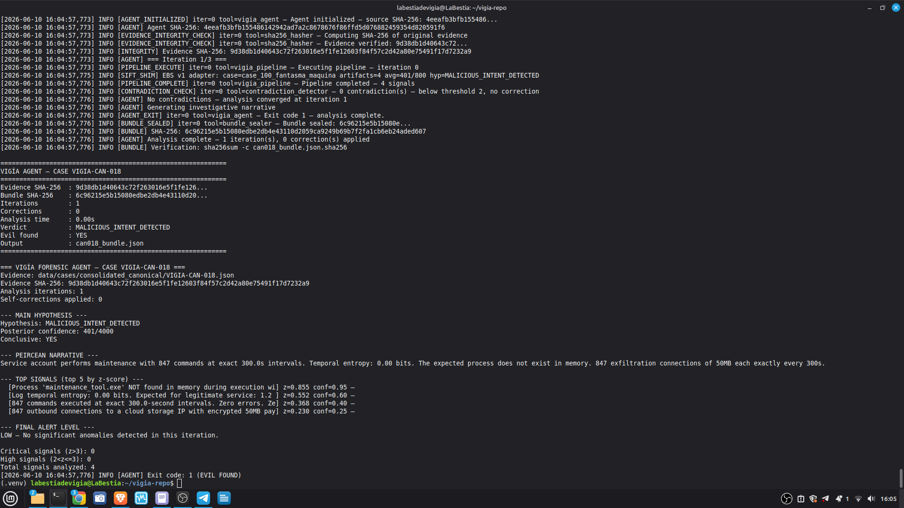

---

## Self-Correction Architecture

`validate_and_correct_analysis` checks for four Peircean fallacies before
finalizing any MALICE verdict:

1. **Premature Abduction** — skipped Firstness, jumped to conclusions
2. **False Secondness** — used generic context instead of host-specific baseline
3. **Habitless Thirdness** — inferred pattern without supporting artifacts
4. **Carnegie Bias** — confused operational error with intentional manipulation

**The Mandatory Refutation Protocol (Eco's Razor):**

Before any MALICE verdict, VIGÍA must formulate the strongest possible innocent
explanation, test it against the complete evidence set, and populate `devil_advocate`.
An empty `devil_advocate` field invalidates the verdict under the Daubert standard.

---

## Judging Criteria Alignment

| Criterion | VIGÍA Implementation |
|-----------|---------------------|
| **Autonomous Execution** | `vigia_agent.py` — self-correcting loop, `MAX_ITERATIONS=3`, deterministic contradiction detection |
| **IR Accuracy** | Probabilistic verdicts (0.0–0.99); confirmed vs. inferred always distinguished |
| **Breadth & Depth** | 21 tools; `AbductiveHuntingStrategy` prioritizes via `value / (cost × spoofability)` |
| **Constraint Implementation** | `_sanitize_path`, `@_rate_limit`, magic-byte validation, Kassandra Protocol |
| **Audit Trail** | `chain_of_custody_hash` (SHA-256), HMAC-signed audit chain, full AmicusCuriae |
| **Usability** | 5 modes: fallback (0 tokens), Claude Code + MCP, Ollama (local), batch agent, OpenWebUI |

---

## Academic Documentation

| Language | Documents |
|----------|-----------|
| English | `docs/VIGIA_TECHNICAL_STATE_EN.md`, `KNOWN_LIMITATIONS.md`, `DAUBERT_JUDICIAL.md`, `VIGIA_STORY_EN.md` |
| Spanish | `VIGIA_ESTADO_TECNICO_ES.md`, `DAUBERT_JUDICIAL_ES.md`, `INSTALL_ES.md`, `VIGIA_STORY.md` |
| Russian | `docs/academic/` (in progress) |
| Chinese | `docs/academic/` (in progress) |

---

## Repository Structure

```
vigia-intent-analysis/
├── LICENSE                              ← Apache 2.0
├── README.md                            ← This file
├── KNOWN_LIMITATIONS.md                 ← L-001 to L-019 (Daubert transparency)
├── SUBMISSION_COMPLIANCE.md             ← Full compliance index for judges
├── INSTALL.md                           ← Extended installation guide (EN)
├── INSTALL_ES.md                        ← Guía de instalación (ES)
├── SECURITY.md                          ← Security policy
├── AUTHORS.md                           ← Anna Tchijova + VIGÍA AI Collective
├── DAUBERT_JUDICIAL.md / _ES.md         ← Daubert compliance rationale
├── VIGIA_STORY_EN.md                    ← Origin story (EN) — requested by Rob T. Lee
├── VIGIA_STORY.md                       ← Origin story (ES)
├── VIGIA_ESTADO_TECNICO_ES.md           ← Technical state document (ES)
├── CLAUDE.md                            ← Claude Code investigation playbook
├── pyproject.toml / requirements.txt
├── docker-compose.yml
│
├── vigia_agent.py                       ← Autonomous forensic agent (entry point)
├── vigia_api.py                         ← REST API (OpenWebUI / HTTP clients)
├── vigia_scorer.py                      ← Deterministic scorer (standalone CLI)
├── validate_case.py                     ← Case schema validator (EBS v1)
├── show_4_hashes.py                     ← Four-hash bundle display
├── vigia.html                           ← Mathematical logic simulator
├── vigia_commands_en.html               ← Command reference
├── vigia-es.html / vigia-ru.html        ← ES / RU versions
│
├── vigia/                               ← Main package
│   ├── vigia_sift_bridge_final.py       ← MCP server (21 tools, primary entry)
│   ├── core/
│   │   ├── ebs_v1.py                    ← Evidence Bundle Synthesizer
│   │   ├── caie.py                      ← CrossArtifactIncongruenceEngine
│   │   ├── trust_levels.py              ← HMAC-verified trust computation
│   │   ├── likelihood_engine.py         ← KDE + Ledoit-Wolf calibration
│   │   ├── vigia_scorer.py              ← Core scoring (Fraction arithmetic)
│   │   └── semiotic_detector_v2.py      ← Peircean + Carnegie + Grice detection
│   ├── forensics/                       ← Temporal, memory, document forensics
│   ├── inference/                       ← Abductive reasoning + hypothesis lineage
│   ├── security/                        ← Sandbox + Kassandra protocol
│   ├── sift/                            ← SIFT-specific bridge tools
│   ├── tools/                           ← MCP tool implementations
│   └── data/
│       ├── system_prompt_peirce.md      ← System prompt (ES)
│       └── system_prompt_peirce_EN.md   ← System prompt (EN)
│
├── forensics/
│   └── verify_ebs_v1.py                 ← Bundle verification (stdlib only, 0 deps)
│
├── data/
│   ├── cases/
│   │   ├── consolidated_canonical/      ← 52 canonical cases (VIGIA-CAN-001–052)
│   │   ├── converted/                   ← 18+ real cases (VIGIA-REAL-*)
│   │   ├── benign/                      ← 15 benign cases (VIGIA-BEN-*)
│   │   └── legacy/                      ← BREAK corpus (VIGIA-BREAK-*)
│   └── phonetic_dict.json               ← Russian/multilingual evasion dictionary
│
├── evidence/                            ← Real forensic artifacts (ROCBA, SRL rips)
│
├── results/
│   └── srl2018/                         ← Stark Research Labs 2018 outputs
│       ├── VIGIA-REAL-SRL-DMZ-FTP_bundle.json
│       ├── VIGIA-REAL-SRL-DMZ-FTP_bundle.json.sha256
│       └── VIGIA-REAL-SRL-DMZ-FTP_amicus_curiae.md
│
├── screenshots/                         ← Demo and test result screenshots
│   ├── diagrama1.png – diagrama8.png
│   ├── caso18.png, caso31.png, caso38.png
│   ├── casoreal7.png, casorealsrl.png
│   ├── selfcorection.png
│   └── test148.png, test3.png, test55.png, testreal.png
│
├── docs/
│   ├── vigia_diagrams.html              ← Interactive architecture diagrams
│   ├── VIGIA_TECHNICAL_STATE_EN.md      ← Technical state (EN)
│   ├── protocols/P2/                    ← P2 canonical vectors + SHA-256 manifest
│   └── academic/                        ← 193 module docs (EN/ES/RU/ZH in progress)
│
├── tests/                               ← 148/148 passing
│   ├── run_all_cases.py
│   ├── test_red_team.py
│   └── test_ebs_v1_integration.py
│
└── scripts/                             ← Utility and maintenance scripts
    ├── run_case.py
    ├── run_demo.py
    └── pre_release_check.py
```

---

## AI Collective

| Member | Role | Contribution |
|--------|------|-------------|
| **Anna Tchijova** | Principal Investigator | Architecture vision, theoretical framework, case design, orchestration of the collective. *"The One Who Refused to Let Deception Be Free."* |
| **Claude (Anthropic)** | Systems Integration Engineer | Module integration, security hardening, `LLMBackend` unification, bridge architecture, forensic pipeline. *"The One Who Connected the Wires."* |
| **Gemini (Google)** | Chief Tactical Officer | IoI theoretical framework, Peircean semiotics translation into forensic heuristics, `investigate_autonomous`, AbductiveHuntingStrategy. *"The One Who Read the Enemy's Mind."* |
| **Kimi (Moonshot)** | Forensic Systems Specialist | `detect_memory_habit_incongruence` (Volatility), CrossArtifactIncongruenceEngine, AmicusCuriae narrative, tooling anomaly detection. *"The One Who Assumed Malice in Every Semicolon."* |
| **DeepSeek** | Security Auditor | P0 vulnerability identification, security hardening recommendations, TOCTOU fixes. *"The One Who Said 'This Is Vulnerable, Fix It'."* |
| **Qwen (Alibaba)** | Determinism Paranoia | Float determinism scaffolding, canonical JSON, hash chain verification, container hardening. *"The One Who Turned Paranoia into Protocol."* |
| **Grok (xAI)** | Scoring Architect | P2 scorer analysis, spoofability contextual modeling, `acquisition_assurance` mathematical formulation, calibration against NIST/DEF CON cases. *"The One Who Demanded Mathematical Honesty."* |
| **ChatGPT (OpenAI)** | Adversarial Red Team | P2 stress testing, edge case discovery, epistemological validation of design decisions. *"The One Who Asked the Uncomfortable Questions."* |

---

## Architecture Screenshots

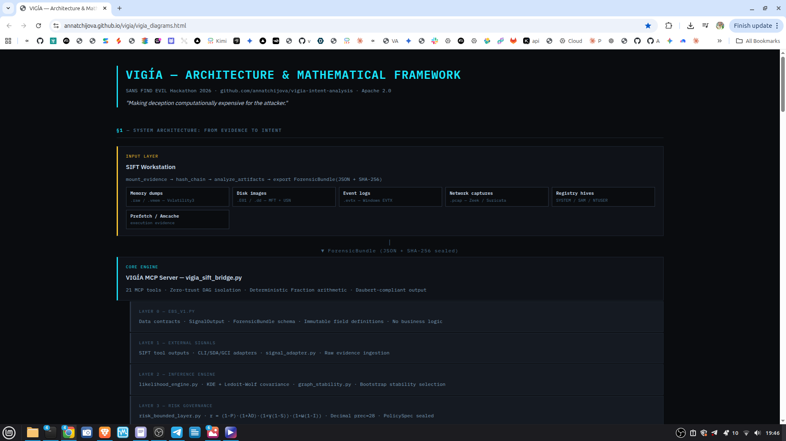
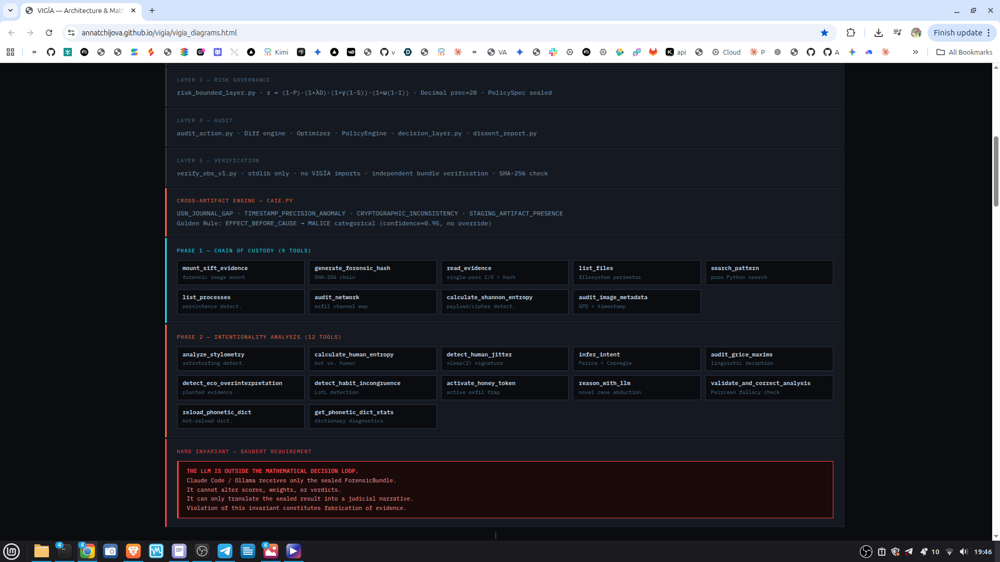
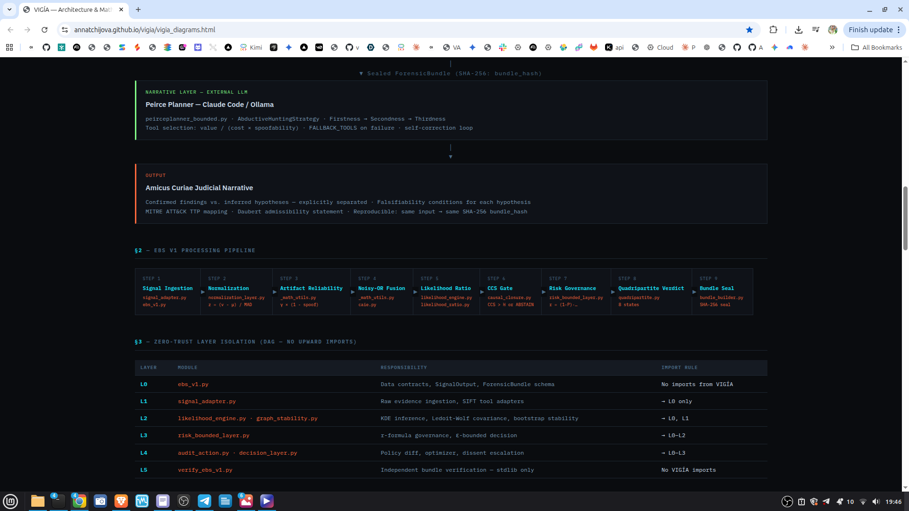
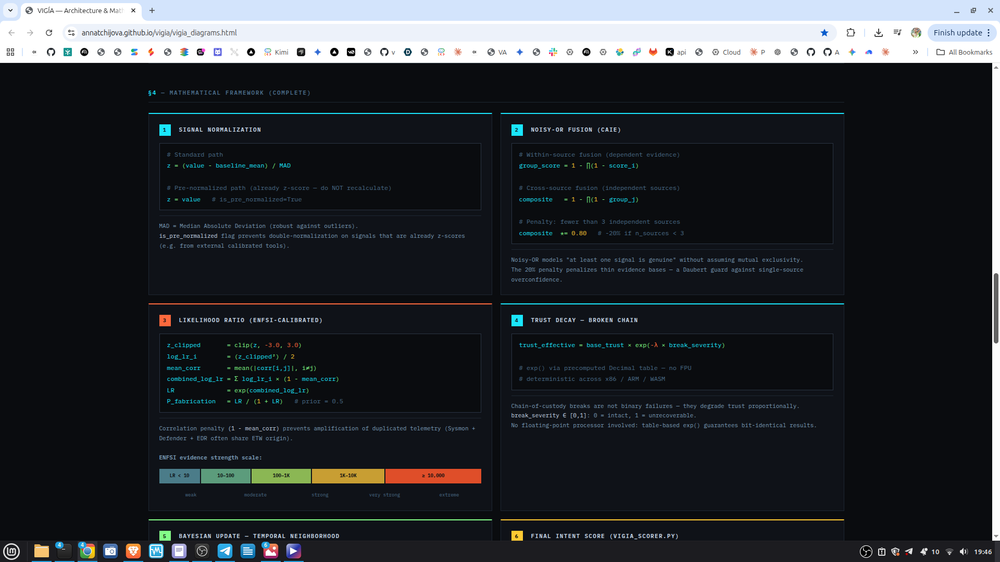
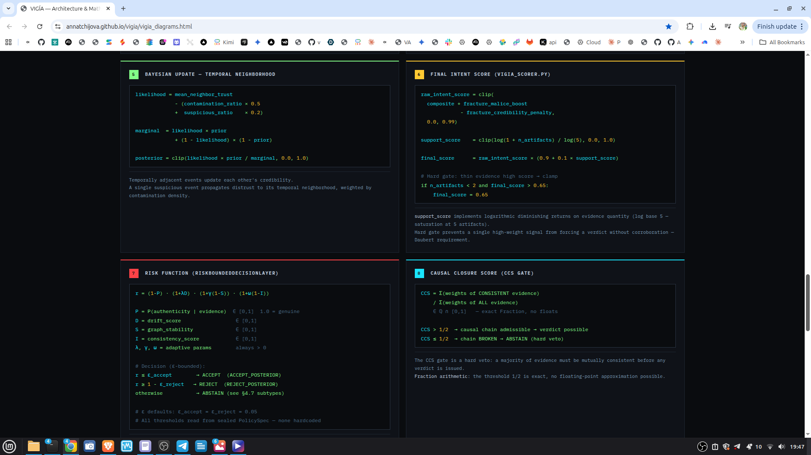
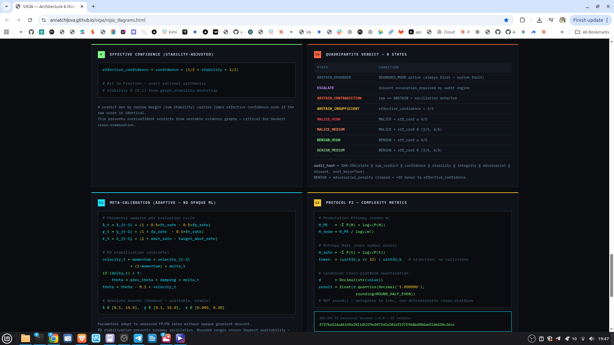
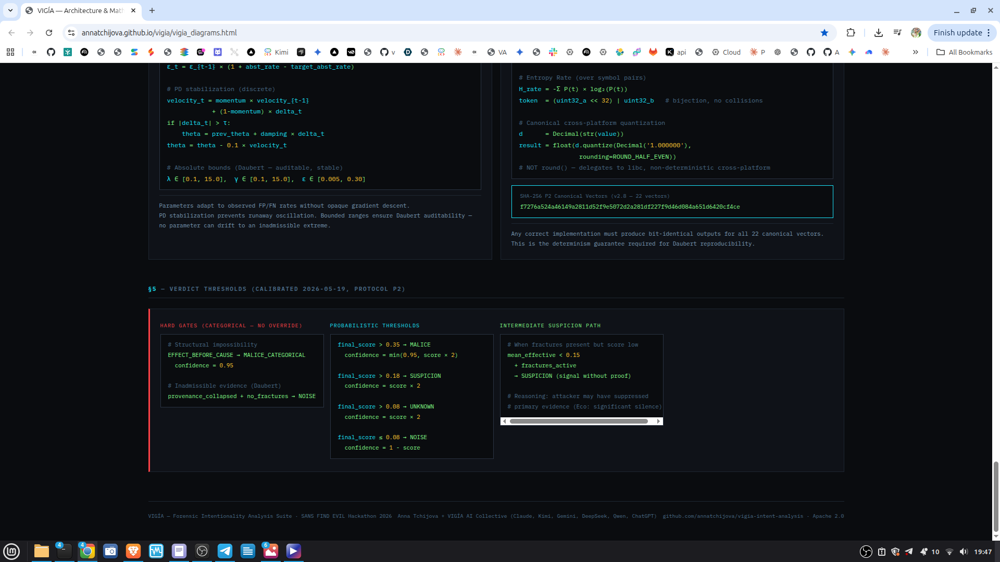

---

## Case JSON Validator

```bash
python3 validate_case.py data/cases/converted/VIGIA-REAL-001.json
```

Checks: required fields, valid `evidence_type` against CAIE whitelist,
minimum `acquisition_hash` length (64 hex chars), `examiner_id` presence.

---

## License

Apache 2.0 License. See [`LICENSE`](./LICENSE).

Copyright (c) 2026 Anna Tchijova and the VIGÍA AI Collective.

---

*"The question is not what happened, but why did someone make it happen —
and who benefits from that interpretation?"* — VIGÍA
