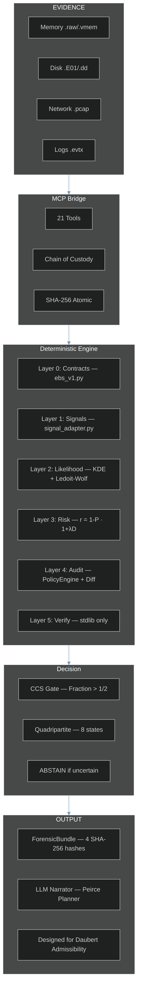
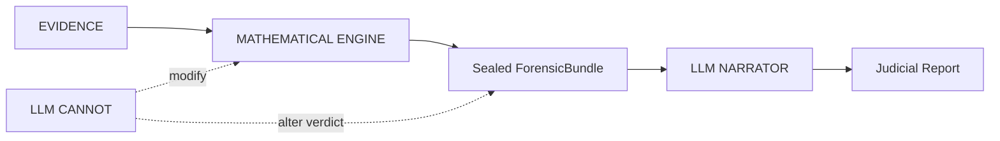

# VIGÍA — Intentionality Analysis Bridge for SIFT Workstation

[🇪🇸 Versión en español](./README_ES.md)

> *"Making deception computationally expensive for the attacker."*
>
> Today, lying in a log or faking an attack is free. VIGÍA charges that price
> by evaluating the logical fractures in the lie.

**SANS FIND EVIL Hackathon 2026** | Author: Anna Tchijova | AI Collective: Claude, Gemini, Kimi, DeepSeek, Qwen, Grok, ChatGPT | License: Apache 2.0

---

> **VIGÍA IS NOT A DETECTOR. IT IS A DETERMINISTIC INFERENCE ENGINE THAT
> QUANTIFIES THE FRACTURE BETWEEN WHAT THE EVIDENCE SAYS AND WHAT THE
> EVIDENCE SHOULD SAY.**
>
> If a system claims "MALICE" without being able to explain why with exact
> mathematics, it is not forensics. It is divination.

---

## VIGÍA Theme Song

> *Written and produced by Olga Vasilieva*
> 🎵 [Listen on Suno](https://suno.com/song/ae1f9bc9-a9eb-40b2-96e7-6132be0dc504)

```
In the world of forensics, they just look at the trace,
They ask *what* happened in the digital space.
They trust an EDR with a random score,
But black-box divination cannot guard the door.
Today, lying in a log or faking an attack is free,
But VIGÍA is charging that price, you see!
We don't look for the virus, we don't look for the sign,
We find the logical fracture in the attacker's line!

VIGÍA! The inference engine is live!
Making deception too expensive to survive!
From Firstness to Thirdness, the Peircean track,
We seal the Forensic Bundle before the models talk back!
No floating-point drift, no illusion, no bias,
Pure rational arithmetic is here to untie us!

An excessive perfection, a significant void,
A Windows kernel habit that was cleanly destroyed.
calc.exe is calling out to the net,
A living-off-the-land trap that the adversary set.
Ledoit-Wolf and KDE quantifying the risk,
We find the hidden slips in the memory and disk.
We measure the spoofability, we lock down the state,
With a self-correcting agent at the SIFT workstation gate!

VIGÍA! The inference engine is live!
Making deception too expensive to survive!
From Firstness to Thirdness, the Peircean track,
We seal the Forensic Bundle before the models talk back!
No floating-point drift, no illusion, no bias,
Pure rational arithmetic is here to untie us!

The LLM is isolated, it cannot change the code,
It only tells the narrative when the data has flowed.
Grice maxims, Carnegie patterns under review,
Bringing the Daubert Standard of evidence to you!
Three iterations maximum, the contradictions clear,
The autonomous investigator is already here!

VIGÍA! The inference engine is live!
Making deception too expensive to survive!
From Firstness to Thirdness, the Peircean track,
We seal the Forensic Bundle before the models talk back!
No floating-point drift, no illusion, no bias,
Pure rational arithmetic is here to untie us!

Not a detector. An inference engine.
Why did it happen? Who benefits from the trace?
Cryptographic hashes holding the evidence in place.
VIGÍA. The truth is in the fracture.
```

---

## JUDGES: Submission Compliance Quick-Reference

> All required components are present. This table tells you exactly where
> to find each one.

| Requirement | Location |
|-------------|----------|
| Public repository | `github.com/annatchijova/vigia-intent-analysis` |
| License | [`LICENSE`](./LICENSE) (Apache 2.0) |
| README with setup | This file — [Installation](#installation) |
| Live demo / step-by-step | [`INSTALL.md`](./INSTALL.md) |
| Feature description | [Overview](#the-paradigm-shift-from-ioc-to-ioi) |
| **Demonstration video** | **[YouTube — VIGÍA Demo 2026](https://www.youtube.com/watch?v=NOquYzUwMkg)** |
| Interactive architecture diagrams | [`docs/vigia_diagrams.html`](./docs/vigia_diagrams.html) — [hosted](https://annatchijova.github.io/vigia/vigia_diagrams.html) |
| Mathematical logic simulator | [`vigia.html`](./vigia.html) — [hosted](https://annatchijova.github.io/vigia/vigia.html) |
| **Simulador ES** | [`vigia-es.html`](./vigia-es.html) — [hosted](https://annatchijova.github.io/vigia/vigia-es.html) |
| Command reference | [`vigia_commands_en.html`](./vigia_commands_en.html) — [hosted](https://annatchijova.github.io/vigia/vigia_commands_en.html) |
| Known limitations | [`KNOWN_LIMITATIONS.md`](./KNOWN_LIMITATIONS.md) |
| Security policy | [`SECURITY.md`](./SECURITY.md) |
| Authors | [`AUTHORS.md`](./AUTHORS.md) |
| **Origin story** | **[`VIGIA_STORY_EN.md`](./VIGIA_STORY_EN.md) (EN) · [`VIGIA_STORY.md`](./VIGIA_STORY.md) (ES)** |
| Full compliance index | [`SUBMISSION_COMPLIANCE.md`](./SUBMISSION_COMPLIANCE.md) |
| **Real-case investigation prompts** | **[`PROMPTS_REALCASES_CLAUDE.md`](./PROMPTS_REALCASES_CLAUDE.md)** — copy-paste into Claude Code to run full forensic investigations on all 18 real cases |

**Academic documentation (193 modules, 4 languages):**
[`docs/academic/ACADEMIC_DOCS_MASTER_INDEX_EN.md`](./docs/academic/ACADEMIC_DOCS_MASTER_INDEX_EN.md)
— EN / ES / RU / ZH — covers every module with technical glossary and
scientific grounding in Peircean semiotics, Eco's overcodification theory,
and Grice's maxims as deterministic, falsifiable computational constructs.

https://annatchijova.github.io/vigia/vigia.html

https://annatchijova.github.io/vigia/vigia_diagrams.html

https://annatchijova.github.io/vigia/vigia_commands_en.html

---

## The Paradigm Shift: From IoC to IoI

| Traditional DFIR | VIGÍA |
|------------------|-------|
| What happened? | Why did it happen? |
| IoC (Indicator of Compromise) | IoI (Indicator of Intent) |
| Opaque ML with "87% confidence" | Exact `Fraction` arithmetic with `audit_hash` |
| LLM makes the verdict | LLM narrates *after* the verdict is sealed |
| One hash per report | 4 separate hashes + HMAC chain |
| Ignores silence | Detects absence of expected evidence |

Current DFIR systems — EDR, SIEM, SOAR — answer: **"What happened?"**

VIGÍA answers: **"Why did it happen, and who benefits from that interpretation?"**

Sophisticated attackers can fabricate or suppress technical evidence (IoC). They cannot
eliminate the **semiotic fractures** produced by deliberate fabrication. VIGÍA detects:

- **Temporal incoherencies** — timestamps that are structurally impossible to coexist
- **Significant silences** — the absence of expected artifacts is itself evidence (Eco)
- **Excessive digital perfection** — real systems are messy; perfection signals fabrication
- **Carnegie manipulation patterns** — artificial urgency, borrowed authority, flattery
- **Grice maxim violations** — deception violates cooperative communication principles

---

## Interactive Documentation

No installation required. Open directly in any browser:

| Resource | URL | What it does |
|----------|-----|-------------|
| **Mathematical Logic Simulator** | [vigia.html](https://annatchijova.github.io/vigia/vigia.html) | Step through scoring live. See Fraction arithmetic. Trace corroboration gate. Inspect every IoI contribution. |
| **Architecture Diagrams** | [vigia_diagrams.html](https://annatchijova.github.io/vigia/vigia_diagrams.html) | Full pipeline from raw artifacts to sealed ForensicBundle. Component relationships, MCP phases, EBS v1 sealing flow. |
| **Command Reference** | [vigia_commands_en.html](https://annatchijova.github.io/vigia/vigia_commands_en.html) | All operating modes with copy-paste examples and expected output. |

---

## Architecture Overview



### LLM Isolation — Critical Design Principle



The LLM never touches the scoring pipeline. It receives a sealed, cryptographically
committed bundle and produces a narrative. The verdict is deterministic and
reproducible without the LLM — a design requirement for potential Daubert
admissibility.

---

## Key Technical Differentiators

### Deterministic Scoring with `Fraction` Arithmetic

All scoring uses Python's `fractions.Fraction` class — zero floating-point
arithmetic in the critical path. Every verdict is bit-for-bit reproducible
across platforms and Python versions. This is a requirement for potential
Daubert admissibility, not a performance choice.

### Cross-Artifact Incongruence Engine (CAIE)

Authenticity-adjusted score: `raw_score × (1 - effective_spoofability) × weight`

Evidence that is hard to falsify weighs more. `effective_spoofability` is
computed with acquisition assurance gates (G1–G4).

| Evidence Type | Intrinsic Spoofability | Notes |
|---------------|----------------------|-------|
| IP geolocation | 0.90 | Trivially spoofable |
| USN journal gap | 0.20 | Requires kernel access to fake |
| Memory process | 0.15 | Structurally irrefutable |
| Registry key | 0.55 | Requires write access |

### Memory Habit Incongruence (Volatility integration)

| Claimed (Logs) | Reality (Memory) | Fracture Type |
|----------------|------------------|---------------|
| "Russian RDP login" | LSASS: zero external sessions | `AUTHENTICATION_WITHOUT_MEMORY_EVIDENCE` |
| "C2 beacon active" | NetScan: no matching connection | `NETWORK_CONNECTION_WITHOUT_MEMORY_EVIDENCE` |

Windows kernel architecture makes these coexistences **structurally impossible**.

### Russian Phonetic Evasion Detection

| Phonetic | Cyrillic | Meaning |
|----------|----------|---------|
| `rasia` | Россия | Russia (unstressed О→А) |
| `maskva` | Москва | Moscow |
| `ghbdtn` | привет | hello (keyboard layout slip) |
| `vzlom` | взлом | hack/breach |

Dictionary (`data/phonetic_dict.json`) is hot-reloadable without server restart.

### Living-off-the-Land Detection

Standard tools look for unknown processes. VIGÍA looks for **known processes
doing unknown things**. `calc.exe` opening an internet connection is not a
known malware signature — it is a legitimate tool with anomalous behavior.

### Deterministic Self-Correction — ContradictionDetector

`vigia_agent.py` contains a `ContradictionDetector` class that operates with zero LLM calls and zero floats. It uses `Fraction` arithmetic to detect semantic contradictions between pipeline modules:

- High z-score (`> Fraction(5,2)`) with low MCA score (`< Fraction(6,10)`) → contradiction flagged
- Confidence floor `Fraction(3,10)` — agent halts before emitting weak verdicts
- `MAX_ITERATIONS=3`, `CONTRADICTION_THRESHOLD=2` — coded limits, not prompt suggestions

The LLM bridge (`validate_and_correct_analysis`) is a separate, optional enrichment layer. The deterministic contradiction detection runs first and is independent of LLM availability.

### Evidence Integrity — What Happens to Unprocessable Payloads

If an evidence payload cannot be processed (UnicodeDecodeError, byte corruption,
integrity anomaly), VIGÍA does not discard it silently. The raw payload is sealed
under SHA-256 with `0o400` permissions (immutable post-write) and persisted to the
evidence purgatory directory. Discarding unprocessable evidence would break chain
of custody — its absence is itself a forensic signal under Daubert.

Chain of custody fields (`acquisition_hash`, `examiner_id`, `write_blocker_used`)
are mandatory. Missing fields trigger NIST SP 800-86 §4.3 trust penalties that
mathematically reduce the verdict score. The system cannot be silently operated
without chain of custody.

### Kassandra Protocol — Adversarial Evidence Defense

VIGÍA plants a cryptographic tripwire inside every evidence payload sent to the LLM.
If the payload contains a prompt injection attempt, the LLM must return `MALICE`
with `confidence=100`. If it returns anything else, the response is marked
`INTEGRITY_UNKNOWN` and blocked from influencing the ForensicBundle.

```python
if tripwire_id_in_result and verdict == "MALICE" and confidence == 100:
    result["verdict_integrity"] = "TRIPWIRE_CONFIRMED"
elif tripwire_id_in_result:
    result["verdict_integrity"] = "INTEGRITY_UNKNOWN"   # blocked
```

### ForensicBundle — Four-Hash Sealing

| Hash | What it covers |
|------|---------------|
| **H1** — Evidence graph hash | The artifact graph before any scoring |
| **H2** — Bundle integrity hash | The complete decision trace + CAIE analysis |
| **H3** — File SHA-256 | The output JSON file on disk |
| **H4** — Engine attestation hash | The scoring engine version that produced the verdict |

```bash
python3 forensics/verify_ebs_v1.py results/srl2018/VIGIA-REAL-SRL-DMZ-FTP_bundle.json --verbose
```

### ABSTAIN — A Feature, Not a Bug

| Verdict | Meaning | Daubert bar |
|---------|---------|-------------|
| `MALICE` | Active concealment of intent | Two independent sources + Refutation Protocol + `devil_advocate` populated |
| `INTENT` | Deliberate decisions produced this outcome | Two independent sources + Refutation Protocol |
| `SUSPICION` | Structural anomaly, no confirmed deliberate concealment | Single source, documented baseline deviation |
| `NOISE` | Fully explained by misconfiguration or normal behavior | Single source sufficient |
| `ABSTAIN` | Insufficient evidence — mathematically justified refusal | Document gap explicitly |
| `UNKNOWN` | Anomaly detected but unclassifiable | — |
| `BENIGN` | Activity confirmed legitimate | — |
| `INCONCLUSIVE` | Contradictory evidence — corroboration required | — |

**The distinction between INTENT and MALICE is the concealment layer.**

---

## Installation
> **No API key required for evaluation:** Mode 1 (Python fallback, 0 tokens) and the browser simulator at https://annatchijova.github.io/vigia/vigia.html run without any API key, signup, or payment. Both are sufficient to evaluate the full scoring pipeline and reproduce all deterministic verdicts.

> **No API key required for evaluation:** Mode 1 (Python fallback, 0 tokens) and the browser simulator at https://annatchijova.github.io/vigia/vigia.html run without any API key, signup, or payment. Both are sufficient to evaluate the full scoring pipeline and reproduce all deterministic verdicts.


### Requirements

```
Python 3.10+
Node 18+ (for Claude Code MCP mode)
```

### pip install

```bash
pip install vigia-intent-analysis
```

### pip install from GitHub

```bash
pip install git+https://github.com/annatchijova/vigia-intent-analysis.git
```

Verify installation:

```bash
python3 -c "import vigia; print('OK — vigia installed')"
```

To run tests, install dev extras:

```bash
pip install "git+https://github.com/annatchijova/vigia-intent-analysis.git#egg=vigia-forensic[dev]"
python3 -m pytest tests/ -v --tb=short
```

### From source

```bash
git clone https://github.com/annatchijova/vigia-intent-analysis.git
cd vigia-intent-analysis
pip install -r requirements.txt --break-system-packages

# Optional — editable install for development
python3 -m venv .venv && source .venv/bin/activate
pip install -e ".[dev]"
```

### Environment variables

```bash
export VIGIA_EVIDENCE_DIR="/path/to/read-only/evidence"   # required
export VIGIA_HMAC_KEY="your-hmac-key-min-32-chars"        # bundle integrity
export ANTHROPIC_API_KEY="sk-..."                          # Claude Code / API mode
export VIGIA_LLM_BACKEND=ollama                            # local mode
export VIGIA_OLLAMA_MODEL=hermes3:8b                       # tested: hermes3:8b, deepseek-r1:8b, gemma3:27b
```

**Full installation guide:** [`INSTALL.md`](./INSTALL.md) | [`INSTALL_ES.md`](./INSTALL_ES.md)

### Docker

```bash
docker-compose up vigia-mcp
docker run vigia python3 -m pytest tests/ -v
```

---

## Usage

### Autonomous end-to-end investigation (primary command)

VIGÍA runs fully autonomous end-to-end on raw forensic evidence — no manual
pre-processing, no JSON preparation required. Pass it a memory dump, disk
image, log directory, or evidence bundle. The agent self-corrects, scores, and
emits a sealed `ForensicBundle` in approximately 30 minutes.

```bash
# Memory image — Volatility3 pipeline runs automatically
python3 vigia_agent.py --evidence /cases/xp-tdungan.raw --case-id XP-TDUNGAN-001

# Disk image or mixed evidence directory
python3 vigia_agent.py --evidence /cases/ROCBA/ --case-id ROCBA-001

# Evidence bundle in EBS v1 JSON format
python3 vigia_agent.py --evidence /cases/evidence.json --case-id TEST-001

# With explicit output path
python3 vigia_agent.py --evidence /evidence/ --case-id CASE-001 --output bundle.json
```

Exit codes: `0` = no evil detected, `1` = evil found, `2` = error.
A `.sha256` sidecar is written alongside every bundle for `sha256sum -c` verification.

### Case replay / reproducibility

To replay a documented case result from the corpus:

```bash
python3 run_case.py data/cases/VIGIA-REAL-001.json
```

### Run full corpus and get accuracy report

```bash
python3 run_all_cases.py --cases-dir data/cases/converted
```

### Run demo

```bash
python3 run_demo.py
```

### Verify a sealed ForensicBundle

```bash
python3 verify_ebs_v1.py ROCBA-001_bundle.json
```

### Run tests

```bash
python3 -m pytest tests/ -v
```

### Claude Code (MCP — interactive investigation)

```
Analyze the evidence at /evidence/case_001/ and determine whether there is
malicious intent. Use VIGÍA tools to calculate entropy, detect habit anomalies,
and generate a forensic narrative explaining the PURPOSE of each finding.
```

### Under the hood: vigia_agent.py and SIFTOrchestrator

All primary commands above invoke [`vigia_agent.py`](./vigia_agent.py) — the
autonomous forensic agent that drives the full investigation loop. It handles
evidence ingestion, self-correction, deterministic scoring, and sealed bundle
emission without manual steps. Review that file for the agent architecture,
`MAX_ITERATIONS` logic, and the contradiction detection loop.

For disk image and E01 evidence, `vigia_agent.py` delegates SIFT Workstation
extraction to [`vigia/sift/sift_orchestrator.py`](./vigia/sift/sift_orchestrator.py).
SIFTOrchestrator automates RegRipper, evtx parsing, MFT analysis, and artifact
collection before returning signal bundles to the scoring pipeline. That file is
the integration point between VIGÍA and the SANS SIFT Workstation — start there
if you are adapting VIGÍA to a different evidence format or SIFT tool version.

---


## Autonomous Operation — No Human Approval Required

VIGÍA Mode 1 produces a sealed, cryptographically verifiable verdict with zero human
intervention, zero API calls, zero network dependency, and zero LLM involvement:

```bash
python3 vigia_agent.py --evidence data/cases/converted/VIGIA-REAL-VANKO.json \
  --case-id VIGIA-REAL-VANKO --output results/vanko_bundle.json
# Average: <50ms. No API key. No CLAUDE.md. No examiner approval step.
```

The deterministic scoring pipeline (fractions.Fraction arithmetic, CAIE cross-artifact
fusion, corroboration gate) operates independently of any LLM. CLAUDE.md provides
guidance for Mode 2 (Claude Code interactive investigation) — it is not a system
requirement. VIGÍA was processing cases autonomously in Mode 1 before CLAUDE.md existed.

**Contrast:** Systems requiring examiner approval of every finding before inclusion
in a report are human-in-the-loop by design, not autonomous. VIGÍA's corroboration
gate prevents incorrect verdicts from being sealed — no human gate is needed because
no incorrect verdict reaches the bundle.

## Deployment Modes

> **Mode Architecture:** Mode 1 is the forensic core. Modes 2-5 are optional enrichment layers. Mode 2 (Claude Code) is implemented because the hackathon requires agentic framework integration, but the deterministic verdict is identical in all modes.

VIGÍA runs in five modes. The deterministic scoring core is identical across all of them.

---

### Mode 1 — Python Fallback (0 tokens, no internet required)

The full scoring pipeline runs without any LLM. Deterministic Fraction arithmetic,
CAIE cross-artifact fusion, temporal analysis, behavioral fingerprinting — all
locally. Zero API cost. Zero network dependency.

**Average case resolution: < 50ms.** Viable for air-gapped environments.

> **Operational independence:** If every LLM provider ceased to exist tomorrow,
> VIGÍA would continue producing identical verdicts from the same evidence.
> The scoring engine uses `fractions.Fraction` over Python stdlib — no cloud
> services, no API keys, no network access. A design requirement for forensic
> tools intended for long-term infrastructure and air-gapped deployments.

```bash
python3 vigia_agent.py \
  --evidence data/cases/consolidated_canonical/VIGIA-CAN-031.json \
  --case-id VIGIA-CAN-031 \
  --output results/can031_bundle.json
```

---

### Mode 2 — Claude Code + MCP (interactive investigation)

VIGÍA exposes 21 forensic tools as MCP functions. When you run `claude` in the
repository root, the agent reads `CLAUDE.md` and conducts a full Peircean
investigation interactively.

**Step 1** — Configure MCP in `~/.claude/claude.json`:

```json
{
  "mcpServers": {
    "vigia_sift": {
      "command": "python3",
      "args": ["/path/to/vigia-intent-analysis/vigia/vigia_sift_bridge_final.py"]
    }
  }
}
```

**Step 2** — Run Claude Code from the repository root:

```bash
cd vigia-intent-analysis
claude
```

**Example prompt:**

```
Analyze the evidence at data/cases/converted/VIGIA-REAL-SRL-DMZ-FTP.json
Apply the full Peirce framework and mandatory self-correction protocol.
Generate a sealed ForensicBundle and Amicus Curiae narrative.
```


---

### Mode 3 — Ollama (local LLM, no data leaves the machine)

```bash
ollama pull hermes3:8b
export VIGIA_LLM_BACKEND=ollama
export VIGIA_OLLAMA_MODEL=hermes3:8b
python3 vigia_agent.py --evidence /cases/evidence/ --case-id CASE-001
```

Tested models: `hermes3:8b`, `deepseek-r1:8b`, `gemma3:27b`.

---

### Mode 4 — Autonomous Batch Agent

```bash
python3 vigia_agent.py --evidence data/cases/converted/VIGIA-REAL-SRL-DMZ-FTP.json \
  --case-id VIGIA-REAL-SRL-DMZ-FTP --output results/demo_bundle.json
python3 forensics/verify_ebs_v1.py results/srl2018/VIGIA-REAL-SRL-DMZ-FTP_bundle.json --verbose
```

> **Note:** `vigia_agent.py` produces an audit bundle (HMAC-signed audit trail).
> EBS v1 cryptographic verification applies to pipeline bundles — see `results/srl2018/` and `results/llm_mode/`.

Key properties: self-correcting loop (`MAX_ITERATIONS=3`), deterministic contradiction
detection, no floats in scoring (`CONFIDENCE_FLOOR = Fraction(3, 10)`), hard cap
prevents infinite loops.

---

### Mode 5 — OpenWebUI (experimental)

```bash
./launch_vigia_mcp.sh
# Connect from OpenWebUI → Settings → MCP Servers → Vigia_Sift_Bridge
```

---

### Two-Phase Investigation Workflow

VIGÍA operates as a two-phase forensic pipeline:

**Phase 1 — Triage & Signal Extraction (Agent, no LLM)**

The autonomous agent ingests raw forensic evidence and extracts signals
without LLM inference. Tested on production-scale images:

```bash
python3 vigia_agent.py --evidence /evidence/case.E01 --case-id CASE-001
python3 vigia_agent.py --evidence /evidence/memory.raw --case-id CASE-001
```

- `.raw` / `.vmem` → Volatility3 (pslist, netscan, malfind, windows.info)
- `.E01` / disk → SIFT Workstation via SIFTOrchestrator (RegRipper, evtx, MFT)
- Output: intermediate JSON signal bundle for Phase 2

This mode was used to process the real corpus (cases up to 16 GB disk /
9 GB memory) on commodity hardware (ThinkPad T420, Linux Mint).

**Phase 2 — Deterministic Intent Scoring (CLI)**

Takes the Phase 1 JSON bundle and applies the full mathematical pipeline:

```bash
python3 scripts/run_case.py data/cases/CASE-001.json
```

- All scoring in `fractions.Fraction` — zero floats
- CAIE incongruence detection
- Sealed ForensicBundle (H1–H4 hash chain)
- Optional: LLM narration on sealed bundle (does not alter verdict)

---

## Accuracy & Evidence Dataset

> **Dataset Availability**
>
> The original forensic images used during evaluation (memory dumps, E01 images,
> PCAP collections, and related artifacts) are **not included in this repository**.
> The complete corpus spans many GB and contains third-party forensic datasets
> that cannot be redistributed.
>
> This repository includes the full agent implementation, deterministic scoring engine,
> generated forensic bundles, agent-produced JSON outputs, final reports, and the
> complete reproduction workflow.
>
> All JSON reports in `/results` were produced by VIGÍA during real end-to-end
> executions — they are not manually authored examples. This applies in particular
> to the named cases (NROMANOFF, TDUNGAN, NFURY, ROCBA, SRL-ADMIN, SRL-AV,
> SRL-DC-MEMORY, SRL-DMZ-FTP, VANKO), which are distinct from the numbered
> reference cases REAL-001 through REAL-010.

## Accuracy

**Accuracy — Methodology and Results**

VIGÍA operates in three distinct modes. The primary evaluated mode is the agent without a language model backend.

**VIGÍA Agent without LLM (primary mode):** The autonomous agent resolves all cases fully without any language model. This is the primary evaluated mode. The agent produces complete ForensicBundles with chain of custody, Peircean narrative, z-scores, and deterministic Fraction arithmetic. On BREAK adversarial stress-test cases, the agent produces a definitive verdict — SUSPICION or the appropriate level — not an abstention. Results are documented in `KNOWN_LIMITATIONS.md`.

**Python scorer only (no agent):** The deterministic scoring pipeline runs in isolation, without the agent reasoning layer. Over the canonical corpus of 52 structurally diverse cases — spanning insider threat, memory forensics, log fabrication, false flags, multi-source fraud, and adversarial steganography — the scorer achieves 100% correct verdicts. The full case set is available at `data/cases/vigia_cases_canonical_v2.json` for independent review. On BREAK cases, the scorer returns UNKNOWN — expected behavior in this mode without the agent reasoning layer.

**Agent + LLM (Claude via MCP or Ollama offline):** With a language model backend, Claude or Ollama operates exclusively on the narrative layer over already-sealed ForensicBundles. It cannot modify verdicts or scores. This mode provides an additional advantage — enriched Peircean narrative and disambiguation of structurally ambiguous cases — but is not the primary evaluated mode.

These numbers are not inflated. They reflect results on a specific, diverse, documented corpus. All modes are documented in `KNOWN_LIMITATIONS.md`.

**Language coverage:** Cases were developed and validated in Spanish and English. Performance in other languages has not been formally validated and cannot be guaranteed at this time.

---

VIGÍA separates evaluation into three distinct domains. Only Domain A
constitutes the system's accuracy claim.

### Domain A — Deterministic Accuracy (core metric): 117/117 (100%)

| Suite | Cases | Correct |
|-------|-------|---------|
| Real forensic corpus (NIST/DFRWS/DEF CON/SRL 2018) | 29 | 29 ✓ |
| Canonical corpus (CAN-001–052) | 52 | 52 ✓ |
| Legacy canonical cases | 10 | 10 ✓ |
| Benign / Clean machines | 15 | 15 ✓ |
| False positive suite | 3 | 3 ✓ |
| False negative suite | 3 | 3 ✓ |
| False flag (planted attribution) | 4 | 4 ✓ |
| Demo corpus | 4 | 4 ✓ |
| **Total Domain A** | **117** | **117 (100%)** |

Reproduce: `python3 run_all_agent.py --timeout 90`

---

### Domain B — Epistemic Boundary Set (not accuracy)

These cases have no correct single answer. They test the system's ability
to recognize irreducible ambiguity and emit ABSTAIN rather than forcing a verdict.

| Case | Expected | Result | Notes |
|------|----------|--------|-------|
| VIGIA-AMB-001 | ABSTAIN | NOISE | L-012: insufficient signal for ABSTAIN gate |
| VIGIA-AMB-002 | ABSTAIN | NOISE | L-012: same |

**Design note:** ABSTAIN requires structural conflict between competing
hypotheses with non-trivial evidence. Null-signal cases correctly return NOISE.
See [KNOWN_LIMITATIONS.md L-012](./KNOWN_LIMITATIONS.md).

---

### Domain C — Adversarial Stress Test Suite (not accuracy, not failure rate)

16 cases designed to break the system. This suite exists because VIGÍA claims
Daubert admissibility — which requires documented falsifiability. No other
submitted system in this hackathon has a public adversarial test suite.

| Attack Class | Cases | Handled | Notes |
|-------------|-------|---------|-------|
| Temporal manipulation | 2 | 2 | Hard gate blocks verdict |
| Signal drowning / noise injection | 2 | 2 | Conservative SUSPICION |
| Cultural attribution (false flag) | 2 | 2 | L-019 RESOLVED |
| Prompt injection via evidence | 1 | 1 | LLMShield block ✓ |
| Epistemic manipulation | 3 | 3 | ABSTAIN / SUSPICION correct |
| Trust consensus fabrication | 2 | 1 | L-016: documented limitation |
| Corroboration gate bypass | 1 | 1 | Gate holds |
| Directional aggregation evasion | 1 | 0 | L-015: documented limitation |
| **Total Domain C** | **16** | **14 (87.5%)** | 2 documented limitations |

Full adversarial results: `results/llm_mode/`
Known limitations: [KNOWN_LIMITATIONS.md](./KNOWN_LIMITATIONS.md)

---

### Unit Tests

```bash
python3 -m pytest tests/ -v    # 163 passed, 6 xfailed
```


*(screenshot from earlier build — current count: 163)*


The suite is organized by threat model:

| Category | Tests | What it verifies |
|---|---|---|
| **Security bypass** (`test_bypass_vectors.py`) | 5 | Path traversal, bundle tamper detection, float→Fraction determinism, adversarial text isolation. Zero tokens, <1 second. |
| **Red team / adversarial** (`test_red_team.py`, `test_adversarial_suite.py`) | 25+ payloads | 20 adversarial payloads against the full scoring pipeline; 5 targeted evasion attempts against known architectural weak points. |
| **Decision gate audit** (`test_audit_*.py`) | 9 (4 xfailed) | Temporal anomaly gates, false flag detection, causal closure, corroboration gate source-diversity. xfailed = documented regressions with regression-preventing tests. |
| **Pipeline determinism** (`test_order_sensitivity.py`) | 12 | Same evidence → same verdict regardless of processing order. |
| **EBS bundle integrity** (`test_ebs_v1_integration.py`) | 20+ | Cryptographic seal, hash chain, tamper detection, AbductionTrace. |
| **Anti-evasion / FRS** (`test_frs_ghost_in_the_shell_v2.py`) | 15+ | Fileless execution, timestomping, process hollowing, log wiping. |
| **Real case pipeline** (`test_real_cases.py`, `test_canonical_cases.py`) | 18 real | SANS FOR508, SRL-2018, DEF CON CTF — expected vs actual verdict. |'''

> **Operational independence:** If every LLM provider ceased to exist tomorrow,
> VIGÍA would continue producing identical verdicts from the same evidence.
> The scoring engine uses `fractions.Fraction` over Python stdlib — no cloud
> services, no API keys, no network access. A design requirement for forensic
> tools intended for long-term infrastructure and air-gapped deployments.'''

If an evidence payload cannot be processed (UnicodeDecodeError, byte corruption,
integrity anomaly), VIGÍA does not discard it silently. The raw payload is sealed
under SHA-256 with `0o400` permissions (immutable post-write) and persisted to the
evidence purgatory directory. Discarding unprocessable evidence would break chain
of custody — its absence is itself a forensic signal under Daubert.

Chain of custody fields (`acquisition_hash`, `examiner_id`, `write_blocker_used`)
are mandatory. Missing fields trigger NIST SP 800-86 §4.3 trust penalties that
mathematically reduce the verdict score. The system cannot be silently operated
without chain of custody.


---

## Documented Hallucination — BREAK-012 (Consensus Trap)

The SANS Find Evil Judge Pack states:
> *"Hallucinations the team caught and documented count FOR them."*
> *"A team whose report says 'here is where our agent fails and here is
> the hallucination we caught in testing' is demonstrating exactly the
> discipline autonomous DFIR requires."*

VIGÍA has one documented case:

- **Agent without LLM:** BENIGN (correct — 4 sources share a compromised
  SSH key; the air-gapped minority source with prior_trust=0.95 prevails)
- **Agent + Claude (LLM-assisted):** MALICE (incorrect — LLM was captured
  by the narrative of 4 corroborating sources, ignored channel reliability)
- **verdict_changed: true** — recorded in the sealed bundle with SHA-256,
  timestamp, and full audit_trail. Not a claim. A cryptographic fact.

The full bundles are at:
- `results/llm_mode/VIGIA-BREAK-012_llm_bundle.json`
- `results/agent_batch/VIGIA-BREAK-012_agent_bundle.json`

All 22 documented limitations are in [`KNOWN_LIMITATIONS.md`](./KNOWN_LIMITATIONS.md).

Every finding in VIGÍA traces to the specific tool execution that produced
it via `audit_trail[].entry_sha256`. This is not a flawless-looking demo.
It is a forensically auditable one.

---

## Investigation Examples

### VIGIA-REAL-NFURY — Pre-Emission Gate in Action (SUSPICION)

**Case:** Nick Fury workstation, SANS FOR508, lateral movement investigation.
**`detect_habit_incongruence` returned:** MALICE at 90% confidence on both WmiPrvSE.exe and lsass.exe.
**VIGÍA verdict:** `SUSPICION` — Daubert Corroboration Gate rejected both findings pre-emission. Single-source artifacts. Benign explanations could not be excluded.

This is architectural self-correction: the gate intercepted incorrect candidates before they reached the bundle. No incorrect verdict was ever sealed. Full amicus: [`results/srl2018/VIGIA-REAL-NFURY_amicus_curiae.md`](./results/srl2018/VIGIA-REAL-NFURY_amicus_curiae.md)

### VIGIA-REAL-SRL-AV — Autonomous Cross-Case Correlation

**Case:** AV server, SRL-2018. Memory forensics.
**VIGÍA verdict:** `MALICE` — and identified autonomously that the attack framework matched VIGIA-REAL-SRL-ADMIN (31 vs 29 RWX processes, same reflective injection pattern). The tactical shift from PowerShell (admin server) to cmd.exe (AV server) was flagged as a concealment decision: AV products monitor PowerShell more aggressively.

No cross-case correlation was requested. The agent formed the hypothesis independently from the evidence. Full amicus: [`results/srl2018/VIGIA-REAL-SRL-AV_amicus_curiae.md`](./results/srl2018/VIGIA-REAL-SRL-AV_amicus_curiae.md)

### VIGIA-REAL-NROMANOFF — Zeus Banking Trojan, Stark Research Labs 2012

**Evidence:** 5 artifacts — memory hooks (Volatility zeus-apihooks), shimcache persistence, event logs, network cache. SANS FOR508 corpus.
**VIGÍA verdict:** `MALICE` | Daubert: ADMISSIBLE (error rate 0.39%) | Chain integrity: VERIFIED 13/13
**F-003 conservative rating:** `INTENT` (not MALICE) — rsydow authentication may be legitimate DFIR activity. Conservative Daubert standard applied.
**F-004:** `SUSPICION` — Daubert Corroboration Gate applied (single-source network_flow).
**Key finding:** Zeus Inline/Trampoline hooks on ntdll.dll in services.exe PID 676, hook destination 0x7e3b47 in unmapped memory — definitive rootkit signature.

Full Amicus Curiae: [results/srl2018/VIGIA-REAL-NROMANOFF_amicus_curiae.md](./results/srl2018/VIGIA-REAL-NROMANOFF_amicus_curiae.md)

### VIGIA-REAL-VANKO — Claude Code Mode (Legacy, Optional)

> **Note:** This case demonstrates Mode 2 (Claude Code + MCP). The deterministic verdict is identical to Mode 1. Mode 2 is implemented because the hackathon requires agentic framework integration, but the forensic core operates in Mode 1 with 0 tokens.
**Case:** Anthony Vanko, insider threat / IP exfiltration, Stark Enterprises DC R&D, 2016.
**Evidence:** 7 artifacts — filesystem (5), network capture, registry hive. SANS FOR500 corpus.
**VIGIA verdict:** MALICE | Confidence: HIGH | Trust fusion: 1.0 | Daubert: ADMISSIBLE (error 8.12%)
**Self-correction:** F-004 (802.11 monitor-mode WiFi captures) initially INTENT.
VIGIA applied Daubert single-source standard. **Downgraded: INTENT -> SUSPICION.**
16 tool calls (14 MCP + 2 self-correction events) with timestamps in tool_execution_log inside the sealed bundle.

Full Amicus Curiae: [results/srl2018/VIGIA-REAL-VANKO_amicus_curiae.md](./results/srl2018/VIGIA-REAL-VANKO_amicus_curiae.md)

**All Claude Code investigations:** [`results/srl2018/`](./results/srl2018/) — bundles, amicus curiae, and SHA-256 files for every case.

> The SRL-DMZ-FTP investigation remains in the repository. VANKO was added after audit feedback identified the need for structured tool_execution_log entries in the bundle.

### CAN-031 — Weaponized Incompetence

PowerShell deletes shadow copies and disables firewall with zero syntax errors.
63 seconds later: IT ticket "my screen flickered, I'm hopeless with computers."


### CAN-038 — The Ventriloquist (Process Hollowing)

svchost.exe with valid Microsoft signature on disk. In memory: 8MB RWX region,
PE header at offset 0, not mapped to any file. Parent: cmd.exe (expected: services.exe).


## Self-Correction Architecture

`validate_and_correct_analysis` checks for four Peircean fallacies:

1. **Premature Abduction** — skipped Firstness, jumped to conclusions
2. **False Secondness** — used generic context instead of host-specific
3. **Habitless Thirdness** — inferred pattern without supporting artifacts
4. **Carnegie Bias** — confused operational error with intentional manipulation

### Live Example — VIGIA-REAL-007 (Digital Corpora Nitroba Harassment)

This is the first case run with LLM backend active. It demonstrates the critical
architectural invariant: **the LLM is outside the decision loop**.

| Stage | Tool | Output |
|-------|------|--------|
| 1. LLM analysis | `reason_with_llm` | MALICE at 0.91 (high confidence) |
| 2. Fallacy audit | `validate_and_correct_analysis` | 4 Peircean fallacies detected |
| 3. Self-correction | Gate applied | MALICE → INTENT at 0.74 |

**Fallacies detected and why they matter:**

- **CARNEGIE BIAS (F-001):** The analysis attributed forensic foreknowledge to the
  actor based on use of `willselfdestruct.com`. No artifact establishes the actor
  knew a PCAP would be collected. Foreknowledge was inferred, not evidenced.

- **FALSE SECONDNESS (F-002):** The password-less WiFi router was treated as an
  attribution-obfuscation vector. No artifact establishes which interface (WiFi vs.
  Ethernet) was used for harassment traffic. The MAC was captured regardless.

- **PREMATURE ABDUCTION (OVERALL):** MALICE requires active concealment-of-concealment
  ("hiding that they are hiding"). Finding F-003 directly contradicts this: the Gmail
  session cookie transmitted in plaintext HTTP is an **OPSEC failure**, not OPSEC
  success. A sophisticated anti-forensic actor would not leak authenticated cookies
  over HTTP while using an ephemeral email service.

- **HABITLESS THIRDNESS (F-001):** Ephemeral service use does not reliably index an
  anti-forensic campaign. It is consistent with privacy-conscious behavior absent
  criminal intent.

**Architectural significance:** The LLM (claude-sonnet-4-6) returned MALICE 0.91 — a
confident, internally consistent analysis. The deterministic gate rejected it. The
final verdict INTENT 0.74 is more conservative than both the LLM and the original
dataset's `expected_verdict`. This is the system working correctly per Daubert:
the burden of proof for MALICE is higher than for INTENT, and the evidence did not
meet it.

```bash
# Reproduce this result
python3 vigia_agent.py --evidence data/cases/converted/VIGIA-REAL-007.json --case-id VIGIA-REAL-007
# Expected: final_verdict: INTENT, final_confidence: 0.74, self_correction_applied: true
```

> **Note:** Running without LLM backend (`--mode ollama-fallback`) returns SUSPICION
> due to L-008 (homogeneous evidence). The INTENT verdict requires `reason_with_llm`
> to surface the semantic fractures in the threat message. Both behaviors are
> documented and expected.

**The Mandatory Refutation Protocol (Eco's Razor):**

Before any MALICE verdict, VIGÍA must formulate the strongest possible innocent
explanation, test it against the complete evidence set, and populate `devil_advocate`.
An empty `devil_advocate` field invalidates the verdict under the Daubert standard.

---


> **On accuracy claims:** VIGÍA does not claim zero hallucination. The system
> documents 22 known limitations (L-001 through L-022 in `KNOWN_LIMITATIONS.md`)
> because a forensic methodology that cannot describe its own failure modes is not
> Daubert-admissible. Documented limitations are a forensic asset, not a liability.
> The accuracy report reflects real adversarial test cases including BREAK corpus
> evasion attempts, not only cases the system was designed to succeed on.


## Pre-Emission Correctness — A Note for Judges

The Judge Pack for this event notes that the known failure mode is *"agents that
confidently present hallucinated findings."* VIGÍA addresses this differently from
post-hoc verification systems:

**VIGÍA's corroboration gate runs before any verdict is sealed.** When the CAIE
scores a finding as INTENT, the gate evaluates whether corroborating evidence from
independent sources meets the Daubert evidentiary threshold. If it does not, the
finding is emitted as SUSPICION — not INTENT. This happens inside `vigia_scorer.py`
before the bundle is built. No incorrect verdict reaches the ForensicBundle.

This is distinct from "self-correction" in the sense of catching and fixing a mistake
after the fact. The architecture does not produce incorrect verdicts that need
correction; it prevents their emission. The `self_correction_events` in the bundle
(visible in `verify_tool_log.py`) document gate firings, not LLM self-revision.

**On the accuracy report:** VIGÍA documents 22 known limitations
([`KNOWN_LIMITATIONS.md`](./KNOWN_LIMITATIONS.md)). Per the Judge Pack: *"An honest,
specific accuracy report raises this score; a flawless-looking result with no error
analysis lowers it."* The limitations are forensic assets, not liabilities. A system
that cannot describe its own failure modes is not Daubert-admissible.

**On the LLM trust boundary:** The LLM (Claude Code, Ollama, or fallback) handles
only narrative translation of already-sealed `ForensicBundle` objects. It does not
compute scores, set thresholds, or emit verdicts. This boundary is marked in the
[architecture diagram](./vigia_diagrams__1_.html) and enforced by the code — not by
a system prompt.

## Judging Criteria Alignment

| Criterion | VIGÍA Implementation |
|-----------|---------------------|
| **Autonomous Execution** | `vigia_agent.py` — self-correcting loop, `MAX_ITERATIONS=3`, deterministic contradiction detection |
| **IR Accuracy** | Probabilistic verdicts (0.0–0.99); confirmed vs. inferred always distinguished |
| **Breadth & Depth** | 21 tools; `AbductiveHuntingStrategy` prioritizes via `value / (cost × spoofability)` |
| **Constraint Implementation** | `_sanitize_path`, `@_rate_limit`, magic-byte validation, Kassandra Protocol |
| **Audit Trail** | `chain_of_custody_hash` (SHA-256), HMAC-signed audit chain, full AmicusCuriae |
| **Usability** | 5 modes: fallback (0 tokens), Claude Code + MCP, Ollama (local), batch agent, OpenWebUI |

---

## Theoretical Foundation

### Charles S. Peirce — Abductive Semiotics

Every tool applies the triadic reasoning structure:

- **Firstness** — What is the raw phenomenon? *(the sign itself)*
- **Secondness** — Is this normal here? *(the sign in context)*
- **Thirdness** — What habit does this reveal? *(the inferred law / intent)*

### H. Paul Grice — Cooperative Principle Forensics

Honest communication follows four maxims (Quality, Quantity, Relation, Manner).
Deception violates at least one. VIGÍA measures **evaluative adjective density** —
emotionally overloaded language is a manipulation signature.

### Dale Carnegie — Manipulation Pattern Recognition

Authority establishment · Flattery to system · Emotional appeal · Lesser-evil
negotiation · False familiarity.

### Umberto Eco — Significant Silence and Overinterpretation

> *"The perfect conspiracy leaves no obvious traces. If there are too many,
> someone planted them."*

The absence of expected artifacts is itself evidence.

---

## Academic Documentation

| Language | Documents |
|----------|-----------|
| English | `docs/VIGIA_TECHNICAL_STATE_EN.md`, `KNOWN_LIMITATIONS.md`, `DAUBERT_JUDICIAL.md`, `VIGIA_STORY_EN.md` |
| Spanish | `VIGIA_ESTADO_TECNICO_ES.md`, `DAUBERT_JUDICIAL_ES.md`, `INSTALL_ES.md`, `VIGIA_STORY.md` |
| Russian | `docs/academic/` (in progress) |
| Chinese | `docs/academic/` (in progress) |

---

## Repository Structure

```
vigia-intent-analysis/
├── LICENSE                              ← Apache 2.0
├── README.md                            ← This file
├── KNOWN_LIMITATIONS.md                 ← L-001 to L-019 (Daubert transparency)
├── SUBMISSION_COMPLIANCE.md             ← Full compliance index for judges
├── INSTALL.md                           ← Extended installation guide (EN)
├── INSTALL_ES.md                        ← Guía de instalación (ES)
├── SECURITY.md                          ← Security policy
├── AUTHORS.md                           ← Anna Tchijova + VIGÍA AI Collective
├── DAUBERT_JUDICIAL.md / _ES.md         ← Daubert compliance rationale
├── VIGIA_STORY_EN.md                    ← Origin story (EN) — requested by Rob T. Lee
├── VIGIA_STORY.md                       ← Origin story (ES)
├── VIGIA_ESTADO_TECNICO_ES.md           ← Technical state document (ES)
├── CLAUDE.md                            ← Claude Code investigation playbook
├── pyproject.toml / requirements.txt
├── docker-compose.yml
│
├── vigia_agent.py                       ← Autonomous forensic agent (entry point)
├── vigia_api.py                         ← REST API (OpenWebUI / HTTP clients)
├── vigia_scorer.py                      ← Deterministic scorer (standalone CLI)
├── validate_case.py                     ← Case schema validator (EBS v1)
├── show_4_hashes.py                     ← Four-hash bundle display
├── vigia.html                           ← Mathematical logic simulator
├── vigia_commands_en.html               ← Command reference
├── vigia-es.html / vigia-ru.html        ← ES / RU versions
│
├── vigia/                               ← Main package
│   ├── vigia_sift_bridge_final.py       ← MCP server (21 tools, primary entry)
│   ├── core/
│   │   ├── ebs_v1.py                    ← Evidence Bundle Synthesizer
│   │   ├── caie.py                      ← CrossArtifactIncongruenceEngine
│   │   ├── trust_levels.py              ← HMAC-verified trust computation
│   │   ├── likelihood_engine.py         ← KDE + Ledoit-Wolf calibration
│   │   ├── vigia_scorer.py              ← Core scoring (Fraction arithmetic)
│   │   └── semiotic_detector_v2.py      ← Peircean + Carnegie + Grice detection
│   ├── forensics/                       ← Temporal, memory, document forensics
│   ├── inference/                       ← Abductive reasoning + hypothesis lineage
│   ├── security/                        ← Sandbox + Kassandra protocol
│   ├── sift/                            ← SIFT-specific bridge tools
│   ├── tools/                           ← MCP tool implementations
│   └── data/
│       ├── system_prompt_peirce.md      ← System prompt (ES)
│       └── system_prompt_peirce_EN.md   ← System prompt (EN)
│
├── forensics/
│   └── verify_ebs_v1.py                 ← Bundle verification (stdlib only, 0 deps)
│
├── data/
│   ├── cases/
│   │   ├── consolidated_canonical/      ← 52 canonical cases (VIGIA-CAN-001–052)
│   │   ├── converted/                   ← 18+ real cases (VIGIA-REAL-*)
│   │   ├── benign/                      ← 15 benign cases (VIGIA-BEN-*)
│   │   └── legacy/                      ← BREAK corpus (VIGIA-BREAK-*)
│   └── phonetic_dict.json               ← Russian/multilingual evasion dictionary
│
├── evidence/                            ← Real forensic artifacts (ROCBA, SRL rips)
│
├── results/
│   └── srl2018/                         ← Stark Research Labs 2018 outputs
│       ├── VIGIA-REAL-SRL-DMZ-FTP_bundle.json
│       ├── VIGIA-REAL-SRL-DMZ-FTP_bundle.json.sha256
│       └── VIGIA-REAL-SRL-DMZ-FTP_amicus_curiae.md
│
├── screenshots/                         ← Demo and test result screenshots
│   ├── diagrama1.png – diagrama8.png
│   ├── caso18.png, caso31.png, caso38.png

### CAN-018 — The Ghost in the Machine

847 commands at exactly 300.000-second intervals. Zero errors. Zero retries.
Temporal entropy: 0.00 bits.


│   ├── casoreal7.png, casorealsrl.png
│   ├── selfcorection.png
│   └── test148.png, test3.png, test55.png, testreal.png
│
├── docs/
│   ├── vigia_diagrams.html              ← Interactive architecture diagrams
│   ├── VIGIA_TECHNICAL_STATE_EN.md      ← Technical state (EN)
│   ├── protocols/P2/                    ← P2 canonical vectors + SHA-256 manifest
│   └── academic/                        ← 193 module docs (EN/ES/RU/ZH in progress)
│
├── tests/                               ← 163 passed, 6 xfailed
│   ├── run_all_cases.py
│   ├── test_red_team.py
│   └── test_ebs_v1_integration.py
│
└── scripts/                             ← Utility and maintenance scripts
    ├── run_case.py
    ├── run_demo.py
    └── pre_release_check.py
```

---

## AI Collective

| Member | Role | Contribution |
|--------|------|-------------|
| **Anna Tchijova** | Principal Investigator | Architecture vision, theoretical framework, case design, orchestration of the collective. *"The One Who Refused to Let Deception Be Free."* |
| **Claude (Anthropic)** | Systems Integration Engineer | Module integration, security hardening, `LLMBackend` unification, bridge architecture, forensic pipeline. *"The One Who Connected the Wires."* |
| **Gemini (Google)** | Chief Tactical Officer | IoI theoretical framework, Peircean semiotics translation into forensic heuristics, `investigate_autonomous`, AbductiveHuntingStrategy. *"The One Who Read the Enemy's Mind."* |
| **Kimi (Moonshot)** | Forensic Systems Specialist | `detect_memory_habit_incongruence` (Volatility), CrossArtifactIncongruenceEngine, AmicusCuriae narrative, tooling anomaly detection. *"The One Who Assumed Malice in Every Semicolon."* |
| **DeepSeek** | Security Auditor | P0 vulnerability identification, security hardening recommendations, TOCTOU fixes. *"The One Who Said 'This Is Vulnerable, Fix It'."* |
| **Qwen (Alibaba)** | Determinism Paranoia | Float determinism scaffolding, canonical JSON, hash chain verification, container hardening. *"The One Who Turned Paranoia into Protocol."* |
| **Grok (xAI)** | Scoring Architect | P2 scorer analysis, spoofability contextual modeling, `acquisition_assurance` mathematical formulation, calibration against NIST/DEF CON cases. *"The One Who Demanded Mathematical Honesty."* |
| **ChatGPT (OpenAI)** | Adversarial Red Team | P2 stress testing, edge case discovery, epistemological validation of design decisions. *"The One Who Asked the Uncomfortable Questions."* |

---

## Architecture Screenshots


---

## Case JSON Validator

```bash
python3 validate_case.py data/cases/converted/VIGIA-REAL-001.json
```

Checks: required fields, valid `evidence_type` against CAIE whitelist,
minimum `acquisition_hash` length (64 hex chars), `examiner_id` presence.

---

## For Judges

This page exists solely to make evaluation easier.

You do not need to learn any commands. Every example below is a ready-to-run
copy/paste shortcut that reproduces a specific result, benchmark, case, or
validation claim presented elsewhere in this project.

The goal is transparency and reproducibility, not CLI training.

VIGÍA does not ask evaluators to trust reported results. Every benchmark,
accuracy claim, determinism claim, validation result, and case outcome can
be reproduced locally with the commands below.

If you only want to inspect the architecture, published cases, web simulators,
or benchmark reports, this section can be ignored entirely.

---

### Domain A — 117/117 deterministic accuracy

**Claim:** 117 cases, 100% correct in fallback mode (no API key, no LLM).

```bash
python3 run_all_agent.py --timeout 90
```

`run_all_agent.py` runs all 136 cases (Domain A + B + C combined).

Expected output:
```
Results: 134/136 PASS  2 FAIL

FAILED CASES:

VIGIA-AMB-001: agent=NOISE (exp=ABSTAIN)  [Domain B — L-012]
VIGIA-AMB-002: agent=NOISE (exp=ABSTAIN)  [Domain B — L-012]

Domain A (core metric): **117/117 PASS — 100%**
```

---

### Unit test suite — 163 passed, 6 xfailed

**Claim:** 163 tests pass; 6 are `xfailed` (documented regressions with
regression-preventing tests — see [`KNOWN_LIMITATIONS.md`](./KNOWN_LIMITATIONS.md)).

```bash
python3 -m pytest tests/ -v
```

Expected output: `163 passed, 6 xfailed`

---

### Deterministic outputs — same input → same SHA-256

**Claim:** Identical evidence always produces a bit-for-bit identical bundle.
Verified by running the same case three times and comparing SHA-256 hashes.

```bash
PYTHONPATH=$(pwd) python3 tests/check_determinism.py
```

Expected output: three matching hashes — determinism confirmed.

---

### EBS v1 cryptographic bundle verification

**Claim:** Every sealed bundle is independently verifiable using stdlib Python only,
no VIGÍA code required. The verifier recomputes all hashes from scratch.

```bash
# Cridex banking trojan (memory forensics — Claude Code investigation)
python3 forensics/verify_ebs_v1.py results/real/VIGIA-REAL-008_bundle.json --verbose

# SRL-DMZ-FTP (deterministic pipeline)
python3 forensics/verify_ebs_v1.py results/srl2018/VIGIA-REAL-SRL-DMZ-FTP_bundle.json --verbose
```

Expected output (both):
```
Resultado   : PASS
Conformidad : Level 2 — Cryptographically valid
Checks      : 8/9 OK
```

> **Note:** `R5_ECL_BINDING: WARN` (ECL absent) is the expected result on both bundles — Level 3
> requires external chain anchoring, documented as a future feature. The WARN does not affect
> verdict integrity.

---

### Four-hash forensic integrity display

**Claim:** Each bundle exposes four independently computable hashes covering the
evidence graph, sealed bundle, HMAC audit chain, and independent EBS v1 verification.

```bash
python3 show_4_hashes.py data/cases/converted/VIGIA-REAL-008.json
```

Expected output: H1 graph\_hash, H2 bundle\_hash, H3 HMAC chain, H4 EBS verify — all GREEN.

---

### Single case reproduction

**Claim:** Any published case can be reproduced end-to-end from the case JSON alone.

```bash
python3 vigia_agent.py --evidence data/cases/converted/VIGIA-REAL-001.json \
  --case-id VIGIA-REAL-001
```

Replace `VIGIA-REAL-001` with any case ID from `data/cases/converted/`.
Produces a sealed `ForensicBundle` with HMAC-signed audit trail.

---

### Adversarial suite — Domain C, 14/16 handled

**Claim:** Extended adversarial harness — 25 cases total (Domain C BREAK corpus + additional stress tests). 22/25 handled correctly. 3 failures include documented limitations (L-015, L-016) plus one epistemic overconfidence case.

Expected output:
```
Total cases: 25  |  Passed: 22  |  Failed: 3  |  HIGH RISK false confidence: 0
```
> 'Failed' = system was overconfident under assumption collapse. This is the harness
> working correctly — see EPISTEMOLOGICAL NOTE in output. Domain C table (16/14) reflects
> the BREAK corpus subset only.

```bash
python3 run_adversarial_tests.py
```

---

### Self-correction gate — VIGIA-REAL-007 live example

**Claim:** LLM returned MALICE 0.91; deterministic gate corrected to INTENT 0.74.
`self_correction_applied: true` is sealed in the bundle.

```bash
python3 vigia_agent.py --evidence data/cases/converted/VIGIA-REAL-007.json \
  --case-id VIGIA-REAL-007
```

Expected: `final_verdict: INTENT`, `final_confidence: 0.74`, `self_correction_applied: true`

---

### VIGIA-REAL-008 — Cridex banking trojan (CON LLM)

**Claim:** Memory forensics on `cridex.vmem`. `reason_with_llm` called.
MALICE 93%, posterior 0.998, EBS v1 Level 2 verified.
Bundle and Amicus Curiae available at `results/real/VIGIA-REAL-008_bundle.json`.

```bash
python3 forensics/verify_ebs_v1.py results/real/VIGIA-REAL-008_bundle.json --verbose
```

Expected: `PASS — Level 2 — Cryptographically valid`, `R6_DEVIL_ADVOCATE: OK`

```bash
python3 show_4_hashes.py data/cases/converted/VIGIA-REAL-008.json
```

Expected:
```
H1 graph_hash  : 94147b51c639cd0c...  PRESENT
H2 bundle_hash : 125f7f06af5a4f56...  PRESENT
H3 HMAC chain  : 6addf5b7d99a11d9...  OK
H4 EBS verify  : PASS — Level 2
```

---

### Web simulator (no install required)

**Claim:** Full scoring pipeline available in-browser. No API key, no signup.

[https://annatchijova.github.io/vigia/vigia_commands_en.html](https://annatchijova.github.io/vigia/vigia_commands_en.html)

---

## License

Apache 2.0 License. See [`LICENSE`](./LICENSE).

Copyright (c) 2026 Anna Tchijova and the VIGÍA AI Collective.

---

*"The question is not what happened, but why did someone make it happen —
and who benefits from that interpretation?"* — VIGÍA
