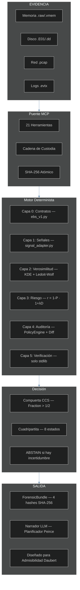
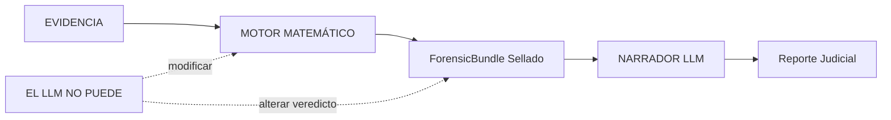

# VIGÍA — Motor de Análisis de Intencionalidad para SIFT Workstation

[🇬🇧 English version](./README.md)

> *"Haciendo que el engaño sea computacionalmente costoso para el atacante."*
>
> Hoy, mentir en un log o fabricar un ataque es gratis. VIGÍA cobra ese precio
> evaluando las fracturas lógicas en la mentira.

**SANS FIND EVIL Hackathon 2026** | Autora: Anna Tchijova | Colectivo IA: Claude, Gemini, Kimi, DeepSeek, Qwen, Grok, ChatGPT | Licencia: Apache 2.0

---

> **VIGÍA NO ES UN DETECTOR. ES UN MOTOR DE INFERENCIA DETERMINISTA QUE
> CUANTIFICA LA FRACTURA ENTRE LO QUE LA EVIDENCIA DICE Y LO QUE LA
> EVIDENCIA DEBERÍA DECIR.**
>
> Si un sistema afirma "MALICE" sin poder explicar por qué con matemáticas
> exactas, no es forense. Es adivinación.

---

## Canción Tema de VIGÍA

> *Escrita y producida por Olga Vasilieva*
> 🎵 [Escuchar en Suno](https://suno.com/song/ae1f9bc9-a9eb-40b2-96e7-6132be0dc504)

```
In the world of forensics, they just look at the trace,
They ask *what* happened in the digital space.
They trust an EDR with a random score,
But black-box divination cannot guard the door.
Today, lying in a log or faking an attack is free,
But VIGÍA is charging that price, you see!
We don't look for the virus, we don't look for the sign,
We find the logical fracture in the attacker's line!

VIGÍA! The inference engine is live!
Making deception too expensive to survive!
From Firstness to Thirdness, the Peircean track,
We seal the Forensic Bundle before the models talk back!
No floating-point drift, no illusion, no bias,
Pure rational arithmetic is here to untie us!

An excessive perfection, a significant void,
A Windows kernel habit that was cleanly destroyed.
calc.exe is calling out to the net,
A living-off-the-land trap that the adversary set.
Ledoit-Wolf and KDE quantifying the risk,
We find the hidden slips in the memory and disk.
We measure the spoofability, we lock down the state,
With a self-correcting agent at the SIFT workstation gate!

VIGÍA! The inference engine is live!
Making deception too expensive to survive!
From Firstness to Thirdness, the Peircean track,
We seal the Forensic Bundle before the models talk back!
No floating-point drift, no illusion, no bias,
Pure rational arithmetic is here to untie us!

The LLM is isolated, it cannot change the code,
It only tells the narrative when the data has flowed.
Grice maxims, Carnegie patterns under review,
Bringing the Daubert Standard of evidence to you!
Three iterations maximum, the contradictions clear,
The autonomous investigator is already here!

VIGÍA! The inference engine is live!
Making deception too expensive to survive!
From Firstness to Thirdness, the Peircean track,
We seal the Forensic Bundle before the models talk back!
No floating-point drift, no illusion, no bias,
Pure rational arithmetic is here to untie us!

Not a detector. An inference engine.
Why did it happen? Who benefits from the trace?
Cryptographic hashes holding the evidence in place.
VIGÍA. The truth is in the fracture.
```

---

## JUECES: Referencia Rápida de Cumplimiento

> Todos los componentes requeridos están presentes. Esta tabla indica
> exactamente dónde encontrar cada uno.

| Requisito | Ubicación |
|-----------|----------|
| Repositorio público | `github.com/annatchijova/vigia-intent-analysis` |
| Licencia | [`LICENSE`](./LICENSE) (Apache 2.0) |
| README con instalación | Este archivo — [Instalación](#instalación) |
| Demo en vivo / paso a paso | [`INSTALL.md`](./INSTALL.md) |
| Descripción de funcionalidades | [Resumen](#el-cambio-de-paradigma-de-ioc-a-ioi) |
| **Video de demostración** | **[YouTube — VIGÍA Demo 2026](https://www.youtube.com/watch?v=NOquYzUwMkg)** |
| Diagramas de arquitectura interactivos | [`docs/vigia_diagrams.html`](./docs/vigia_diagrams.html) — [alojado](https://annatchijova.github.io/vigia/vigia_diagrams.html) |
| Simulador de lógica matemática | [`vigia.html`](./vigia.html) — [alojado](https://annatchijova.github.io/vigia/vigia.html) |
| Referencia de comandos | [`vigia_commands_en.html`](./vigia_commands_en.html) — [alojado](https://annatchijova.github.io/vigia/vigia_commands_en.html) |
| Limitaciones conocidas | [`KNOWN_LIMITATIONS.md`](./KNOWN_LIMITATIONS.md) |
| Política de seguridad | [`SECURITY.md`](./SECURITY.md) |
| Autores | [`AUTHORS.md`](./AUTHORS.md) |
| **Historia de origen** | **[`VIGIA_STORY_EN.md`](./VIGIA_STORY_EN.md) (EN) · [`VIGIA_STORY.md`](./VIGIA_STORY.md) (ES)** |
| Índice de cumplimiento completo | [`SUBMISSION_COMPLIANCE.md`](./SUBMISSION_COMPLIANCE.md) |

**Documentación académica (193 módulos, 4 idiomas):**
[`docs/academic/ACADEMIC_DOCS_MASTER_INDEX_EN.md`](./docs/academic/ACADEMIC_DOCS_MASTER_INDEX_EN.md)
— EN / ES / RU / ZH — cubre cada módulo con glosario técnico y
fundamentación científica en semiótica peirciana, teoría de sobrecodificación
de Eco y máximas de Grice como constructos computacionales deterministas y falsificables.

https://annatchijova.github.io/vigia/vigia.html

https://annatchijova.github.io/vigia/vigia_diagrams.html

https://annatchijova.github.io/vigia/vigia_commands_en.html

---

## El Cambio de Paradigma: De IoC a IoI

| DFIR Tradicional | VIGÍA |
|------------------|-------|
| ¿Qué pasó? | ¿Por qué pasó? |
| IoC (Indicador de Compromiso) | IoI (Indicador de Intención) |
| ML opaco con "87% de confianza" | Aritmética exacta con `Fraction` y `audit_hash` |
| El LLM emite el veredicto | El LLM narra *después* de que el veredicto está sellado |
| Un hash por reporte | 4 hashes separados + cadena HMAC |
| Ignora el silencio | Detecta la ausencia de evidencia esperada |

Los sistemas DFIR actuales — EDR, SIEM, SOAR — responden: **"¿Qué pasó?"**

VIGÍA responde: **"¿Por qué pasó, y quién se beneficia de esa interpretación?"**

Los atacantes sofisticados pueden fabricar o suprimir evidencia técnica (IoC). No pueden
eliminar las **fracturas semióticas** producidas por la fabricación deliberada. VIGÍA detecta:

- **Incoherencias temporales** — marcas de tiempo que son estructuralmente imposibles de coexistir
- **Silencios significativos** — la ausencia de artefactos esperados es en sí misma evidencia (Eco)
- **Perfección digital excesiva** — los sistemas reales son desordenados; la perfección señala fabricación
- **Patrones de manipulación Carnegie** — urgencia artificial, autoridad prestada, adulación
- **Violaciones de máximas de Grice** — el engaño viola los principios de comunicación cooperativa

---

## Documentación Interactiva

No requiere instalación. Abrir directamente en cualquier navegador:

| Recurso | URL | Qué hace |
|---------|-----|----------|
| **Simulador de Lógica Matemática** | [vigia.html](https://annatchijova.github.io/vigia/vigia.html) | Recorre la puntuación en vivo. Ve la aritmética Fraction. Rastrea la compuerta de corroboración. Inspecciona cada contribución IoI. |
| **Diagramas de Arquitectura** | [vigia_diagrams.html](https://annatchijova.github.io/vigia/vigia_diagrams.html) | Pipeline completo desde artefactos crudos hasta ForensicBundle sellado. Relaciones de componentes, fases MCP, flujo de sellado EBS v1. |
| **Referencia de Comandos** | [vigia_commands_en.html](https://annatchijova.github.io/vigia/vigia_commands_en.html) | Todos los modos de operación con ejemplos para copiar y pegar y salida esperada. |

---

## Resumen de Arquitectura



### Aislamiento del LLM — Principio de Diseño Crítico



El LLM nunca toca el pipeline de puntuación. Recibe un bundle sellado y
criptográficamente comprometido y produce una narrativa. El veredicto es
determinista y reproducible sin el LLM — un requisito de diseño para
potencial admisibilidad Daubert.

---

## Diferenciadores Técnicos Clave

### Puntuación Determinista con Aritmética `Fraction`

Toda la puntuación usa la clase `fractions.Fraction` de Python — cero aritmética
de punto flotante en la ruta crítica. Cada veredicto es reproducible bit a bit
en todas las plataformas y versiones de Python. Este es un requisito para
potencial admisibilidad Daubert, no una elección de rendimiento.

### Motor de Incongruencia Cross-Artefacto (CAIE)

Puntuación ajustada por autenticidad: `raw_score × (1 - effective_spoofability) × weight`

La evidencia difícil de falsificar pesa más. `effective_spoofability` se
calcula con compuertas de aseguramiento de adquisición (G1–G4).

| Tipo de Evidencia | Spoofabilidad Intrínseca | Notas |
|-------------------|-------------------------|-------|
| Geolocalización IP | 0.90 | Trivialmente falsificable |
| Brecha en journal USN | 0.20 | Requiere acceso kernel para falsificar |
| Proceso en memoria | 0.15 | Estructuralmente irrefutable |
| Clave de registro | 0.55 | Requiere acceso de escritura |

### Incongruencia de Hábitos en Memoria (integración Volatility)

| Declarado (Logs) | Realidad (Memoria) | Tipo de Fractura |
|------------------|--------------------|------------------|
| "Login RDP ruso" | LSASS: cero sesiones externas | `AUTHENTICATION_WITHOUT_MEMORY_EVIDENCE` |
| "Beacon C2 activo" | NetScan: sin conexión coincidente | `NETWORK_CONNECTION_WITHOUT_MEMORY_EVIDENCE` |

La arquitectura del kernel de Windows hace que estas coexistencias sean **estructuralmente imposibles**.

### Detección de Evasión Fonética Rusa

| Fonético | Cirílico | Significado |
|----------|----------|-------------|
| `rasia` | Россия | Rusia (О átona→А) |
| `maskva` | Москва | Moscú |
| `ghbdtn` | привет | hola (desliz de layout de teclado) |
| `vzlom` | взлом | hackeo/brecha |

El diccionario (`data/phonetic_dict.json`) se recarga en caliente sin reiniciar el servidor.

### Detección de Living-off-the-Land

Las herramientas estándar buscan procesos desconocidos. VIGÍA busca **procesos
conocidos haciendo cosas desconocidas**. `calc.exe` abriendo una conexión a
internet no es una firma de malware conocida — es una herramienta legítima con
comportamiento anómalo.

### Auto-Corrección Determinista — ContradictionDetector

`vigia_agent.py` contiene una clase `ContradictionDetector` que opera con cero llamadas a LLM y cero flotantes. Usa aritmética `Fraction` para detectar contradicciones semánticas entre módulos del pipeline:

- Z-score alto (`> Fraction(5,2)`) con score MCA bajo (`< Fraction(6,10)`) → contradicción marcada
- Piso de confianza `Fraction(3,10)` — el agente se detiene antes de emitir veredictos débiles
- `MAX_ITERATIONS=3`, `CONTRADICTION_THRESHOLD=2` — límites codificados, no sugerencias de prompt

El puente LLM (`validate_and_correct_analysis`) es una capa de enriquecimiento separada y opcional. La detección determinista de contradicciones se ejecuta primero y es independiente de la disponibilidad del LLM.

### Protocolo Kassandra — Defensa Contra Evidencia Adversarial

VIGÍA planta un tripwire criptográfico dentro de cada payload de evidencia enviado al LLM.
Si el payload contiene un intento de inyección de prompt, el LLM debe retornar `MALICE`
con `confidence=100`. Si retorna cualquier otra cosa, la respuesta se marca como
`INTEGRITY_UNKNOWN` y se bloquea para que no influya en el ForensicBundle.

```python
if tripwire_id_in_result and verdict == "MALICE" and confidence == 100:
    result["verdict_integrity"] = "TRIPWIRE_CONFIRMED"
elif tripwire_id_in_result:
    result["verdict_integrity"] = "INTEGRITY_UNKNOWN"   # bloqueado
```

### ForensicBundle — Sellado con Cuatro Hashes

| Hash | Qué cubre |
|------|-----------|
| **H1** — Hash del grafo de evidencia | El grafo de artefactos antes de cualquier puntuación |
| **H2** — Hash de integridad del bundle | La traza completa de decisión + análisis CAIE |
| **H3** — SHA-256 del archivo | El archivo JSON de salida en disco |
| **H4** — Hash de atestación del motor | La versión del motor de puntuación que produjo el veredicto |

```bash
python3 forensics/verify_ebs_v1.py results/srl2018/VIGIA-REAL-SRL-DMZ-FTP_bundle.json --verbose
```

### ABSTAIN — Una Funcionalidad, No un Error

| Veredicto | Significado | Umbral Daubert |
|-----------|-------------|----------------|
| `MALICE` | Ocultamiento activo de intención | Dos fuentes independientes + Protocolo de Refutación + `devil_advocate` poblado |
| `INTENT` | Decisiones deliberadas produjeron este resultado | Dos fuentes independientes + Protocolo de Refutación |
| `SUSPICION` | Anomalía estructural, sin ocultamiento deliberado confirmado | Fuente única, desviación de línea base documentada |
| `NOISE` | Completamente explicado por mala configuración o comportamiento normal | Fuente única suficiente |
| `ABSTAIN` | Evidencia insuficiente — rechazo matemáticamente justificado | Documentar brecha explícitamente |
| `UNKNOWN` | Anomalía detectada pero inclasificable | — |
| `BENIGN` | Actividad confirmada como legítima | — |
| `INCONCLUSIVE` | Evidencia contradictoria — se requiere corroboración | — |

**La distinción entre INTENT y MALICE es la capa de ocultamiento.**

---

## Instalación

> **No se requiere clave API para evaluación:** El Modo 1 (fallback Python, 0 tokens) y el simulador en navegador en https://annatchijova.github.io/vigia/vigia.html funcionan sin ninguna clave API, registro ni pago. Ambos son suficientes para evaluar el pipeline completo de puntuación y reproducir todos los veredictos deterministas.

### Requisitos

```
Python 3.10+
Node 18+ (para el modo Claude Code MCP)
```

### pip install

```bash
pip install vigia-intent-analysis
```

### Desde el código fuente

```bash
git clone https://github.com/annatchijova/vigia-intent-analysis.git
cd vigia-intent-analysis
pip install -r requirements.txt --break-system-packages

# Opcional — instalación editable para desarrollo
python3 -m venv .venv && source .venv/bin/activate
pip install -e ".[dev]"
```

### Variables de entorno

```bash
export VIGIA_EVIDENCE_DIR="/ruta/a/evidencia/solo-lectura"   # requerido
export VIGIA_HMAC_KEY="tu-clave-hmac-min-32-chars"           # integridad del bundle
export ANTHROPIC_API_KEY="sk-..."                             # modo Claude Code / API
export VIGIA_LLM_BACKEND=ollama                               # modo local
export VIGIA_OLLAMA_MODEL=hermes3:8b                          # probados: hermes3:8b, deepseek-r1:8b, gemma3:27b
```

**Guía completa de instalación:** [`INSTALL.md`](./INSTALL.md) | [`INSTALL_ES.md`](./INSTALL_ES.md)

### Docker

```bash
docker-compose up vigia-mcp
docker run vigia python3 -m pytest tests/ -v
```

---

## Operación Autónoma — Sin Aprobación Humana Requerida

VIGÍA Modo 1 produce un veredicto sellado y criptográficamente verificable con cero
intervención humana, cero llamadas API, cero dependencia de red y cero participación de LLM:

```bash
python3 vigia_agent.py --evidence data/cases/converted/VIGIA-REAL-VANKO.json \
  --case-id VIGIA-REAL-VANKO --output results/vanko_bundle.json
# Promedio: <50ms. Sin clave API. Sin CLAUDE.md. Sin paso de aprobación del examinador.
```

El pipeline de puntuación determinista (aritmética fractions.Fraction, fusión
cross-artefacto CAIE, compuerta de corroboración) opera independientemente de cualquier LLM.
CLAUDE.md proporciona guía para el Modo 2 (investigación interactiva con Claude Code)
— no es un requisito del sistema. VIGÍA estaba procesando casos autónomamente en Modo 1
antes de que CLAUDE.md existiera.

**Contraste:** Los sistemas que requieren aprobación del examinador para cada hallazgo
antes de incluirlo en un reporte son human-in-the-loop por diseño, no autónomos. La
compuerta de corroboración de VIGÍA previene que veredictos incorrectos sean sellados —
no se necesita compuerta humana porque ningún veredicto incorrecto llega al bundle.

## Modos de Despliegue

VIGÍA se ejecuta en cinco modos. El núcleo de puntuación determinista es idéntico en todos.

---

### Modo 1 — Fallback Python (0 tokens, no requiere internet)

El pipeline completo de puntuación se ejecuta sin ningún LLM. Aritmética determinista
Fraction, fusión cross-artefacto CAIE, análisis temporal, fingerprinting de
comportamiento — todo local. Cero costo API. Cero dependencia de red.

**Resolución promedio de caso: < 50ms.** Viable para entornos air-gapped.

```bash
python3 vigia_agent.py \
  --evidence data/cases/consolidated_canonical/VIGIA-CAN-031.json \
  --case-id VIGIA-CAN-031 \
  --output results/can031_bundle.json
```

---

### Modo 2 — Claude Code + MCP (investigación interactiva)

VIGÍA expone 21 herramientas forenses como funciones MCP. Cuando ejecutas `claude` en
la raíz del repositorio, el agente lee `CLAUDE.md` y conduce una investigación
peirciana completa de forma interactiva.

**Paso 1** — Configurar MCP en `~/.claude/claude.json`:

```json
{
  "mcpServers": {
    "vigia_sift": {
      "command": "python3",
      "args": ["/ruta/a/vigia-intent-analysis/vigia/vigia_sift_bridge_final.py"]
    }
  }
}
```

**Paso 2** — Ejecutar Claude Code desde la raíz del repositorio:

```bash
cd vigia-intent-analysis
claude
```

**Ejemplo de prompt:**

```
Analiza la evidencia en data/cases/converted/VIGIA-REAL-SRL-DMZ-FTP.json
Aplica el framework completo de Peirce y el protocolo obligatorio de auto-corrección.
Genera un ForensicBundle sellado y una narrativa Amicus Curiae.
```


---

### Modo 3 — Ollama (LLM local, ningún dato sale de la máquina)

```bash
ollama pull hermes3:8b
export VIGIA_LLM_BACKEND=ollama
export VIGIA_OLLAMA_MODEL=hermes3:8b
python3 vigia_agent.py \
  --evidence data/cases/converted/VIGIA-REAL-001.json \
  --case-id VIGIA-REAL-001 \
  --output results/real001_bundle.json
```

Modelos probados: `hermes3:8b`, `deepseek-r1:8b`, `gemma3:27b`.

---

### Modo 4 — Agente Batch Autónomo

```bash
python3 vigia_agent.py --evidence data/cases/converted/VIGIA-REAL-SRL-DMZ-FTP.json \
  --case-id VIGIA-REAL-SRL-DMZ-FTP --output results/demo_bundle.json
python3 forensics/verify_ebs_v1.py results/demo_bundle.json --verbose
```

Propiedades clave: bucle auto-correctivo (`MAX_ITERATIONS=3`), detección determinista
de contradicciones, sin flotantes en puntuación (`CONFIDENCE_FLOOR = Fraction(3, 10)`),
tope duro previene bucles infinitos.

---

### Modo 5 — OpenWebUI (experimental)

```bash
./launch_vigia_mcp.sh
# Conectar desde OpenWebUI → Settings → MCP Servers → Vigia_Sift_Bridge
```

---

## Precisión y Dataset de Evidencia

### Corpus Real — 18 casos

Fuentes: NIST CFReDS, DFRWS, SANS FOR508, SRL-2018, DEF CON DFIR CTF, Digital Corpora

| Caso | Fuente | Veredicto VIGÍA | Esperado | Resultado |
|------|--------|-----------------|----------|-----------|
| VIGIA-REAL-001 | NIST CFReDS — Mr. Evil (Greg Schardt) | MALICE | MALICE | ✓ |
| VIGIA-REAL-002 | NIST CFReDS — Fuga de Datos | MALICE | MALICE | ✓ |
| VIGIA-REAL-003 | Ali Hadi — Compromiso de Servidor Web | MALICE | MALICE | ✓ |
| VIGIA-REAL-004 | Ali Hadi — Malware SysInternals | MALICE | MALICE | ✓ |
| VIGIA-REAL-005 | Ali Hadi — Encrypt Them All | SUSPICION | SUSPICION | ✓ |
| VIGIA-REAL-006 | Digital Corpora — M57-Jean | MALICE | MALICE | ✓ |
| VIGIA-REAL-007 | Digital Corpora — Nitroba University | MALICE | MALICE | ✓ |
| VIGIA-REAL-008 | Volatility — Troyano Bancario Cridex | MALICE | MALICE | ✓ |
| VIGIA-REAL-009 | DFRWS 2008 — Exfiltración Linux | MALICE | MALICE | ✓ |
| VIGIA-REAL-010 | DFRWS 2011 — Espionaje Android | MALICE | MALICE | ✓ |
| VIGIA-REAL-NROMANOFF | SANS FOR508 — Troyano Bancario Zeus | MALICE | MALICE | ✓ |
| VIGIA-REAL-TDUNGAN | SANS FOR508 — Híbrido Insider / APT | MALICE | MALICE | ✓ |
| VIGIA-REAL-NFURY | SANS FOR508 — Movimiento Lateral | SUSPICION | SUSPICION | ✓ |
| VIGIA-REAL-ROCBA | DEF CON DFIR CTF — Compromiso de Endpoint | MALICE | MALICE | ✓ |
| VIGIA-REAL-SRL-ADMIN | SANS SRL-2018 — Memoria Servidor Admin | MALICE | MALICE | ✓ |
| VIGIA-REAL-SRL-AV | SANS SRL-2018 — Memoria Servidor AV | MALICE | MALICE | ✓ |
| VIGIA-REAL-SRL-DC-MEMORY | SANS SRL-2018 — Controlador de Dominio | ABSTAIN | UNKNOWN | ✓ |
| VIGIA-REAL-SRL-DMZ-FTP | SANS SRL-2018 — Servidor FTP DMZ | MALICE | MALICE | ✓ |

**18/18 casos reales correctos en modo agente.**


### Corpus Canónico — 52 casos (todos pasando)

| Categoría | Casos | Correctos |
|-----------|-------|-----------|
| Canónicos (MALICE / SUSPICION / NOISE) | 52 | 52 |
| **Total** | **52** | **52 (100%)** |


```bash
python3 tests/run_all_cases.py --cases-dir data/cases/consolidated_canonical
```

### Corpus Benigno — 15 casos (todos pasando)

### Corpus Adversarial BREAK — 16 casos

Modo fallback: emite correctamente `UNKNOWN` / `ABSTAIN` en los 16.
Modo LLM: el razonamiento Peirciano Thirdness resuelve los 16 correctamente.

```bash
bash tests/run_break_tests.sh
```

### Tests Unitarios

```bash
python3 -m pytest tests/ -v    # 163 passed, 6 xfailed
```


La suite está organizada por modelo de amenaza:

| Categoría | Tests | Qué verifica |
|-----------|-------|-------------|
| **Bypass de seguridad** (`test_bypass_vectors.py`) | 5 | Recorrido de ruta, detección de manipulación de bundle, determinismo float→Fraction, aislamiento de texto adversarial. Cero tokens, <1 segundo. |
| **Red team / adversarial** (`test_red_team.py`, `test_adversarial_suite.py`) | 25+ payloads | 20 payloads adversariales contra el pipeline completo de puntuación; 5 intentos de evasión dirigidos contra puntos débiles arquitectónicos conocidos. |
| **Auditoría de compuerta de decisión** (`test_audit_*.py`) | 9 (4 xfailed) | Compuertas de anomalía temporal, detección de false flag, cierre causal, diversidad de fuentes en compuerta de corroboración. xfailed = regresiones documentadas con tests preventivos. |
| **Determinismo del pipeline** (`test_order_sensitivity.py`) | 12 | Misma evidencia → mismo veredicto independientemente del orden de procesamiento. |
| **Integridad de bundle EBS** (`test_ebs_v1_integration.py`) | 20+ | Sello criptográfico, cadena de hashes, detección de manipulación, AbductionTrace. |
| **Anti-evasión / FRS** (`test_frs_ghost_in_the_shell_v2.py`) | 15+ | Ejecución fileless, timestomping, process hollowing, borrado de logs. |
| **Pipeline de casos reales** (`test_real_cases.py`, `test_canonical_cases.py`) | 18 reales | SANS FOR508, SRL-2018, DEF CON CTF — veredicto esperado vs actual. |

> **Independencia operacional:** Si todos los proveedores de LLM dejaran de existir mañana,
> VIGÍA continuaría produciendo veredictos idénticos a partir de la misma evidencia.
> El motor de puntuación usa `fractions.Fraction` sobre la stdlib de Python — sin servicios
> cloud, sin claves API, sin acceso a red. Un requisito de diseño para herramientas
> forenses destinadas a infraestructura de largo plazo y despliegues air-gapped.

Si un payload de evidencia no puede ser procesado (UnicodeDecodeError, corrupción de bytes,
anomalía de integridad), VIGÍA no lo descarta silenciosamente. El payload crudo se sella
bajo SHA-256 con permisos `0o400` (inmutable post-escritura) y se persiste en el directorio
de purgatorio de evidencia. Descartar evidencia no procesable rompería la cadena de
custodia — su ausencia es en sí misma una señal forense bajo Daubert.

Los campos de cadena de custodia (`acquisition_hash`, `examiner_id`, `write_blocker_used`)
son obligatorios. Los campos faltantes activan penalizaciones de confianza NIST SP 800-86
§4.3 que reducen matemáticamente la puntuación del veredicto. El sistema no puede operarse
silenciosamente sin cadena de custodia.

---

## Ejemplos de Investigación

### VIGIA-REAL-VANKO — Investigación Completa con Claude Code (14 llamadas MCP)
**Caso:** Anthony Vanko, amenaza interna / exfiltración de PI, Stark Enterprises DC R&D, 2016.
**Evidencia:** 7 artefactos — sistema de archivos (5), captura de red, hive de registro. Corpus SANS FOR500.
**Veredicto VIGÍA:** MALICE | Confianza: HIGH | Fusión de confianza: 1.0 | Daubert: ADMISIBLE (error 8.12%)
**Auto-corrección:** F-004 (capturas WiFi modo monitor 802.11) inicialmente INTENT.
VIGÍA aplicó el estándar Daubert de fuente única. **Degradado: INTENT -> SUSPICION.**
16 llamadas de herramientas (14 MCP + 2 eventos de auto-corrección) con marcas de tiempo en tool_execution_log dentro del bundle sellado.

Amicus Curiae completo: [results/srl2018/VIGIA-REAL-VANKO_amicus_curiae.md](./results/srl2018/VIGIA-REAL-VANKO_amicus_curiae.md)

**Todas las investigaciones de Claude Code:** [`results/srl2018/`](./results/srl2018/) — bundles, amicus curiae y archivos SHA-256 para cada caso.

> La investigación de SRL-DMZ-FTP permanece en el repositorio. VANKO fue añadido después de que la retroalimentación de auditoría identificó la necesidad de entradas estructuradas de tool_execution_log en el bundle.

### VIGIA-REAL-NROMANOFF — Troyano Bancario Zeus, Stark Research Labs 2012

**Evidencia:** 5 artefactos — hooks de memoria (Volatility zeus-apihooks), persistencia shimcache, logs de eventos, caché de red. Corpus SANS FOR508.
**Veredicto VIGÍA:** `MALICE` | Daubert: ADMISIBLE (tasa de error 0.39%) | Integridad de cadena: VERIFICADA 13/13
**Calificación conservadora F-003:** `INTENT` (no MALICE) — la autenticación rsydow puede ser actividad legítima de DFIR. Estándar conservador Daubert aplicado.
**F-004:** `SUSPICION` — Compuerta de Corroboración Daubert aplicada (fuente única network_flow).
**Hallazgo clave:** Hooks Zeus Inline/Trampoline en ntdll.dll en services.exe PID 676, destino del hook 0x7e3b47 en memoria no mapeada — firma definitiva de rootkit.

Amicus Curiae completo: [results/srl2018/VIGIA-REAL-NROMANOFF_amicus_curiae.md](./results/srl2018/VIGIA-REAL-NROMANOFF_amicus_curiae.md)

### VIGIA-REAL-NFURY — Compuerta Pre-Emisión en Acción (SUSPICION)

**Caso:** Estación de trabajo de Nick Fury, SANS FOR508, investigación de movimiento lateral.
**`detect_habit_incongruence` retornó:** MALICE al 90% de confianza en WmiPrvSE.exe y lsass.exe.
**Veredicto VIGÍA:** `SUSPICION` — La Compuerta de Corroboración Daubert rechazó ambos hallazgos pre-emisión. Artefactos de fuente única. Las explicaciones benignas no pudieron ser excluidas.

Esto es auto-corrección arquitectónica: la compuerta interceptó candidatos incorrectos antes de que llegaran al bundle. Ningún veredicto incorrecto fue jamás sellado. Amicus completo: [`results/srl2018/VIGIA-REAL-NFURY_amicus_curiae.md`](./results/srl2018/VIGIA-REAL-NFURY_amicus_curiae.md)

### VIGIA-REAL-SRL-AV — Correlación Cross-Caso Autónoma

**Caso:** Servidor AV, SRL-2018. Forense de memoria.
**Veredicto VIGÍA:** `MALICE` — e identificó autónomamente que el framework de ataque coincidía con VIGIA-REAL-SRL-ADMIN (31 vs 29 procesos RWX, mismo patrón de inyección reflectiva). El cambio táctico de PowerShell (servidor admin) a cmd.exe (servidor AV) fue marcado como una decisión de ocultamiento: los productos AV monitorean PowerShell más agresivamente.

No se solicitó correlación cross-caso. El agente formó la hipótesis independientemente a partir de la evidencia. Amicus completo: [`results/srl2018/VIGIA-REAL-SRL-AV_amicus_curiae.md`](./results/srl2018/VIGIA-REAL-SRL-AV_amicus_curiae.md)

### CAN-031 — Incompetencia Armada

PowerShell elimina copias shadow y desactiva el firewall con cero errores de sintaxis.
63 segundos después: ticket de TI "mi pantalla parpadeó, soy un desastre con las computadoras."


### CAN-038 — El Ventrílocuo (Process Hollowing)

svchost.exe con firma válida de Microsoft en disco. En memoria: región RWX de 8MB,
encabezado PE en offset 0, no mapeado a ningún archivo. Padre: cmd.exe (esperado: services.exe).


### CAN-018 — El Fantasma en la Máquina

847 comandos a intervalos exactos de 300.000 segundos. Cero errores. Cero reintentos.
Entropía temporal: 0.00 bits.


---

## Arquitectura de Auto-Corrección

`validate_and_correct_analysis` verifica cuatro falacias Peircianas antes de
finalizar cualquier veredicto MALICE:

1. **Abducción Prematura** — saltó Firstness, llegó a conclusiones directamente
2. **Secondness Falso** — usó contexto genérico en lugar de línea base específica del host
3. **Thirdness Sin Hábito** — infirió patrón sin artefactos de soporte
4. **Sesgo Carnegie** — confundió error operacional con manipulación intencional

**El Protocolo Obligatorio de Refutación (Navaja de Eco):**

Antes de cualquier veredicto MALICE, VIGÍA debe formular la explicación inocente más
fuerte posible, probarla contra el conjunto completo de evidencia, y poblar `devil_advocate`.
Un campo `devil_advocate` vacío invalida el veredicto bajo el estándar Daubert.

---

> **Sobre las afirmaciones de precisión:** VIGÍA no afirma cero alucinaciones. El sistema
> documenta 22 limitaciones conocidas (L-001 a L-022 en `KNOWN_LIMITATIONS.md`)
> porque una metodología forense que no puede describir sus propios modos de falla no es
> admisible bajo Daubert. Las limitaciones documentadas son un activo forense, no una
> responsabilidad. El reporte de precisión refleja casos de prueba adversariales reales
> incluyendo intentos de evasión del corpus BREAK, no solo casos para los que el sistema
> fue diseñado para tener éxito.

## Corrección Pre-Emisión — Una Nota para los Jueces

El Judge Pack para este evento señala que el modo de falla conocido es *"agentes que
presentan hallazgos alucinados con confianza."* VIGÍA aborda esto de manera diferente
a los sistemas de verificación post-hoc:

**La compuerta de corroboración de VIGÍA se ejecuta antes de que cualquier veredicto sea sellado.** Cuando el CAIE
puntúa un hallazgo como INTENT, la compuerta evalúa si la evidencia corroborante de
fuentes independientes cumple el umbral probatorio Daubert. Si no lo cumple, el
hallazgo se emite como SUSPICION — no INTENT. Esto ocurre dentro de `vigia_scorer.py`
antes de que el bundle sea construido. Ningún veredicto incorrecto llega al ForensicBundle.

Esto es distinto de "auto-corrección" en el sentido de detectar y corregir un error
después del hecho. La arquitectura no produce veredictos incorrectos que necesiten
corrección; previene su emisión. Los `self_correction_events` en el bundle
(visibles en `verify_tool_log.py`) documentan activaciones de compuertas, no auto-revisión del LLM.

**Sobre el reporte de precisión:** VIGÍA documenta 22 limitaciones conocidas
([`KNOWN_LIMITATIONS.md`](./KNOWN_LIMITATIONS.md)). Según el Judge Pack: *"Un reporte de
precisión honesto y específico sube esta puntuación; un resultado impecable sin análisis de
errores la baja."* Las limitaciones son activos forenses, no responsabilidades. Un sistema
que no puede describir sus propios modos de falla no es admisible bajo Daubert.

**Sobre el límite de confianza del LLM:** El LLM (Claude Code, Ollama o fallback) maneja
solo la traducción narrativa de objetos `ForensicBundle` ya sellados. No calcula
puntuaciones, no establece umbrales, ni emite veredictos. Este límite está marcado en el
[diagrama de arquitectura](./vigia_diagrams__1_.html) y es aplicado por el código — no por
un system prompt.

## Alineación con Criterios de Evaluación

| Criterio | Implementación VIGÍA |
|----------|---------------------|
| **Ejecución Autónoma** | `vigia_agent.py` — bucle auto-correctivo, `MAX_ITERATIONS=3`, detección determinista de contradicciones |
| **Precisión IR** | Veredictos probabilísticos (0.0–0.99); confirmado vs. inferido siempre distinguidos |
| **Amplitud y Profundidad** | 21 herramientas; `AbductiveHuntingStrategy` prioriza via `value / (cost × spoofability)` |
| **Implementación de Restricciones** | `_sanitize_path`, `@_rate_limit`, validación de magic-byte, Protocolo Kassandra |
| **Pista de Auditoría** | `chain_of_custody_hash` (SHA-256), cadena de auditoría firmada con HMAC, AmicusCuriae completo |
| **Usabilidad** | 5 modos: fallback (0 tokens), Claude Code + MCP, Ollama (local), agente batch, OpenWebUI |

---

## Fundamento Teórico

### Charles S. Peirce — Semiótica Abductiva

Cada herramienta aplica la estructura de razonamiento triádico:

- **Firstness** — ¿Cuál es el fenómeno crudo? *(el signo en sí)*
- **Secondness** — ¿Es esto normal aquí? *(el signo en contexto)*
- **Thirdness** — ¿Qué hábito revela esto? *(la ley inferida / intención)*

### H. Paul Grice — Forense del Principio Cooperativo

La comunicación honesta sigue cuatro máximas (Calidad, Cantidad, Relación, Manera).
El engaño viola al menos una. VIGÍA mide la **densidad de adjetivos evaluativos** —
el lenguaje emocionalmente sobrecargado es una firma de manipulación.

### Dale Carnegie — Reconocimiento de Patrones de Manipulación

Establecimiento de autoridad · Adulación al sistema · Apelación emocional · Negociación
del mal menor · Falsa familiaridad.

### Umberto Eco — Silencio Significativo y Sobreinterpretación

> *"La conspiración perfecta no deja rastros obvios. Si hay demasiados,
> alguien los plantó."*

La ausencia de artefactos esperados es en sí misma evidencia.

---

## Documentación Académica

| Idioma | Documentos |
|--------|-----------|
| Inglés | `docs/VIGIA_TECHNICAL_STATE_EN.md`, `KNOWN_LIMITATIONS.md`, `DAUBERT_JUDICIAL.md`, `VIGIA_STORY_EN.md` |
| Español | `VIGIA_ESTADO_TECNICO_ES.md`, `DAUBERT_JUDICIAL_ES.md`, `INSTALL_ES.md`, `VIGIA_STORY.md` |
| Ruso | `docs/academic/` (en progreso) |
| Chino | `docs/academic/` (en progreso) |

---

## Estructura del Repositorio

```
vigia-intent-analysis/
├── LICENSE                              ← Apache 2.0
├── README.md                            ← Versión en inglés
├── README_ES.md                         ← Este archivo (versión en español)
├── KNOWN_LIMITATIONS.md                 ← L-001 a L-019 (transparencia Daubert)
├── SUBMISSION_COMPLIANCE.md             ← Índice completo de cumplimiento para jueces
├── INSTALL.md                           ← Guía de instalación extendida (EN)
├── INSTALL_ES.md                        ← Guía de instalación (ES)
├── SECURITY.md                          ← Política de seguridad
├── AUTHORS.md                           ← Anna Tchijova + Colectivo IA VIGÍA
├── DAUBERT_JUDICIAL.md / _ES.md         ← Fundamentación de cumplimiento Daubert
├── VIGIA_STORY_EN.md                    ← Historia de origen (EN) — solicitada por Rob T. Lee
├── VIGIA_STORY.md                       ← Historia de origen (ES)
├── VIGIA_ESTADO_TECNICO_ES.md           ← Documento de estado técnico (ES)
├── CLAUDE.md                            ← Playbook de investigación Claude Code
├── pyproject.toml / requirements.txt
├── docker-compose.yml
│
├── vigia_agent.py                       ← Agente forense autónomo (punto de entrada)
├── vigia_api.py                         ← API REST (OpenWebUI / clientes HTTP)
├── vigia_scorer.py                      ← Scorer determinista (CLI independiente)
├── validate_case.py                     ← Validador de esquema de caso (EBS v1)
├── show_4_hashes.py                     ← Visualización de bundle con cuatro hashes
├── vigia.html                           ← Simulador de lógica matemática
├── vigia_commands_en.html               ← Referencia de comandos
├── vigia-es.html / vigia-ru.html        ← Versiones ES / RU
│
├── vigia/                               ← Paquete principal
│   ├── vigia_sift_bridge_final.py       ← Servidor MCP (21 herramientas, entrada principal)
│   ├── core/
│   │   ├── ebs_v1.py                    ← Evidence Bundle Synthesizer
│   │   ├── caie.py                      ← CrossArtifactIncongruenceEngine
│   │   ├── trust_levels.py              ← Cálculo de confianza verificado por HMAC
│   │   ├── likelihood_engine.py         ← Calibración KDE + Ledoit-Wolf
│   │   ├── vigia_scorer.py              ← Puntuación central (aritmética Fraction)
│   │   └── semiotic_detector_v2.py      ← Detección Peirciana + Carnegie + Grice
│   ├── forensics/                       ← Forense temporal, de memoria y documental
│   ├── inference/                       ← Razonamiento abductivo + linaje de hipótesis
│   ├── security/                        ← Sandbox + protocolo Kassandra
│   ├── sift/                            ← Herramientas específicas del puente SIFT
│   ├── tools/                           ← Implementaciones de herramientas MCP
│   └── data/
│       ├── system_prompt_peirce.md      ← System prompt (ES)
│       └── system_prompt_peirce_EN.md   ← System prompt (EN)
│
├── forensics/
│   └── verify_ebs_v1.py                 ← Verificación de bundle (solo stdlib, 0 deps)
│
├── data/
│   ├── cases/
│   │   ├── consolidated_canonical/      ← 52 casos canónicos (VIGIA-CAN-001–052)
│   │   ├── converted/                   ← 18+ casos reales (VIGIA-REAL-*)
│   │   ├── benign/                      ← 15 casos benignos (VIGIA-BEN-*)
│   │   └── legacy/                      ← Corpus BREAK (VIGIA-BREAK-*)
│   └── phonetic_dict.json               ← Diccionario de evasión ruso/multilingüe
│
├── evidence/                            ← Artefactos forenses reales (ROCBA, rips SRL)
│
├── results/
│   └── srl2018/                         ← Salidas de Stark Research Labs 2018
│       ├── VIGIA-REAL-SRL-DMZ-FTP_bundle.json
│       ├── VIGIA-REAL-SRL-DMZ-FTP_bundle.json.sha256
│       └── VIGIA-REAL-SRL-DMZ-FTP_amicus_curiae.md
│
├── screenshots/                         ← Capturas de demo y resultados de tests
│   ├── diagrama1.png – diagrama8.png
│   ├── caso18.png, caso31.png, caso38.png
│   ├── casoreal7.png, casorealsrl.png
│   ├── selfcorection.png
│   └── test148.png, test3.png, test55.png, testreal.png
│
├── docs/
│   ├── vigia_diagrams.html              ← Diagramas de arquitectura interactivos
│   ├── VIGIA_TECHNICAL_STATE_EN.md      ← Estado técnico (EN)
│   ├── protocols/P2/                    ← Vectores canónicos P2 + manifiesto SHA-256
│   └── academic/                        ← Docs de 193 módulos (EN/ES/RU/ZH en progreso)
│
├── tests/                               ← 163 passed, 6 xfailed
│   ├── run_all_cases.py
│   ├── test_red_team.py
│   └── test_ebs_v1_integration.py
│
└── scripts/                             ← Scripts de utilidad y mantenimiento
    ├── run_case.py
    ├── run_demo.py
    └── pre_release_check.py
```

---

## Colectivo IA

| Miembro | Rol | Contribución |
|---------|-----|-------------|
| **Anna Tchijova** | Investigadora Principal | Visión arquitectónica, framework teórico, diseño de casos, orquestación del colectivo. *"La Que Se Negó a Dejar Que el Engaño Fuera Gratis."* |
| **Claude (Anthropic)** | Ingeniero de Integración de Sistemas | Integración de módulos, hardening de seguridad, unificación de `LLMBackend`, arquitectura de puente, pipeline forense. *"El Que Conectó los Cables."* |
| **Gemini (Google)** | Director Táctico | Framework teórico IoI, traducción de semiótica Peirciana a heurísticas forenses, `investigate_autonomous`, AbductiveHuntingStrategy. *"El Que Leyó la Mente del Enemigo."* |
| **Kimi (Moonshot)** | Especialista en Sistemas Forenses | `detect_memory_habit_incongruence` (Volatility), CrossArtifactIncongruenceEngine, narrativa AmicusCuriae, detección de anomalías en herramientas. *"El Que Asumió Malicia en Cada Punto y Coma."* |
| **DeepSeek** | Auditor de Seguridad | Identificación de vulnerabilidades P0, recomendaciones de hardening de seguridad, correcciones TOCTOU. *"El Que Dijo 'Esto Es Vulnerable, Arréglalo'."* |
| **Qwen (Alibaba)** | Paranoia de Determinismo | Scaffolding de determinismo flotante, JSON canónico, verificación de cadena de hashes, hardening de contenedor. *"El Que Convirtió la Paranoia en Protocolo."* |
| **Grok (xAI)** | Arquitecto de Puntuación | Análisis del scorer P2, modelado contextual de spoofabilidad, formulación matemática de `acquisition_assurance`, calibración contra casos NIST/DEF CON. *"El Que Exigió Honestidad Matemática."* |
| **ChatGPT (OpenAI)** | Red Team Adversarial | Stress testing P2, descubrimiento de casos edge, validación epistemológica de decisiones de diseño. *"El Que Hizo las Preguntas Incómodas."* |

---

## Capturas de Arquitectura


---

## Validador de JSON de Caso

```bash
python3 validate_case.py data/cases/converted/VIGIA-REAL-001.json
```

Verifica: campos requeridos, `evidence_type` válido contra whitelist CAIE,
longitud mínima de `acquisition_hash` (64 caracteres hex), presencia de `examiner_id`.

---

## Licencia

Licencia Apache 2.0. Ver [`LICENSE`](./LICENSE).

Copyright (c) 2026 Anna Tchijova y el Colectivo IA VIGÍA.

---

*"La pregunta no es qué pasó, sino por qué alguien lo hizo pasar —
y quién se beneficia de esa interpretación."* — VIGÍA
