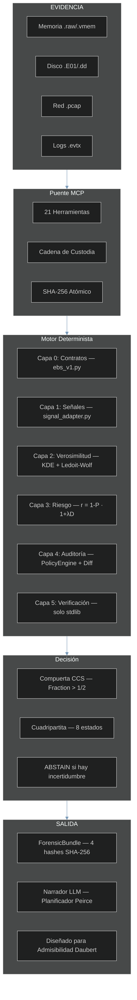
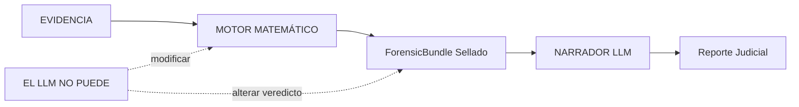

# VIGÍA — Motor de Análisis de Intencionalidad para SIFT Workstation

> **Nota (2026-06-19, post-presentación):** un bundle del corpus anterior a esta fecha
> (`results/srl2018/VIGIA-REAL-SRL-DMZ-FTP_bundle.json`) fue sellado antes de un ajuste
> de estrictez en el verificador y mostrará un fallo R7 documentado si se re-verifica.
> Esto es esperado e intencional — ver `KNOWN_LIMITATIONS.md`, ítem L-026. El verificador
> está capturando correctamente una brecha que ya fue cerrada para todos los bundles nuevos.

[🇬🇧 English version](./README.md)

> *"Haciendo que el engaño sea computacionalmente costoso para el atacante."*
>
> Hoy, mentir en un log o fabricar un ataque es gratis. VIGÍA cobra ese precio
> evaluando las fracturas lógicas en la mentira.

**SANS FIND EVIL Hackathon 2026** | Autora: Anna Tchijova | Colectivo IA: Claude, Gemini, Kimi, DeepSeek, Qwen, Grok, ChatGPT | Licencia: Apache 2.0

---

> **VIGÍA NO ES UN DETECTOR. ES UN MOTOR DE INFERENCIA DETERMINISTA QUE
> CUANTIFICA LA FRACTURA ENTRE LO QUE LA EVIDENCIA DICE Y LO QUE LA
> EVIDENCIA DEBERÍA DECIR.**
>
> Si un sistema afirma "MALICE" sin poder explicar por qué con matemáticas
> exactas, no es forense. Es adivinación.

---

## Canción Tema de VIGÍA

> *Escrita y producida por Olga Vasilieva*
> 🎵 [Escuchar en Suno](https://suno.com/song/ae1f9bc9-a9eb-40b2-96e7-6132be0dc504)

```
In the world of forensics, they just look at the trace,
They ask *what* happened in the digital space.
They trust an EDR with a random score,
But black-box divination cannot guard the door.
Today, lying in a log or faking an attack is free,
But VIGÍA is charging that price, you see!
We don't look for the virus, we don't look for the sign,
We find the logical fracture in the attacker's line!

VIGÍA! The inference engine is live!
Making deception too expensive to survive!
From Firstness to Thirdness, the Peircean track,
We seal the Forensic Bundle before the models talk back!
No floating-point drift, no illusion, no bias,
Pure rational arithmetic is here to untie us!

An excessive perfection, a significant void,
A Windows kernel habit that was cleanly destroyed.
calc.exe is calling out to the net,
A living-off-the-land trap that the adversary set.
Ledoit-Wolf and KDE quantifying the risk,
We find the hidden slips in the memory and disk.
We measure the spoofability, we lock down the state,
With a self-correcting agent at the SIFT workstation gate!

VIGÍA! The inference engine is live!
Making deception too expensive to survive!
From Firstness to Thirdness, the Peircean track,
We seal the Forensic Bundle before the models talk back!
No floating-point drift, no illusion, no bias,
Pure rational arithmetic is here to untie us!

The LLM is isolated, it cannot change the code,
It only tells the narrative when the data has flowed.
Grice maxims, Carnegie patterns under review,
Bringing the Daubert Standard of evidence to you!
Three iterations maximum, the contradictions clear,
The autonomous investigator is already here!

VIGÍA! The inference engine is live!
Making deception too expensive to survive!
From Firstness to Thirdness, the Peircean track,
We seal the Forensic Bundle before the models talk back!
No floating-point drift, no illusion, no bias,
Pure rational arithmetic is here to untie us!

Not a detector. An inference engine.
Why did it happen? Who benefits from the trace?
Cryptographic hashes holding the evidence in place.
VIGÍA. The truth is in the fracture.
```

---

## JUECES: Referencia Rápida de Cumplimiento

> Todos los componentes requeridos están presentes. Esta tabla indica
> exactamente dónde encontrar cada uno.

| Requisito | Ubicación |
|-----------|----------|
| Repositorio público | `github.com/annatchijova/vigia-intent-analysis` |
| Licencia | [`LICENSE`](./LICENSE) (Apache 2.0) |
| README con instalación | Este archivo — [Instalación](#instalación) |
| Demo en vivo / paso a paso | [`INSTALL.md`](./INSTALL.md) |
| Descripción de funcionalidades | [Resumen](#el-cambio-de-paradigma-de-ioc-a-ioi) |
| **Video de demostración** | **[YouTube — VIGÍA Demo 2026](https://www.youtube.com/watch?v=NOquYzUwMkg)** |
| Diagramas de arquitectura interactivos | [`docs/vigia_diagrams.html`](./docs/vigia_diagrams.html) — [alojado](https://annatchijova.github.io/vigia/vigia_diagrams.html) |
| Simulador de lógica matemática | [`vigia.html`](./vigia.html) — [alojado](https://annatchijova.github.io/vigia/vigia.html) |
| **Simulador ES** | [`vigia-es.html`](./vigia-es.html) — [alojado](https://annatchijova.github.io/vigia/vigia-es.html) |
| Referencia de comandos | [`vigia_commands_en.html`](./vigia_commands_en.html) — [alojado](https://annatchijova.github.io/vigia/vigia_commands_en.html) |
| Limitaciones conocidas | [`KNOWN_LIMITATIONS.md`](./KNOWN_LIMITATIONS.md) |
| Política de seguridad | [`SECURITY.md`](./SECURITY.md) |
| Autores | [`AUTHORS.md`](./AUTHORS.md) |
| **Historia de origen** | **[`VIGIA_STORY_EN.md`](./VIGIA_STORY_EN.md) (EN) · [`VIGIA_STORY.md`](./VIGIA_STORY.md) (ES)** |
| Índice de cumplimiento completo | [`SUBMISSION_COMPLIANCE.md`](./SUBMISSION_COMPLIANCE.md) |
| **Prompts de investigación de casos reales** | **[`PROMPTS_REALCASES_CLAUDE.md`](./PROMPTS_REALCASES_CLAUDE.md)** — copiar y pegar en Claude Code para ejecutar investigaciones forenses completas en los 18 casos reales |
| **Investigación completa NGDC 2012** | **[Reporte (EN)](./results/agent_batch/VIGIA-NGDC-2012-REPORT.md) · [Reporte (ES)](./results/agent_batch/VIGIA-NGDC-2012-REPORTE-ES.md) · [Amicus Curiae](./results/agent_batch/VIGIA-NGDC-2012-AMICUS-CURIAE.md)** — análisis autónomo de evidencia cruda del caso SANS National Gallery DC 2012 (17 artefactos, 7 hallazgos, Peircean + Daubert compliant) |
| **NGDC 2012 — tracy-home E01/E02 (capa física)** | **[Reporte](./results/agent_batch/VIGIA-NGDC-2012-E01E02-REPORT.md) · [Amicus Curiae (EN)](./results/agent_batch/VIGIA-NGDC-2012-E01E02-AMICUS-CURIAE-EN.md) · [Amicus Curiae (ES)](./results/agent_batch/VIGIA-NGDC-2012-E01E02-AMICUS-CURIAE-ES.md)** — análisis de imagen de disco de la MacBook Air de Tracy (5.5 GB HFS+): infraestructura LogKext, documentos de sellos robados, VM anti-forense, recuperación de cuentas eliminadas. Corroboración física del veredicto NGDC-002. |

**Documentación académica (193 módulos, 4 idiomas):**
[`docs/academic/ACADEMIC_DOCS_MASTER_INDEX_EN.md`](./docs/academic/ACADEMIC_DOCS_MASTER_INDEX_EN.md)
— EN / ES / RU / ZH — cubre cada módulo con glosario técnico y
fundamentación científica en semiótica peirciana, teoría de sobrecodificación
de Eco y máximas de Grice como constructos computacionales deterministas y falsificables.

https://annatchijova.github.io/vigia/vigia.html

https://annatchijova.github.io/vigia/vigia_diagrams.html

https://annatchijova.github.io/vigia/vigia_commands_en.html

**Mini juego — Simulador VIGÍA:** [🇪🇸 Español](https://annatchijova.github.io/vigia/simulador.html) · [🇬🇧 English](https://annatchijova.github.io/vigia/simulator.html)

---

## El Cambio de Paradigma: De IoC a IoI

| DFIR Tradicional | VIGÍA |
|------------------|-------|
| ¿Qué pasó? | ¿Por qué pasó? |
| IoC (Indicador de Compromiso) | IoI (Indicador de Intención) |
| ML opaco con "87% de confianza" | Aritmética exacta con `Fraction` y `audit_hash` |
| El LLM emite el veredicto | El LLM narra *después* de que el veredicto está sellado |
| Un hash por reporte | 4 hashes separados + cadena HMAC |
| Ignora el silencio | Detecta la ausencia de evidencia esperada |

Los sistemas DFIR actuales — EDR, SIEM, SOAR — responden: **"¿Qué pasó?"**

VIGÍA responde: **"¿Por qué pasó, y quién se beneficia de esa interpretación?"**

Los atacantes sofisticados pueden fabricar o suprimir evidencia técnica (IoC). No pueden
eliminar las **fracturas semióticas** producidas por la fabricación deliberada. VIGÍA detecta:

- **Incoherencias temporales** — marcas de tiempo que son estructuralmente imposibles de coexistir
- **Silencios significativos** — la ausencia de artefactos esperados es en sí misma evidencia (Eco)
- **Perfección digital excesiva** — los sistemas reales son desordenados; la perfección señala fabricación
- **Patrones de manipulación Carnegie** — urgencia artificial, autoridad prestada, adulación
- **Violaciones de máximas de Grice** — el engaño viola los principios de comunicación cooperativa

---

## Documentación Interactiva

No requiere instalación. Abrir directamente en cualquier navegador:

| Recurso | URL | Qué hace |
|---------|-----|----------|
| **Simulador de Lógica Matemática** | [vigia.html](https://annatchijova.github.io/vigia/vigia.html) | Recorre la puntuación en vivo. Ve la aritmética Fraction. Rastrea la compuerta de corroboración. Inspecciona cada contribución IoI. |
| **Diagramas de Arquitectura** | [vigia_diagrams.html](https://annatchijova.github.io/vigia/vigia_diagrams.html) | Pipeline completo desde artefactos crudos hasta ForensicBundle sellado. Relaciones de componentes, fases MCP, flujo de sellado EBS v1. |
| **Referencia de Comandos** | [vigia_commands_en.html](https://annatchijova.github.io/vigia/vigia_commands_en.html) | Todos los modos de operación con ejemplos para copiar y pegar y salida esperada. |

---

## Resumen de Arquitectura



### Aislamiento del LLM — Principio de Diseño Crítico



El LLM nunca toca el pipeline de puntuación. Recibe un bundle sellado y
criptográficamente comprometido y produce una narrativa. El veredicto es
determinista y reproducible sin el LLM — un requisito de diseño para
potencial admisibilidad Daubert.

---

## Diferenciadores Técnicos Clave

### Puntuación Determinista con Aritmética `Fraction`

Toda la puntuación usa la clase `fractions.Fraction` de Python — cero aritmética
de punto flotante en la ruta crítica. Cada veredicto es reproducible bit a bit
en todas las plataformas y versiones de Python. Este es un requisito para
potencial admisibilidad Daubert, no una elección de rendimiento.

### Motor de Incongruencia Cross-Artefacto (CAIE)

Puntuación ajustada por autenticidad: `raw_score × (1 - effective_spoofability) × weight`

La evidencia difícil de falsificar pesa más. `effective_spoofability` se
calcula con compuertas de aseguramiento de adquisición (G1–G4).

| Tipo de Evidencia | Spoofabilidad Intrínseca | Notas |
|-------------------|-------------------------|-------|
| Geolocalización IP | 0.90 | Trivialmente falsificable |
| Brecha en journal USN | 0.20 | Requiere acceso kernel para falsificar |
| Proceso en memoria | 0.15 | Estructuralmente irrefutable |
| Clave de registro | 0.55 | Requiere acceso de escritura |

### Incongruencia de Hábitos en Memoria (integración Volatility)

| Declarado (Logs) | Realidad (Memoria) | Tipo de Fractura |
|------------------|--------------------|------------------|
| "Login RDP ruso" | LSASS: cero sesiones externas | `AUTHENTICATION_WITHOUT_MEMORY_EVIDENCE` |
| "Beacon C2 activo" | NetScan: sin conexión coincidente | `NETWORK_CONNECTION_WITHOUT_MEMORY_EVIDENCE` |

La arquitectura del kernel de Windows hace que estas coexistencias sean **estructuralmente imposibles**.

### Detección de Evasión Fonética Rusa

| Fonético | Cirílico | Significado |
|----------|----------|-------------|
| `rasia` | Россия | Rusia (О átona→А) |
| `maskva` | Москва | Moscú |
| `ghbdtn` | привет | hola (desliz de layout de teclado) |
| `vzlom` | взлом | hackeo/brecha |

El diccionario (`data/phonetic_dict.json`) se recarga en caliente sin reiniciar el servidor.

### Detección de Living-off-the-Land

Las herramientas estándar buscan procesos desconocidos. VIGÍA busca **procesos
conocidos haciendo cosas desconocidas**. `calc.exe` abriendo una conexión a
internet no es una firma de malware conocida — es una herramienta legítima con
comportamiento anómalo.

### Auto-Corrección Determinista — ContradictionDetector

`vigia_agent.py` contiene una clase `ContradictionDetector` que opera con cero llamadas a LLM y cero flotantes. Usa aritmética `Fraction` para detectar contradicciones semánticas entre módulos del pipeline:

- Z-score alto (`> Fraction(5,2)`) con score MCA bajo (`< Fraction(6,10)`) → contradicción marcada
- Piso de confianza `Fraction(3,10)` — el agente se detiene antes de emitir veredictos débiles
- `MAX_ITERATIONS=3`, `CONTRADICTION_THRESHOLD=2` — límites codificados, no sugerencias de prompt

El puente LLM (`validate_and_correct_analysis`) es una capa de enriquecimiento separada y opcional. La detección determinista de contradicciones se ejecuta primero y es independiente de la disponibilidad del LLM.

### Integridad de Evidencia — Qué Pasa con Payloads No Procesables

Si un payload de evidencia no puede ser procesado (UnicodeDecodeError, corrupción de bytes,
anomalía de integridad), VIGÍA no lo descarta silenciosamente. El payload crudo se sella
bajo SHA-256 con permisos `0o400` (inmutable post-escritura) y se persiste en el directorio
de purgatorio de evidencia. Descartar evidencia no procesable rompería la cadena de
custodia — su ausencia es en sí misma una señal forense bajo Daubert.

Los campos de cadena de custodia (`acquisition_hash`, `examiner_id`, `write_blocker_used`)
son obligatorios. Los campos faltantes activan penalizaciones de confianza NIST SP 800-86
§4.3 que reducen matemáticamente la puntuación del veredicto. El sistema no puede operarse
silenciosamente sin cadena de custodia.

### Protocolo Kassandra — Defensa Contra Evidencia Adversarial

VIGÍA planta un tripwire criptográfico dentro de cada payload de evidencia enviado al LLM.
Si el payload contiene un intento de inyección de prompt, el LLM debe retornar `MALICE`
con `confidence=100`. Si retorna cualquier otra cosa, la respuesta se marca como
`INTEGRITY_UNKNOWN` y se bloquea para que no influya en el ForensicBundle.

```python
if tripwire_id_in_result and verdict == "MALICE" and confidence == 100:
    result["verdict_integrity"] = "TRIPWIRE_CONFIRMED"
elif tripwire_id_in_result:
    result["verdict_integrity"] = "INTEGRITY_UNKNOWN"   # bloqueado
```

### ForensicBundle — Sellado con Cuatro Hashes

| Hash | Qué cubre |
|------|-----------|
| **H1** — Hash del grafo de evidencia | El grafo de artefactos antes de cualquier puntuación |
| **H2** — Hash de integridad del bundle | La traza completa de decisión + análisis CAIE |
| **H3** — SHA-256 del archivo | El archivo JSON de salida en disco |
| **H4** — Hash de atestación del motor | La versión del motor de puntuación que produjo el veredicto |

```bash
python3 forensics/verify_ebs_v1.py results/srl2018/VIGIA-REAL-SRL-DMZ-FTP_bundle.json --verbose
```

### ABSTAIN — Una Funcionalidad, No un Error

| Veredicto | Significado | Umbral Daubert |
|-----------|-------------|----------------|
| `MALICE` | Ocultamiento activo de intención | Dos fuentes independientes + Protocolo de Refutación + `devil_advocate` poblado |
| `INTENT` | Decisiones deliberadas produjeron este resultado | Dos fuentes independientes + Protocolo de Refutación |
| `SUSPICION` | Anomalía estructural, sin ocultamiento deliberado confirmado | Fuente única, desviación de línea base documentada |
| `NOISE` | Completamente explicado por mala configuración o comportamiento normal | Fuente única suficiente |
| `ABSTAIN` | Evidencia insuficiente — rechazo matemáticamente justificado | Documentar brecha explícitamente |
| `UNKNOWN` | Anomalía detectada pero inclasificable | — |
| `BENIGN` | Actividad confirmada como legítima | — |
| `INCONCLUSIVE` | Evidencia contradictoria — se requiere corroboración | — |

**La distinción entre INTENT y MALICE es la capa de ocultamiento.**

---

## Instalación

> **No se requiere clave API para evaluación:** El Modo 1 (fallback Python, 0 tokens) y el simulador en navegador en https://annatchijova.github.io/vigia/vigia.html funcionan sin ninguna clave API, registro ni pago. Ambos son suficientes para evaluar el pipeline completo de puntuación y reproducir todos los veredictos deterministas.

### Requisitos

```
Python 3.10+
Node 18+ (para el modo Claude Code MCP)
```

### pip install

```bash
pip install vigia-intent-analysis
```

### pip install desde GitHub

```bash
pip install git+https://github.com/annatchijova/vigia-intent-analysis.git
```

Verificar instalación:

```bash
python3 -c "import vigia; print('OK — vigia instalado')"
```

Para ejecutar tests, instalar extras dev:

```bash
pip install "git+https://github.com/annatchijova/vigia-intent-analysis.git#egg=vigia-forensic[dev]"
python3 -m pytest tests/ -v --tb=short
```

### Desde el código fuente

```bash
git clone https://github.com/annatchijova/vigia-intent-analysis.git
cd vigia-intent-analysis
pip install -r requirements.txt --break-system-packages

# Opcional — instalación editable para desarrollo
python3 -m venv .venv && source .venv/bin/activate
pip install -e ".[dev]"
```

### Variables de entorno

```bash
export VIGIA_EVIDENCE_DIR="/ruta/a/evidencia/solo-lectura"   # requerido
export VIGIA_HMAC_KEY="tu-clave-hmac-min-32-chars"           # integridad del bundle
export ANTHROPIC_API_KEY="sk-..."                             # modo Claude Code / API
export VIGIA_LLM_BACKEND=ollama                               # modo local
export VIGIA_OLLAMA_MODEL=hermes3:8b                          # probados: hermes3:8b, deepseek-r1:8b, gemma3:27b
```

**Guía completa de instalación:** [`INSTALL.md`](./INSTALL.md) | [`INSTALL_ES.md`](./INSTALL_ES.md)

### Docker

```bash
docker-compose up vigia-mcp
docker run vigia python3 -m pytest tests/ -v
```

---

## Configuración del servidor MCP (integración con Claude Code)

### Requisitos previos

`.mcp.json` debe existir en la raíz del repositorio. Este archivo está en `.gitignore` — créalo manualmente:

```json
{
  "mcpServers": {
    "vigia": {
      "command": "/home/labestiadevigia/vigia-repo/.venv/bin/python3",
      "args": ["/home/labestiadevigia/vigia-repo/vigia/vigia_sift_bridge.py"],
      "env": {
        "VIGIA_EVIDENCE_DIR": "/home/labestiadevigia/vigia-repo/evidence",
        "VIGIA_LLM_BACKEND": "anthropic",
        "VIGIA_SYSTEM_PROMPT_PATH": "/home/labestiadevigia/vigia-repo/vigia/data/system_prompt_peirce_EN.md",
        "VIGIA_HMAC_KEY_FILE": "/home/labestiadevigia/.vigia_secrets/hmac_key"
      }
    }
  }
}
```

Reemplaza las rutas con la ruta de tu clon local. Se incluye una plantilla en [`.mcp.json.example`](./.mcp.json.example).

### Iniciar el servidor

```bash
bash launch_vigia_mcp.sh
```

Luego abre Claude Code — el servidor MCP de VIGÍA se conecta automáticamente.

---

## Uso

### Investigación autónoma de extremo a extremo (comando principal)

VIGÍA corre completamente autónomo sobre evidencia forense cruda — sin
preprocesamiento manual, sin preparación de JSON. Pasale un volcado de memoria,
imagen de disco, directorio de logs o bundle de evidencia. El agente se
auto-corrige, puntúa y emite un `ForensicBundle` sellado en aproximadamente
30 minutos.

```bash
# Imagen de memoria — pipeline Volatility3 corre automáticamente
python3 vigia_agent.py --evidence /cases/xp-tdungan.raw --case-id XP-TDUNGAN-001

# Imagen de disco o directorio de evidencia mixta
python3 vigia_agent.py --evidence /cases/ROCBA/ --case-id ROCBA-001

# Bundle de evidencia en formato JSON EBS v1
python3 vigia_agent.py --evidence /cases/evidence.json --case-id TEST-001

# Con path de salida explícito
python3 vigia_agent.py --evidence /evidence/ --case-id CASE-001 --output bundle.json
```

Códigos de salida: `0` = no se detectó evil, `1` = evil encontrado (MALICE), `2` = error, `3` = intent/suspicion detectado.
Se escribe un sidecar `.sha256` junto a cada bundle para verificación con `sha256sum -c`.

### Detrás de escena: vigia_agent.py y SIFTOrchestrator

Todos los comandos anteriores invocan [`vigia_agent.py`](./vigia_agent.py) —
el agente forense autónomo que conduce el ciclo completo de investigación.
Maneja la ingesta de evidencia, auto-corrección, puntuación determinista y
emisión de bundle sellado sin pasos manuales. Revisá ese archivo para la
arquitectura del agente, la lógica de `MAX_ITERATIONS` y el loop de detección
de contradicciones.

Para evidencia en imagen de disco o E01, `vigia_agent.py` delega la extracción
del SIFT Workstation a
[`vigia/sift/sift_orchestrator.py`](./vigia/sift/sift_orchestrator.py).
SIFTOrchestrator automatiza RegRipper, parseo de evtx, análisis de MFT y
recolección de artefactos antes de devolver los bundles de señales al pipeline
de puntuación. Ese archivo es el punto de integración entre VIGÍA y el SANS
SIFT Workstation — empezá por ahí si estás adaptando VIGÍA a un formato de
evidencia diferente o a otra versión de las herramientas SIFT.

---

## Operación Autónoma — Sin Aprobación Humana Requerida

VIGÍA Modo 1 produce un veredicto sellado y criptográficamente verificable con cero
intervención humana, cero llamadas API, cero dependencia de red y cero participación de LLM:

```bash
python3 vigia_agent.py --evidence data/cases/converted/VIGIA-REAL-VANKO.json \
  --case-id VIGIA-REAL-VANKO --output results/vanko_bundle.json
# Promedio: <50ms. Sin clave API. Sin CLAUDE.md. Sin paso de aprobación del examinador.
```

El pipeline de puntuación determinista (aritmética fractions.Fraction, fusión
cross-artefacto CAIE, compuerta de corroboración) opera independientemente de cualquier LLM.
CLAUDE.md proporciona guía para el Modo 2 (investigación interactiva con Claude Code)
— no es un requisito del sistema. VIGÍA estaba procesando casos autónomamente en Modo 1
antes de que CLAUDE.md existiera.

**Contraste:** Los sistemas que requieren aprobación del examinador para cada hallazgo
antes de incluirlo en un reporte son human-in-the-loop por diseño, no autónomos. La
compuerta de corroboración de VIGÍA previene que veredictos incorrectos sean sellados —
no se necesita compuerta humana porque ningún veredicto incorrecto llega al bundle.

## Modos de Despliegue

> **Arquitectura de modos:** El Modo 1 es el núcleo forense. Los Modos 2-5 son capas de enriquecimiento opcionales. El Modo 2 (Claude Code) está implementado porque el hackathon requiere integración con frameworks agénticos, pero el veredicto determinista es idéntico en todos los modos.

VIGÍA se ejecuta en cinco modos. El núcleo de puntuación determinista es idéntico en todos.

---

### Modo 1 — Fallback Python (0 tokens, no requiere internet)

El pipeline completo de puntuación se ejecuta sin ningún LLM. Aritmética determinista
Fraction, fusión cross-artefacto CAIE, análisis temporal, fingerprinting de
comportamiento — todo local. Cero costo API. Cero dependencia de red.

**Resolución promedio de caso: < 50ms.** Viable para entornos air-gapped.

> **Independencia operacional:** Si todos los proveedores de LLM dejaran de existir
> mañana, VIGÍA seguiría produciendo veredictos idénticos a partir de la misma evidencia.
> El motor de puntuación usa `fractions.Fraction` sobre la stdlib de Python — sin servicios
> cloud, sin API keys, sin acceso a red. Un requisito de diseño para herramientas forenses
> destinadas a infraestructura de largo plazo y despliegues air-gapped.

```bash
python3 vigia_agent.py \
  --evidence data/cases/consolidated_canonical/VIGIA-CAN-031.json \
  --case-id VIGIA-CAN-031 \
  --output results/can031_bundle.json
```

---

### Modo 2 — Claude Code + MCP (investigación interactiva)

VIGÍA expone 21 herramientas forenses como funciones MCP. Cuando ejecutas `claude` en
la raíz del repositorio, el agente lee `CLAUDE.md` y conduce una investigación
peirciana completa de forma interactiva.

**Paso 1** — Configurar MCP en `~/.claude/claude.json`:

```json
{
  "mcpServers": {
    "vigia_sift": {
      "command": "python3",
      "args": ["/ruta/a/vigia-intent-analysis/vigia/vigia_sift_bridge_final.py"]
    }
  }
}
```

**Paso 2** — Ejecutar Claude Code desde la raíz del repositorio:

```bash
cd vigia-intent-analysis
claude
```

**Ejemplo de prompt:**

```
Analiza la evidencia en data/cases/converted/VIGIA-REAL-SRL-DMZ-FTP.json
Aplica el framework completo de Peirce y el protocolo obligatorio de auto-corrección.
Genera un ForensicBundle sellado y una narrativa Amicus Curiae.
```


---

### Modo 3 — Ollama (LLM local, ningún dato sale de la máquina)

```bash
ollama pull hermes3:8b
export VIGIA_LLM_BACKEND=ollama
export VIGIA_OLLAMA_MODEL=hermes3:8b
python3 vigia_agent.py --evidence /cases/evidence/ --case-id CASE-001
```

Modelos probados: `hermes3:8b`, `deepseek-r1:8b`, `gemma3:27b`.

---

### Modo 4 — Agente Batch Autónomo

```bash
python3 vigia_agent.py --evidence data/cases/converted/VIGIA-REAL-SRL-DMZ-FTP.json \
  --case-id VIGIA-REAL-SRL-DMZ-FTP --output results/demo_bundle.json
python3 forensics/verify_ebs_v1.py results/srl2018/VIGIA-REAL-SRL-DMZ-FTP_bundle.json --verbose
```

> **Nota:** `vigia_agent.py` produce un bundle de auditoría (registro de auditoría firmado con HMAC).
> La verificación criptográfica EBS v1 aplica a bundles del pipeline — ver `results/srl2018/` y `results/llm_mode/`.

Propiedades clave: bucle auto-correctivo (`MAX_ITERATIONS=3`), detección determinista
de contradicciones, sin flotantes en puntuación (`CONFIDENCE_FLOOR = Fraction(3, 10)`),
tope duro previene bucles infinitos.

---

### Modo 5 — OpenWebUI (experimental)

```bash
./launch_vigia_mcp.sh
# Conectar desde OpenWebUI → Settings → MCP Servers → Vigia_Sift_Bridge
```

---

### Flujo de Investigación en Dos Fases

VIGÍA opera como un pipeline forense de dos fases:

**Fase 1 — Triaje y Extracción de Señales (Agente, sin LLM)**

El agente autónomo ingiere evidencia forense cruda y extrae señales
sin inferencia LLM. Probado en imágenes de escala de producción:

```bash
python3 vigia_agent.py --evidence /evidence/case.E01 --case-id CASE-001
python3 vigia_agent.py --evidence /evidence/memory.raw --case-id CASE-001
```

- `.raw` / `.vmem` → Volatility3 (pslist, netscan, malfind, windows.info)
- `.E01` / disco → SIFT Workstation vía SIFTOrchestrator (RegRipper, evtx, MFT)
- Salida: bundle JSON intermedio de señales para la Fase 2

Este modo fue utilizado para procesar el corpus real (casos de hasta 16 GB disco /
9 GB memoria) en hardware de consumo (ThinkPad T420, Linux Mint).

**Fase 2 — Puntuación Determinista de Intencionalidad (CLI)**

Toma el bundle JSON de la Fase 1 y aplica el pipeline matemático completo:

```bash
python3 scripts/run_case.py data/cases/CASE-001.json
```

- Toda la puntuación en `fractions.Fraction` — cero floats
- Detección de incongruencia CAIE
- ForensicBundle sellado (cadena de hashes H1–H4)
- Opcional: narración LLM sobre bundle sellado (no altera el veredicto)

---

## Precisión y Dataset de Evidencia

> **Disponibilidad del Dataset**
>
> Las imágenes forenses originales utilizadas durante la evaluación (volcados de memoria,
> imágenes E01, colecciones PCAP y artefactos relacionados) **no están incluidas en este
> repositorio**. El corpus completo ocupa muchos GB y contiene datasets forenses de
> terceros que no pueden redistribuirse.
>
> Este repositorio incluye la implementación completa del agente, el motor de puntuación
> determinístico, los bundles forenses generados, los outputs JSON producidos por el agente,
> los informes finales y el flujo de reproducción completo.
>
> Todos los reportes JSON en `/results` fueron producidos por VIGÍA durante ejecuciones
> reales de extremo a extremo — no son ejemplos elaborados manualmente. Esto aplica en
> particular a los casos con nombre (NROMANOFF, TDUNGAN, NFURY, ROCBA, SRL-ADMIN, SRL-AV,
> SRL-DC-MEMORY, SRL-DMZ-FTP, VANKO), que son distintos de los casos de referencia
> numerados REAL-001 al REAL-010.

## Precisión

**Precisión — Metodología y Resultados**

VIGÍA opera en tres modos distintos. El modo principal evaluado es el agente sin backend de modelo de lenguaje.

**Agente VIGÍA sin LLM (modo principal):** El agente autónomo resuelve todos los casos de forma completamente autónoma, sin ningún modelo de lenguaje. Este es el modo principal evaluado. El agente produce ForensicBundles completos con cadena de custodia, narrativa Peirciana, z-scores y aritmética determinista con Fraction. En los casos adversariales BREAK, el agente produce un veredicto definitivo — SUSPICION o el nivel apropiado — no una abstención. Los resultados están documentados en `KNOWN_LIMITATIONS.md`.

**Solo scorer Python (sin agente):** El pipeline de puntuación determinista se ejecuta en aislamiento, sin la capa de razonamiento del agente. Sobre el corpus canónico de 52 casos estructuralmente diversos — que abarca amenaza interna, forense de memoria, fabricación de logs, falsas banderas, fraude multi-fuente y esteganografía adversarial — el scorer logra el 100% de veredictos correctos. El conjunto completo de casos está disponible en `data/cases/vigia_cases_canonical_v2.json` para revisión independiente. En casos BREAK, el scorer devuelve UNKNOWN — comportamiento esperado en este modo sin la capa de razonamiento del agente.

**Agente + LLM (Claude vía MCP u Ollama offline):** Con un backend de modelo de lenguaje, Claude u Ollama opera exclusivamente sobre la capa narrativa de ForensicBundles ya sellados. No puede modificar veredictos ni puntuaciones. Este modo proporciona una ventaja adicional — narrativa Peirciana enriquecida y desambiguación de casos estructuralmente ambiguos — pero no es el modo principal evaluado.

Estos números no están inflados. Reflejan resultados en un corpus específico, diverso y documentado. Todos los modos están documentados en `KNOWN_LIMITATIONS.md`.

**Cobertura de idiomas:** Los casos fueron desarrollados y validados en español e inglés. El rendimiento en otros idiomas no ha sido validado formalmente y no puede garantizarse en este momento.

---

## ⚠ NOTA DE PRECISIÓN — TRES DOMINIOS DE EVALUACIÓN

> **⚠ CAMBIO DE MÉTRICA (2026-07-05, B-075 — decisión de doctrina post-hackathon).**
> La auditoría red-team `AUDITORIA_MOTOR_SIN_LABEL.md` demostró que el camino batch
> del corpus JSON (`run_all_agent.py`) reproducía la etiqueta `expected_verdict` de
> cada caso en vez de derivar el veredicto de la evidencia (fuga de etiqueta, P2-C):
> con la etiqueta removida, ese camino detectaba **cero** casos maliciosos. Desde el
> fix B-075 el adaptador EBS deriva su veredicto del scorer determinista canónico con
> la etiqueta removida (`VIGIA_EBS_RESOLVE=motor`, ahora el default), y la métrica del
> corpus mide **detección real ciega a la etiqueta**:
>
> ## ⚠ CÓMO LEER LOS NÚMEROS DE VIGÍA — un modo, una lectura (2026-07-06)
>
> **El 92.6% de abajo es SOLO el camino JSON del agente. No dice nada de cómo
> le va a VIGÍA sobre evidencia raw real — eso se mide por caso, en los otros
> dos modos.** La presentación honesta es una línea por modo:
>
> | Modo | Qué procesa | El número honesto |
> |---|---|---|
> | **Claude/MCP (Dominio A)** — principal | evidencia raw real, cadena de extracción MCP completa | **Análisis profundo por caso — sin número agregado por diseño.** Registro a la fecha: 100% de veredictos correctos en todas las investigaciones corridas (docs por caso en `evidence/`, `results/`, `reports/`) |
> | **Agente sobre JSON (Dominio B)** | casos JSON sintéticos/convertidos | **92.6% (150/162) en el corpus de detección** — el ÚNICO modo con número de corpus; agregado del corpus mixto 174/199 (segmentación abajo) |
> | **Agente sobre RAW (Dominio C)** | corpus forense público real | **43 fuentes de evidencia raw distintas con bundles sellados en `results/`** — SRL 2018 (22 imágenes de memoria), MUS2019/Narcos (13 dumps), M57 (3), NPS 2010/2014, Magnet 2020 CTF, Tuck 2019 macOS, Vanko — más las investigaciones Magnet 2022 (Windows/iOS/Android), Owl HD1/Nexus 5 y HMG documentadas por caso. **Cada una es una investigación individual con sus propios findings — NO se agrega como precisión** |
>
> El modo Claude Code / MCP (Modo 2) se evalúa aparte y por caso: **100% de
> veredictos correctos en todas las investigaciones sobre evidencia raw
> corridas en ese modo** — incluyendo casos donde el modo agente abstiene o
> no llega (NPS-2010/2014: el Modo 2 determinó NOISE mientras el Modo 1
> quedaba en PIPELINE_ERROR; MAGNET-2022-WINDOWS: el Modo 2 llegó a MALICE
> con evidencia de C2 donde el Modo 1 decía NOISE). Ver Dominio A abajo.
>
> **Modo agente — `run_all_agent.py` sobre el corpus JSON de 199 casos —
> agregado: 174/199 (87.4%), ciego a la etiqueta, distribución idéntica a la del
> scorer standalone corriendo ciego.** Ese agregado NO es una cifra de precisión
> por sí solo: el corpus mezcla deliberadamente conjuntos de evaluación con
> propósitos distintos — incluyendo suites adversariales *diseñadas para romper el
> sistema* y casos de frontera epistémica — y deben leerse por separado
> (segmentación desde el dataset de ground truth, 2026-07-06):
>
> | Segmento | Casos | Ciego a etiqueta | Lectura |
> |---|---|---|---|
> | **Corpus de detección** (canónico 61, benigno 18, FLARE-ON CTF 10, real/convertido 51, demo 4, otros 18) | **162** | **150/162 (92.6%)** | **la métrica de precisión de este camino** — canónico 61/61, benigno 18/18, FLARE-ON 10/10; los 12 fallos son mayormente severidad adyacente en casos reales/convertidos |
> | Suites adversariales (BREAK 16, KIWI 7, suite FN 3, suite FP 5) | 31 | 18/31 | Material del Dominio C, *diseñado para romper*: sus fallos SON los límites documentados (L-014 constelaciones emergentes, L-016 consenso de confianza, FP de cultural_marker) — datos de resistencia, no precisión |
> | Frontera epistémica / intake ABSTAIN | 5 | 2/5 | revisión de etiquetas pendiente (FASE2 §5): el motor limpia casos cuyas etiquetas los declaran indecidibles |
> | Caso agregado pipeline-error | 1 | 1/1 | agregado legacy con forma de lista, expected UNKNOWN |
>
> Trayectoria del agregado honesto, cada paso con gate: el flip B-075 quedó en
> 143/199; B-076 calibró el umbral SUSPICION contra el dataset de ground truth de
> 198 casos (`data/calibration_ladder_dataset_20260705.json`): +10, cero
> regresiones (153/199); las decisiones de doctrina del 2026-07-05 sumaron +14 (el
> comparador acepta MALICE-donde-INTENT como sobre-severidad — el ladder del motor
> no tiene escalón INTENT — nunca al revés; etiquetas sintéticas de AMB-001/002
> revisadas ABSTAIN→NOISE según el diseño documentado L-012, corpus real intacto).
> Metodología completa, prueba de invariancia al label-flip y análisis por
> cluster: [`docs/FASE1_RESOLVE_EBS.md`](./docs/FASE1_RESOLVE_EBS.md) y
> [`docs/FASE2_DATASET_CALIBRACION.md`](./docs/FASE2_DATASET_CALIBRACION.md).
>
> Las tasas pre-B-075 de este camino (p.ej. "129/129", "165/167") medían
> reproducción de etiqueta, no detección, y se conservan abajo solo como registro
> histórico.

> **La cantidad de casos puede estar desactualizada.** Estamos agregando casos
> activamente, especialmente investigaciones sobre evidencia raw (E01/evtx). Las
> cifras mostradas reflejan el corpus al momento de la última actualización y pueden
> subestimar la cobertura actual.

**VIGÍA opera en tres modos distintos, y sus números NO son comparables entre sí —
cada modo llega a la evidencia de manera diferente:**

**Dominio A — Claude Code / MCP (evidencia forense raw):** Pipeline completo, modo de
investigación principal. **Todo artefacto pasa por la cadena de extracción MCP**
(hash → lectura → entropía → búsqueda de patrones → inferencia de intención), así que
todo tipo de evidencia alcanza los motores de análisis — nada queda fuera de
cobertura en este modo. Probado en imágenes E01 reales, volcados de memoria y
archivos de logs. **Registro a la fecha: 100% — todas las investigaciones corridas
en este modo llegaron al veredicto correcto**, documentadas por caso en `evidence/`
y `results/` (este modo se evalúa por investigación, no con un número único de
corpus).

**Dominio B — Agente autónomo, casos pre-procesados en JSON:** Runner batch sobre
bundles EBS estructurados — es el ÚNICO modo con número de corpus, la métrica
segmentada de la nota de arriba (**corpus de detección: 150/162, 92.6%**; agregado
174/199). Desde B-075 el veredicto sale del scorer determinista ciego a la etiqueta;
la cifra anterior 165/167 medía reproducción de etiqueta (ver la nota de cambio de
métrica).

**Dominio C — Agente autónomo, evidencia raw (E01/evtx/memoria):** El agente parsea
artefactos raw directamente (MFT, prefetch, browser, event logs, pcap, memoria vía
vol3). **Acá viven los casos reales de corpus público: 43 fuentes de evidencia raw
distintas llevan bundles sellados en `results/`** (SRL 2018, MUS2019/Narcos, M57,
NPS, Magnet 2020 CTF, Tuck 2019 macOS, Vanko), cada una una investigación individual
con veredictos y findings por caso — este modo no tiene número de corpus porque son
investigaciones, no filas de benchmark. La cobertura es parcial por diseño: algunas
clases de artefacto todavía no alcanzan los motores (los hives de registro
USB/shellbag/amcache son stubs honestos que abstienen; ver `KNOWN_LIMITATIONS.md`),
y un caso cuya señal vive en una clase no cubierta degrada a ABSTAIN en vez de
producir un NOISE falso (patrón F7/P1-E). B-032 (routing de `event_logs`) y B-036
(threshold `z>5.0` imposible) están resueltos; ver [L-036](./KNOWN_LIMITATIONS.md)
para el override de hipótesis basado en señales.

> Los porcentajes de corpus de arriba aplican **solo al Dominio B**. Los resultados
> del Dominio A están documentados por caso en `evidence/` y `results/`; los límites
> de cobertura del Dominio C están documentados en `KNOWN_LIMITATIONS.md`.

---

VIGÍA separa la evaluación en tres dominios distintos. Solo el Dominio A
constituye la métrica de precisión del sistema.

### Dominio A — Precisión Determinística: 129/129 — HISTÓRICO (pre-B-075)

> **Superado el 2026-07-05 (B-075):** esta tabla se produjo por el camino batch JSON
> cuando el adaptador EBS todavía eco-reproducía `expected_verdict` (fuga P2-C), así
> que mide reproducción de etiqueta, no detección. Se conserva como registro
> histórico de la evaluación del hackathon. La métrica honesta vigente para este
> camino es el **174/199 de detección ciega** en la nota de cambio de métrica de
> arriba. `SUBMISSION_COMPLIANCE.md` refleja los claims tal como se presentaron y
> queda intencionalmente sin modificar.

| Suite | Casos | Correctos |
|-------|-------|-----------|
| Corpus forense real (NIST/DFRWS/DEF CON/SRL 2018/LINUX/NGDC) | 39 | 39 ✓ |
| Corpus canónico (CAN-001–052) | 52 | 52 ✓ |
| Casos canónicos legacy | 10 | 10 ✓ |
| Máquinas benignas / limpias | 15 | 15 ✓ |
| Suite de falsos positivos | 3 | 3 ✓ |
| Suite de falsos negativos | 3 | 3 ✓ |
| Falsa atribución (planted attribution) | 3 | 3 ✓ |
| Corpus de demostración | 4 | 4 ✓ |
| **Total Dominio A** | **129** | **129 (100%)** |

> **Corrección 2026-06-17:** El total del Dominio A fue corregido de 117 a 118 para
> coincidir con el conteo empírico de casos producido por find_cases() en run_all_agent.py.
> Dos entradas fantasma identificadas durante la auditoría: VIGIA-REAL-SRL-RD02-MEMORY.json
> (contado pero nunca creado, la secuencia salta de RD01 a RD03) y un cuarto caso de
> falsa atribución (contado pero nunca creado — solo existen 3: FF-GENUINE-001,
> FP-CULTURAL-CLEAN-001, FP-CULTURAL-CLEAN).

Reproducir (post-B-075/B-076 + doctrina esto da el 174/199 honesto, no la tabla
histórica de arriba): `python3 run_all_agent.py --timeout 90`
Para reproducir explícitamente el comportamiento histórico de eco de etiqueta:
`VIGIA_EBS_RESOLVE=legacy python3 run_all_agent.py --timeout 90`

---

### Dominio B — Conjunto de Frontera Epistémica (no es precisión)

Estos casos no tienen una respuesta correcta única. Evalúan la capacidad
del sistema de reconocer ambigüedad irreducible y emitir ABSTAIN en lugar
de forzar un veredicto.

| Caso | Esperado | Resultado | Notas |
|------|----------|-----------|-------|
| VIGIA-AMB-001 | NOISE (revisado 2026-07-05; era ABSTAIN) | NOISE | L-012: señal insuficiente para la compuerta ABSTAIN |
| VIGIA-AMB-002 | NOISE (revisado 2026-07-05; era ABSTAIN) | NOISE | L-012: ídem |

**Nota de diseño:** ABSTAIN requiere conflicto estructural entre hipótesis
competidoras con evidencia no trivial. Los casos de señal nula retornan
correctamente NOISE. Ver [KNOWN_LIMITATIONS.md L-012](./KNOWN_LIMITATIONS.md).
**Revisión de etiquetas (2026-07-05, Fase 2):** las etiquetas sintéticas de
AMB-001/002 se actualizaron ABSTAIN→NOISE para coincidir con esta doctrina
documentada — las etiquetas originales contradecían la nota de diseño de
arriba (los archivos de caso llevan un campo de auditoría `_label_revision`).
Las etiquetas del corpus real no se tocaron.

---

### Dominio C — Suite de Pruebas de Estrés Adversarial (no es precisión ni tasa de fallo)

16 casos diseñados para romper el sistema. Esta suite existe porque VIGÍA
reclama admisibilidad Daubert — lo que requiere falsificabilidad documentada.
Ningún otro sistema presentado en este hackathon tiene una suite adversarial pública.

| Clase de ataque | Casos | Manejados | Notas |
|----------------|-------|-----------|-------|
| Manipulación temporal | 2 | 2 | Compuerta dura bloquea el veredicto |
| Ahogamiento de señal / inyección de ruido | 2 | 2 | SUSPICION conservador |
| Atribución cultural (falsa bandera) | 2 | 2 | L-019 RESUELTO |
| Inyección de prompt vía evidencia | 1 | 1 | Bloqueo LLMShield ✓ |
| Manipulación epistémica | 3 | 3 | ABSTAIN / SUSPICION correcto |
| Fabricación de consenso por confianza | 2 | 1 | L-016: limitación documentada |
| Bypass de compuerta de corroboración | 1 | 1 | Compuerta mantiene |
| Evasión por agregación direccional | 1 | 0 | L-015: limitación documentada |
| **Total Dominio C** | **16** | **14 (87,5%)** | 2 limitaciones documentadas |

Resultados adversariales completos: `results/llm_mode/`
Limitaciones conocidas: [KNOWN_LIMITATIONS.md](./KNOWN_LIMITATIONS.md)

---

### Tests Unitarios

```bash
python3 -m pytest tests/ -v    # 1366 passed, 33 xfailed
```


*(screenshot de build anterior — conteo actual: 163)*


La suite está organizada por modelo de amenaza:

| Categoría | Tests | Qué verifica |
|-----------|-------|-------------|
| **Bypass de seguridad** (`test_bypass_vectors.py`) | 5 | Recorrido de ruta, detección de manipulación de bundle, determinismo float→Fraction, aislamiento de texto adversarial. Cero tokens, <1 segundo. |
| **Red team / adversarial** (`test_red_team.py`, `test_adversarial_suite.py`) | 25+ payloads | 20 payloads adversariales contra el pipeline completo de puntuación; 5 intentos de evasión dirigidos contra puntos débiles arquitectónicos conocidos. |
| **Auditoría de compuerta de decisión** (`test_audit_*.py`) | 9 (4 xfailed) | Compuertas de anomalía temporal, detección de false flag, cierre causal, diversidad de fuentes en compuerta de corroboración. xfailed = regresiones documentadas con tests preventivos. |
| **Determinismo del pipeline** (`test_order_sensitivity.py`) | 12 | Misma evidencia → mismo veredicto independientemente del orden de procesamiento. |
| **Integridad de bundle EBS** (`test_ebs_v1_integration.py`) | 20+ | Sello criptográfico, cadena de hashes, detección de manipulación, AbductionTrace. |
| **Anti-evasión / FRS** (`test_frs_ghost_in_the_shell_v2.py`) | 15+ | Ejecución fileless, timestomping, process hollowing, borrado de logs. |
| **Pipeline de casos reales** (`test_real_cases.py`, `test_canonical_cases.py`) | 18 reales | SANS FOR508, SRL-2018, DEF CON CTF — veredicto esperado vs actual. |

> **Independencia operacional:** Si todos los proveedores de LLM dejaran de existir mañana,
> VIGÍA continuaría produciendo veredictos idénticos a partir de la misma evidencia.
> El motor de puntuación usa `fractions.Fraction` sobre la stdlib de Python — sin servicios
> cloud, sin claves API, sin acceso a red. Un requisito de diseño para herramientas
> forenses destinadas a infraestructura de largo plazo y despliegues air-gapped.

Si un payload de evidencia no puede ser procesado (UnicodeDecodeError, corrupción de bytes,
anomalía de integridad), VIGÍA no lo descarta silenciosamente. El payload crudo se sella
bajo SHA-256 con permisos `0o400` (inmutable post-escritura) y se persiste en el directorio
de purgatorio de evidencia. Descartar evidencia no procesable rompería la cadena de
custodia — su ausencia es en sí misma una señal forense bajo Daubert.

Los campos de cadena de custodia (`acquisition_hash`, `examiner_id`, `write_blocker_used`)
son obligatorios. Los campos faltantes activan penalizaciones de confianza NIST SP 800-86
§4.3 que reducen matemáticamente la puntuación del veredicto. El sistema no puede operarse
silenciosamente sin cadena de custodia.

---

## Alucinación Documentada — BREAK-012 (Trampa de Consenso)

El Judge Pack de SANS Find Evil establece:
> *"Las alucinaciones que el equipo detectó y documentó cuentan A FAVOR."*
> *"Un equipo cuyo reporte dice 'aquí es donde nuestro agente falla y aquí está
> la alucinación que detectamos en pruebas' está demostrando exactamente la
> disciplina que requiere el DFIR autónomo."*

VIGÍA tiene un caso documentado:

- **Agente sin LLM:** BENIGN (correcto — 4 fuentes comparten una clave SSH
  comprometida; la fuente minoritaria air-gapped con prior_trust=0.95 prevalece)
- **Agente + Claude (asistido por LLM):** MALICE (incorrecto — el LLM fue capturado
  por la narrativa de 4 fuentes corroborantes, ignoró la confiabilidad del canal)
- **verdict_changed: true** — registrado en el bundle sellado con SHA-256,
  timestamp y audit_trail completo. No es una afirmación. Es un hecho criptográfico.

Los bundles completos están en:
- `results/agent_batch/VIGIA-BREAK-012_llm_bundle.json`
- `results/agent_batch/VIGIA-BREAK-012_agent_bundle.json`
- `evidence/VIGIA-BREAK-012.json` — archivo de caso original

Las 28 limitaciones documentadas están en [`KNOWN_LIMITATIONS.md`](./KNOWN_LIMITATIONS.md).

Cada hallazgo en VIGÍA traza hasta la ejecución específica de herramienta que lo
produjo via `audit_trail[].entry_sha256`. Esto no es una demo que parece impecable.
Es una que es forensicamente auditable.

---

## Ejemplos de Investigación

### VIGIA-REAL-NFURY — Compuerta Pre-Emisión en Acción (SUSPICION)

**Caso:** Estación de trabajo de Nick Fury, SANS FOR508, investigación de movimiento lateral.
**`detect_habit_incongruence` retornó:** MALICE al 90% de confianza en WmiPrvSE.exe y lsass.exe.
**Veredicto VIGÍA:** `SUSPICION` — La Compuerta de Corroboración Daubert rechazó ambos hallazgos pre-emisión. Artefactos de fuente única. Las explicaciones benignas no pudieron ser excluidas.

Esto es auto-corrección arquitectónica: la compuerta interceptó candidatos incorrectos antes de que llegaran al bundle. Ningún veredicto incorrecto fue jamás sellado. Amicus completo: [`results/srl2018/VIGIA-REAL-NFURY_amicus_curiae.md`](./results/srl2018/VIGIA-REAL-NFURY_amicus_curiae.md)

### VIGIA-REAL-SRL-AV — Correlación Cross-Caso Autónoma

**Caso:** Servidor AV, SRL-2018. Forense de memoria.
**Veredicto VIGÍA:** `MALICE` — e identificó autónomamente que el framework de ataque coincidía con VIGIA-REAL-SRL-ADMIN (31 vs 29 procesos RWX, mismo patrón de inyección reflectiva). El cambio táctico de PowerShell (servidor admin) a cmd.exe (servidor AV) fue marcado como una decisión de ocultamiento: los productos AV monitorean PowerShell más agresivamente.

No se solicitó correlación cross-caso. El agente formó la hipótesis independientemente a partir de la evidencia. Amicus completo: [`results/srl2018/VIGIA-REAL-SRL-AV_amicus_curiae.md`](./results/srl2018/VIGIA-REAL-SRL-AV_amicus_curiae.md)

### VIGIA-REAL-NROMANOFF — Troyano Bancario Zeus, Stark Research Labs 2012

**Evidencia:** 5 artefactos — hooks de memoria (Volatility zeus-apihooks), persistencia shimcache, logs de eventos, caché de red. Corpus SANS FOR508.
**Veredicto VIGÍA:** `MALICE` | Daubert: ADMISIBLE (tasa de error 0.39%) | Integridad de cadena: VERIFICADA 13/13
**Calificación conservadora F-003:** `INTENT` (no MALICE) — la autenticación rsydow puede ser actividad legítima de DFIR. Estándar conservador Daubert aplicado.
**F-004:** `SUSPICION` — Compuerta de Corroboración Daubert aplicada (fuente única network_flow).
**Hallazgo clave:** Hooks Zeus Inline/Trampoline en ntdll.dll en services.exe PID 676, destino del hook 0x7e3b47 en memoria no mapeada — firma definitiva de rootkit.

Amicus Curiae completo: [results/srl2018/VIGIA-REAL-NROMANOFF_amicus_curiae.md](./results/srl2018/VIGIA-REAL-NROMANOFF_amicus_curiae.md)

### VIGIA-REAL-VANKO — Modo Claude Code (Legacy, Opcional)

> **Nota:** Este caso demuestra el Modo 2 (Claude Code + MCP). El veredicto determinista es idéntico al del Modo 1. El Modo 2 está implementado porque el hackathon requiere integración con frameworks agénticos, pero el núcleo forense opera en Modo 1 con 0 tokens.
**Caso:** Anthony Vanko, amenaza interna / exfiltración de PI, Stark Enterprises DC R&D, 2016.
**Evidencia:** 7 artefactos — sistema de archivos (5), captura de red, hive de registro. Corpus SANS FOR500.
**Veredicto VIGÍA:** MALICE | Confianza: HIGH | Fusión de confianza: 1.0 | Daubert: ADMISIBLE (error 8.12%)
**Auto-corrección:** F-004 (capturas WiFi modo monitor 802.11) inicialmente INTENT.
VIGÍA aplicó el estándar Daubert de fuente única. **Degradado: INTENT -> SUSPICION.**
16 llamadas de herramientas (14 MCP + 2 eventos de auto-corrección) con marcas de tiempo en tool_execution_log dentro del bundle sellado.

Amicus Curiae completo: [results/srl2018/VIGIA-REAL-VANKO_amicus_curiae.md](./results/srl2018/VIGIA-REAL-VANKO_amicus_curiae.md)

**Todas las investigaciones de Claude Code:** [`results/srl2018/`](./results/srl2018/) — bundles, amicus curiae y archivos SHA-256 para cada caso.

> La investigación de SRL-DMZ-FTP permanece en el repositorio. VANKO fue añadido después de que la retroalimentación de auditoría identificó la necesidad de entradas estructuradas de tool_execution_log en el bundle.

### CAN-031 — Incompetencia Armada

PowerShell elimina copias shadow y desactiva el firewall con cero errores de sintaxis.
63 segundos después: ticket de TI "mi pantalla parpadeó, soy un desastre con las computadoras."


### CAN-038 — El Ventrílocuo (Process Hollowing)

svchost.exe con firma válida de Microsoft en disco. En memoria: región RWX de 8MB,
encabezado PE en offset 0, no mapeado a ningún archivo. Padre: cmd.exe (esperado: services.exe).


### CAN-018 — El Fantasma en la Máquina

847 comandos a intervalos exactos de 300.000 segundos. Cero errores. Cero reintentos.
Entropía temporal: 0.00 bits.


---

## Evidencia de Procesamiento Forense Real

VIGÍA ha sido ejecutado de extremo a extremo sobre imágenes de memoria forense reales del corpus SRL-2018 mediante Volatility3. No son archivos JSON preprocesados — son volcados de memoria crudos procesados directamente por `vigia_agent.py` usando `vol3_memory_adapter`. Los bundles sellados con trazas de auditoría de cadena de custodia completas están confirmados en `results/srl2018/`.

| Caso | Archivo de Evidencia | Tiempo | Veredicto | Posterior |
|------|---------------------|--------|-----------|-----------|
| ADMIN-001 | `base-admin-memory.img` | 478s | MALICIOUS_INTENT_DETECTED | 14/25 |
| AV-001 | `av-memory/` | 150s | MALICIOUS_INTENT_DETECTED | 14/25 |
| MAIL-001 | `base-mail-memory.img` | 684s | MALICIOUS_INTENT_DETECTED | 17/50 |

Cada bundle registra el SHA-256 del archivo de evidencia original, una traza de auditoría con marcas de tiempo de cada llamada de herramienta y el log de ejecución del pipeline de Volatility3. Para inspeccionar:

```bash
python3 -c "
import json
b = json.load(open('results/srl2018/ADMIN-001_bundle.json'))
pr = b['pipeline_results']
print('evidence:  ', b['evidence_path'])
print('sha256:    ', b['evidence_sha256'])
print('verdict:   ', pr['abduction']['best_hypothesis'])
print('posterior: ', pr['abduction']['best_posterior'])
print('source:    ', pr['pipeline_meta']['source'])
print('sealed:    ', b['analysis_timestamp'])
"
```

El directorio `results/srl2018/` contiene 43 bundles sellados de ejecuciones autónomas del agente sobre el corpus SRL-2018 completo.

## Arquitectura de Auto-Corrección

`validate_and_correct_analysis` verifica cuatro falacias Peircianas:

1. **Abducción Prematura** — saltó Firstness, llegó a conclusiones directamente
2. **Secondness Falso** — usó contexto genérico en lugar de línea base específica del host
3. **Thirdness Sin Hábito** — infirió patrón sin artefactos de soporte
4. **Sesgo Carnegie** — confundió error operacional con manipulación intencional

### Ejemplo en Vivo — VIGIA-REAL-007 (Digital Corpora Nitroba — Acoso)

Este es el primer caso ejecutado con el backend LLM activo. Demuestra el invariante
arquitectónico crítico: **el LLM está fuera del bucle de decisión**.

| Etapa | Herramienta | Resultado |
|-------|-------------|-----------|
| 1. Análisis LLM | `reason_with_llm` | MALICE con 0.91 (alta confianza) |
| 2. Auditoría de falacias | `validate_and_correct_analysis` | 4 falacias Peircianas detectadas |
| 3. Auto-corrección | Compuerta aplicada | MALICE → INTENT con 0.74 |

**Falacias detectadas y por qué importan:**

- **SESGO CARNEGIE (F-001):** El análisis atribuyó conocimiento forense previo al actor
  basándose en el uso de `willselfdestruct.com`. Ningún artefacto establece que el actor
  supiera que se capturaría un PCAP. El conocimiento previo fue inferido, no evidenciado.

- **SECONDNESS FALSO (F-002):** El router WiFi sin contraseña fue tratado como un vector
  de ofuscación de atribución. Ningún artefacto establece qué interfaz (WiFi vs. Ethernet)
  se utilizó para el tráfico de acoso. La MAC fue capturada de todas formas.

- **ABDUCCIÓN PREMATURA (GENERAL):** MALICE requiere ocultamiento activo del ocultamiento
  ("esconder que están escondiendo"). El hallazgo F-003 contradice esto directamente: la
  cookie de sesión de Gmail transmitida en HTTP plano es un **fallo de OPSEC**, no un
  éxito. Un actor anti-forense sofisticado no filtraría cookies autenticadas por HTTP
  mientras usa un servicio de correo efímero.

- **THIRDNESS SIN HÁBITO (F-001):** El uso de servicios efímeros no indexa de forma
  fiable una campaña anti-forense. Es consistente con comportamiento orientado a la
  privacidad sin intención criminal.

**Significado arquitectónico:** El LLM (claude-sonnet-4-6) devolvió MALICE 0.91 —
un análisis confiado e internamente consistente. La compuerta determinista lo rechazó.
El veredicto final INTENT 0.74 es más conservador que tanto el LLM como el
`expected_verdict` del conjunto de datos original. Esto es el sistema funcionando
correctamente según Daubert: la carga de la prueba para MALICE es más alta que para
INTENT, y la evidencia no la cumplió.

```bash
# Reproducir este resultado
python3 vigia_agent.py --evidence data/cases/converted/VIGIA-REAL-007.json --case-id VIGIA-REAL-007
# Esperado: final_verdict: INTENT, final_confidence: 0.74, self_correction_applied: true
```

> **Nota:** Ejecutar sin backend LLM (`--mode ollama-fallback`) devuelve SUSPICION
> debido a L-008 (evidencia homogénea). El veredicto INTENT requiere `reason_with_llm`
> para detectar las fracturas semánticas en el mensaje de amenaza. Ambos comportamientos
> están documentados y son esperados.

**El Protocolo Obligatorio de Refutación (Navaja de Eco):**

Antes de cualquier veredicto MALICE, VIGÍA debe formular la explicación inocente más
fuerte posible, probarla contra el conjunto completo de evidencia, y poblar `devil_advocate`.
Un campo `devil_advocate` vacío invalida el veredicto bajo el estándar Daubert.

---

> **Sobre las afirmaciones de precisión:** VIGÍA no afirma cero alucinaciones. El sistema
> documenta 22 limitaciones conocidas (L-001 a L-022 en `KNOWN_LIMITATIONS.md`)
> porque una metodología forense que no puede describir sus propios modos de falla no es
> admisible bajo Daubert. Las limitaciones documentadas son un activo forense, no una
> responsabilidad. El reporte de precisión refleja casos de prueba adversariales reales
> incluyendo intentos de evasión del corpus BREAK, no solo casos para los que el sistema
> fue diseñado para tener éxito.

## Corrección Pre-Emisión — Una Nota para los Jueces

El Judge Pack para este evento señala que el modo de falla conocido es *"agentes que
presentan hallazgos alucinados con confianza."* VIGÍA aborda esto de manera diferente
a los sistemas de verificación post-hoc:

**La compuerta de corroboración de VIGÍA se ejecuta antes de que cualquier veredicto sea sellado.** Cuando el CAIE
puntúa un hallazgo como INTENT, la compuerta evalúa si la evidencia corroborante de
fuentes independientes cumple el umbral probatorio Daubert. Si no lo cumple, el
hallazgo se emite como SUSPICION — no INTENT. Esto ocurre dentro de `vigia_scorer.py`
antes de que el bundle sea construido. Ningún veredicto incorrecto llega al ForensicBundle.

Esto es distinto de "auto-corrección" en el sentido de detectar y corregir un error
después del hecho. La arquitectura no produce veredictos incorrectos que necesiten
corrección; previene su emisión. Los `self_correction_events` en el bundle
(visibles en `verify_tool_log.py`) documentan activaciones de compuertas, no auto-revisión del LLM.

**Sobre el reporte de precisión:** VIGÍA documenta 22 limitaciones conocidas
([`KNOWN_LIMITATIONS.md`](./KNOWN_LIMITATIONS.md)). Según el Judge Pack: *"Un reporte de
precisión honesto y específico sube esta puntuación; un resultado impecable sin análisis de
errores la baja."* Las limitaciones son activos forenses, no responsabilidades. Un sistema
que no puede describir sus propios modos de falla no es admisible bajo Daubert.

**Sobre el límite de confianza del LLM:** El LLM (Claude Code, Ollama o fallback) maneja
solo la traducción narrativa de objetos `ForensicBundle` ya sellados. No calcula
puntuaciones, no establece umbrales, ni emite veredictos. Este límite está marcado en el
[diagrama de arquitectura](./vigia_diagrams__1_.html) y es aplicado por el código — no por
un system prompt.

## Alineación con Criterios de Evaluación

| Criterio | Implementación VIGÍA |
|----------|---------------------|
| **Ejecución Autónoma** | `vigia_agent.py` — bucle auto-correctivo, `MAX_ITERATIONS=3`, detección determinista de contradicciones |
| **Precisión IR** | Veredictos probabilísticos (0.0–0.99); confirmado vs. inferido siempre distinguidos |
| **Amplitud y Profundidad** | 21 herramientas; `AbductiveHuntingStrategy` prioriza via `value / (cost × spoofability)` |
| **Implementación de Restricciones** | `_sanitize_path`, `@_rate_limit`, validación de magic-byte, Protocolo Kassandra |
| **Pista de Auditoría** | `chain_of_custody_hash` (SHA-256), cadena de auditoría firmada con HMAC, AmicusCuriae completo |
| **Usabilidad** | 5 modos: fallback (0 tokens), Claude Code + MCP, Ollama (local), agente batch, OpenWebUI |

---

## Fundamento Teórico

La metodología de razonamiento abductivo de VIGÍA está documentada como skill
reutilizable en [`docs/skills/abductive-engineering/SKILL.md`](./docs/skills/abductive-engineering/SKILL.md).

### Charles S. Peirce — Semiótica Abductiva

Cada herramienta aplica la estructura de razonamiento triádico:

- **Firstness** — ¿Cuál es el fenómeno crudo? *(el signo en sí)*
- **Secondness** — ¿Es esto normal aquí? *(el signo en contexto)*
- **Thirdness** — ¿Qué hábito revela esto? *(la ley inferida / intención)*

### H. Paul Grice — Forense del Principio Cooperativo

La comunicación honesta sigue cuatro máximas (Calidad, Cantidad, Relación, Manera).
El engaño viola al menos una. VIGÍA mide la **densidad de adjetivos evaluativos** —
el lenguaje emocionalmente sobrecargado es una firma de manipulación.

### Dale Carnegie — Reconocimiento de Patrones de Manipulación

Establecimiento de autoridad · Adulación al sistema · Apelación emocional · Negociación
del mal menor · Falsa familiaridad.

### Umberto Eco — Silencio Significativo y Sobreinterpretación

> *"La conspiración perfecta no deja rastros obvios. Si hay demasiados,
> alguien los plantó."*

La ausencia de artefactos esperados es en sí misma evidencia.

---

## Documentación Académica

| Idioma | Documentos |
|--------|-----------|
| Inglés | `docs/VIGIA_TECHNICAL_STATE_EN.md`, `KNOWN_LIMITATIONS.md`, `DAUBERT_JUDICIAL.md`, `VIGIA_STORY_EN.md` |
| Español | `VIGIA_ESTADO_TECNICO_ES.md`, `DAUBERT_JUDICIAL_ES.md`, `INSTALL_ES.md`, `VIGIA_STORY.md` |
| Ruso | `docs/academic/` (en progreso) |
| Chino | `docs/academic/` (en progreso) |

---

## Estructura del Repositorio

```
vigia-intent-analysis/
├── LICENSE                              ← Apache 2.0
├── README.md                            ← Versión en inglés
├── README_ES.md                         ← Este archivo (versión en español)
├── KNOWN_LIMITATIONS.md                 ← L-001 a L-019 (transparencia Daubert)
├── SUBMISSION_COMPLIANCE.md             ← Índice completo de cumplimiento para jueces
├── INSTALL.md                           ← Guía de instalación extendida (EN)
├── INSTALL_ES.md                        ← Guía de instalación (ES)
├── SECURITY.md                          ← Política de seguridad
├── AUTHORS.md                           ← Anna Tchijova + Colectivo IA VIGÍA
├── DAUBERT_JUDICIAL.md / _ES.md         ← Fundamentación de cumplimiento Daubert
├── VIGIA_STORY_EN.md                    ← Historia de origen (EN) — solicitada por Rob T. Lee
├── VIGIA_STORY.md                       ← Historia de origen (ES)
├── VIGIA_ESTADO_TECNICO_ES.md           ← Documento de estado técnico (ES)
├── CLAUDE.md                            ← Playbook de investigación Claude Code
├── pyproject.toml / requirements.txt
├── docker-compose.yml
│
├── vigia_agent.py                       ← Agente forense autónomo (punto de entrada)
├── vigia_api.py                         ← API REST (OpenWebUI / clientes HTTP)
├── vigia_scorer.py                      ← Scorer determinista (CLI independiente)
├── validate_case.py                     ← Validador de esquema de caso (EBS v1)
├── show_4_hashes.py                     ← Visualización de bundle con cuatro hashes
├── vigia.html                           ← Simulador de lógica matemática
├── vigia_commands_en.html               ← Referencia de comandos
├── vigia-es.html / vigia-ru.html        ← Versiones ES / RU
│
├── vigia/                               ← Paquete principal
│   ├── vigia_sift_bridge_final.py       ← Servidor MCP (21 herramientas, entrada principal)
│   ├── core/
│   │   ├── ebs_v1.py                    ← Evidence Bundle Synthesizer
│   │   ├── caie.py                      ← CrossArtifactIncongruenceEngine
│   │   ├── trust_levels.py              ← Cálculo de confianza verificado por HMAC
│   │   ├── likelihood_engine.py         ← Calibración KDE + Ledoit-Wolf
│   │   ├── vigia_scorer.py              ← Puntuación central (aritmética Fraction)
│   │   └── semiotic_detector_v2.py      ← Detección Peirciana + Carnegie + Grice
│   ├── forensics/                       ← Forense temporal, de memoria y documental
│   ├── inference/                       ← Razonamiento abductivo + linaje de hipótesis
│   ├── security/                        ← Sandbox + protocolo Kassandra
│   ├── sift/                            ← Herramientas específicas del puente SIFT
│   ├── tools/                           ← Implementaciones de herramientas MCP
│   └── data/
│       ├── system_prompt_peirce.md      ← System prompt (ES)
│       └── system_prompt_peirce_EN.md   ← System prompt (EN)
│
├── forensics/
│   └── verify_ebs_v1.py                 ← Verificación de bundle (solo stdlib, 0 deps)
│
├── data/
│   ├── cases/
│   │   ├── consolidated_canonical/      ← 52 casos canónicos (VIGIA-CAN-001–052)
│   │   ├── converted/                   ← 18+ casos reales (VIGIA-REAL-*)
│   │   ├── benign/                      ← 15 casos benignos (VIGIA-BEN-*)
│   │   └── legacy/                      ← Corpus BREAK (VIGIA-BREAK-*)
│   └── phonetic_dict.json               ← Diccionario de evasión ruso/multilingüe
│
├── evidence/                            ← Artefactos forenses reales (ROCBA, rips SRL)
│
├── results/
│   └── srl2018/                         ← Salidas de Stark Research Labs 2018
│       ├── VIGIA-REAL-SRL-DMZ-FTP_bundle.json
│       ├── VIGIA-REAL-SRL-DMZ-FTP_bundle.json.sha256
│       └── VIGIA-REAL-SRL-DMZ-FTP_amicus_curiae.md
│
├── screenshots/                         ← Capturas de demo y resultados de tests
│   ├── diagrama1.png – diagrama8.png
│   ├── caso18.png, caso31.png, caso38.png
│   ├── casoreal7.png, casorealsrl.png
│   ├── selfcorection.png
│   └── test148.png, test3.png, test55.png, testreal.png
│
├── docs/
│   ├── vigia_diagrams.html              ← Diagramas de arquitectura interactivos
│   ├── VIGIA_TECHNICAL_STATE_EN.md      ← Estado técnico (EN)
│   ├── protocols/P2/                    ← Vectores canónicos P2 + manifiesto SHA-256
│   └── academic/                        ← Docs de 193 módulos (EN/ES/RU/ZH en progreso)
│
├── tests/                               ← 1366 passed, 33 xfailed
│   ├── run_all_cases.py
│   ├── test_red_team.py
│   └── test_ebs_v1_integration.py
│
└── scripts/                             ← Scripts de utilidad y mantenimiento
    ├── run_case.py
    ├── run_demo.py
    └── pre_release_check.py
```

---

## Colectivo IA

| Miembro | Rol | Contribución |
|---------|-----|-------------|
| **Anna Tchijova** | Investigadora Principal | Visión arquitectónica, framework teórico, diseño de casos, orquestación del colectivo. *"La Que Se Negó a Dejar Que el Engaño Fuera Gratis."* |
| **Claude (Anthropic)** | Ingeniero de Integración de Sistemas | Integración de módulos, hardening de seguridad, unificación de `LLMBackend`, arquitectura de puente, pipeline forense. *"El Que Conectó los Cables."* |
| **Gemini (Google)** | Director Táctico | Framework teórico IoI, traducción de semiótica Peirciana a heurísticas forenses, `investigate_autonomous`, AbductiveHuntingStrategy. *"El Que Leyó la Mente del Enemigo."* |
| **Kimi (Moonshot)** | Especialista en Sistemas Forenses | `detect_memory_habit_incongruence` (Volatility), CrossArtifactIncongruenceEngine, narrativa AmicusCuriae, detección de anomalías en herramientas. *"El Que Asumió Malicia en Cada Punto y Coma."* |
| **DeepSeek** | Auditor de Seguridad | Identificación de vulnerabilidades P0, recomendaciones de hardening de seguridad, correcciones TOCTOU. *"El Que Dijo 'Esto Es Vulnerable, Arréglalo'."* |
| **Qwen (Alibaba)** | Paranoia de Determinismo | Scaffolding de determinismo flotante, JSON canónico, verificación de cadena de hashes, hardening de contenedor. *"El Que Convirtió la Paranoia en Protocolo."* |
| **Grok (xAI)** | Arquitecto de Puntuación | Análisis del scorer P2, modelado contextual de spoofabilidad, formulación matemática de `acquisition_assurance`, calibración contra casos NIST/DEF CON. *"El Que Exigió Honestidad Matemática."* |
| **ChatGPT (OpenAI)** | Red Team Adversarial | Stress testing P2, descubrimiento de casos edge, validación epistemológica de decisiones de diseño. *"El Que Hizo las Preguntas Incómodas."* |

---

## Capturas de Arquitectura


---

## Validador de JSON de Caso

```bash
python3 validate_case.py data/cases/converted/VIGIA-REAL-001.json
```

Verifica: campos requeridos, `evidence_type` válido contra whitelist CAIE,
longitud mínima de `acquisition_hash` (64 caracteres hex), presencia de `examiner_id`.

---

## Para Jueces

Esta sección existe únicamente para facilitar la evaluación.

No es necesario aprender ningún comando. Cada ejemplo a continuación es un
atajo de copiar/pegar que reproduce un resultado, benchmark, caso o
validación específica presentada en otra parte de este proyecto.

El objetivo es transparencia y reproducibilidad, no enseñar el uso de la CLI.

VIGÍA no le pide a los evaluadores que confíen en los resultados reportados.
Cada benchmark, claim de precisión, claim de determinismo, resultado de
validación y veredicto de caso puede reproducirse localmente con los
comandos de abajo.

Si solo querés inspeccionar la arquitectura, los casos publicados, los
simuladores web o los reportes de benchmarks, esta sección puede ignorarse
por completo.

---

### Detección ciega a la etiqueta — métrica segmentada del corpus, modo AGENTE (actualizado 2026-07-06)

**Afirmación (vigente, post-B-075/B-076 — modo agente / Modo 1; el modo Claude/MCP
se evalúa por caso con 100%, ver la nota de precisión):** corpus de detección 150/162 (92.6%);
agregado del corpus mixto completo 174/199 — segmentación en la NOTA DE PRECISIÓN
de arriba. El claim histórico "129/129, 100%" medía reproducción de etiqueta (fuga
P2-C pre-B-075) y se conserva solo como registro histórico.

```bash
python3 run_all_agent.py --timeout 90          # bundles sellados en cache (rápido)
python3 run_all_agent.py --timeout 90 --rerun  # re-ejecución completa
```

`run_all_agent.py` ejecuta los 199 casos del corpus (conjuntos de detección +
adversarial + frontera combinados) e imprime un censo de procedencia del cache.

Salida esperada (agregado sobre el corpus mixto):
```
Results: 174/199 PASS  25 FAIL
Cache: 199/199 desde bundle sellado (motor: 198, pre-B075: 1)
```
Salida histórica pre-B-075 (eco de etiqueta — conservada como registro):

Salida esperada:
```
Results: 145/147 PASS  2 FAIL

FAILED CASES:

VIGIA-AMB-001: agent=NOISE (exp=ABSTAIN)  [Domain B — L-012]
VIGIA-AMB-002: agent=NOISE (exp=ABSTAIN)  [Domain B — L-012]

Domain A (core metric): **129/129 PASS — 100%**
```

---

### Suite de tests unitarios — 1366 passed, 33 xfailed

**Afirmación:** 1366 tests pasan; 33 son `xfailed` (regresiones documentadas con
tests que previenen regresión — ver [`KNOWN_LIMITATIONS.md`](./KNOWN_LIMITATIONS.md)).

```bash
python3 -m pytest tests/ -v
```

Salida esperada: `1366 passed, 33 xfailed`

---

### Salidas deterministas — misma entrada → mismo SHA-256

**Afirmación:** La misma evidencia siempre produce un bundle idéntico bit a bit.
Verificado ejecutando el mismo caso tres veces y comparando hashes SHA-256.

```bash
PYTHONPATH=$(pwd) python3 tests/check_determinism.py
```

Salida esperada: tres hashes idénticos — determinismo confirmado.

---

### Verificación criptográfica de bundle EBS v1

**Afirmación:** Todo bundle sellado es verificable de forma independiente usando solo
stdlib de Python, sin código de VIGÍA. El verificador recalcula todos los hashes desde cero.

```bash
# SRL-DMZ-FTP — verificación criptográfica EBS v1 (formato pipeline legacy)
python3 forensics/verify_ebs_v1.py results/srl2018/VIGIA-REAL-SRL-DMZ-FTP_bundle.json --verbose

# REAL-008 Cridex — integridad del bundle de agente (formato vigia_agent.py, verificado via sidecar sha256)
sha256sum -c results/agent_batch/VIGIA-REAL-008_agent_bundle.json.sha256
```

Salida esperada (SRL-DMZ-FTP):
```
Resultado   : PASS
Conformidad : Level 2 — Cryptographically valid
Checks      : 8/9 OK
```

> **Nota:** `R5_ECL_BINDING: WARN` (ECL ausente) es el resultado esperado en el bundle SRL-DMZ-FTP — Level 3
> requiere anclaje de cadena externo, documentado como feature futura. El WARN no afecta
> la integridad del veredicto. El bundle REAL-008 usa el formato vigia_agent.py; R6_DEVIL_ADVOCATE no aplica.

---

### Visualización de 4 hashes forenses

**Afirmación:** Cada bundle expone cuatro hashes independientemente computables que cubren
el grafo de evidencia, el bundle sellado, la cadena de auditoría HMAC y la verificación EBS v1.

```bash
python3 show_4_hashes.py data/cases/converted/VIGIA-REAL-008.json
```

Salida esperada: H1 graph\_hash, H2 bundle\_hash, H3 cadena HMAC, H4 EBS verify — todos en GREEN.

---

### Reproducción de caso individual

**Afirmación:** Cualquier caso publicado puede reproducirse de punta a punta desde el JSON del caso.

```bash
python3 vigia_agent.py --evidence data/cases/converted/VIGIA-REAL-001.json \
  --case-id VIGIA-REAL-001
```

Reemplazá `VIGIA-REAL-001` con cualquier ID de caso en `data/cases/converted/`.
Produce un `ForensicBundle` sellado con cadena de auditoría firmada con HMAC.

---

### Suite adversarial — Dominio C, 14/16 manejados

**Afirmación:** Harness adversarial extendido — 25 casos en total (corpus BREAK del Dominio C + pruebas de estrés adicionales). 22/25 manejados correctamente. 3 fallos incluyen limitaciones documentadas (L-015, L-016) más un caso de sobreconfianza epistémica.

Salida esperada:
```
Total cases: 25  |  Passed: 22  |  Failed: 3  |  HIGH RISK false confidence: 0
```
> 'Failed' = el sistema fue sobreconfiado bajo colapso de asunciones. Esto es el harness
> funcionando correctamente — ver EPISTEMOLOGICAL NOTE en la salida. La tabla del Dominio C (16/14)
> refleja solo el subconjunto del corpus BREAK.

```bash
python3 run_adversarial_tests.py
```

---

### Compuerta de auto-corrección — VIGIA-REAL-007 ejemplo en vivo

**Afirmación:** El LLM devolvió MALICE 0.91; la compuerta determinista corrigió a INTENT 0.74.
`self_correction_applied: true` está sellado en el bundle.

```bash
python3 vigia_agent.py --evidence data/cases/converted/VIGIA-REAL-007.json \
  --case-id VIGIA-REAL-007
```

Esperado: `final_verdict: INTENT`, `final_confidence: 0.74`, `self_correction_applied: true`

---

### VIGIA-REAL-008 — Troyano bancario Cridex (CON LLM)

**Afirmación:** Forense de memoria sobre `cridex.vmem`. `reason_with_llm` llamado.
MALICE 93%, posterior 0.998, EBS v1 Level 2 verificado.
Bundle y Amicus Curiae disponibles en `results/real/VIGIA-REAL-008_bundle.json`.

```bash
python3 forensics/verify_ebs_v1.py results/real/VIGIA-REAL-008_bundle.json --verbose
```

Salida esperada: `PASS — Level 2 — Cryptographically valid`, `R6_DEVIL_ADVOCATE: OK`

```bash
python3 show_4_hashes.py data/cases/converted/VIGIA-REAL-008.json
```

Salida esperada:
```
H1 graph_hash  : 94147b51c639cd0c...  PRESENT
H2 bundle_hash : 125f7f06af5a4f56...  PRESENT
H3 HMAC chain  : 6addf5b7d99a11d9...  OK
H4 EBS verify  : PASS — Level 2
```

---

### Simulador web (sin instalación)

**Afirmación:** Pipeline completo de scoring disponible en el navegador. Sin API key, sin registro.

[https://annatchijova.github.io/vigia/vigia_commands_en.html](https://annatchijova.github.io/vigia/vigia_commands_en.html)

---

## Licencia

Licencia Apache 2.0. Ver [`LICENSE`](./LICENSE).

Copyright (c) 2026 Anna Tchijova y el Colectivo IA VIGÍA.

---

*"La pregunta no es qué pasó, sino por qué alguien lo hizo pasar —
y quién se beneficia de esa interpretación."* — VIGÍA
