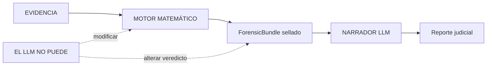

# VIGÍA — Motor de Análisis de Intencionalidad para SIFT Workstation

[English version](./README.md) · Autora: Anna Tchijova · Licencia: Apache 2.0

> *"Hacer que el engaño sea computacionalmente caro para el atacante."*
> Hoy, mentir en un log o falsificar un ataque es gratis. VIGÍA le pone precio
> cuantificando las fracturas lógicas de la mentira.

**VIGÍA no es un detector. Es un motor de inferencia determinista que cuantifica
la fractura entre lo que la evidencia dice y lo que la evidencia debería decir.**
Si un sistema afirma MALICE sin poder explicar por qué con matemática exacta, no es
forense — es adivinación.

---

## De IoC a IoI

Los sistemas DFIR actuales — EDR, SIEM, SOAR — responden **"¿Qué pasó?"**
VIGÍA responde **"¿Por qué pasó, y quién se beneficia de esa interpretación?"**

| DFIR tradicional | VIGÍA |
|------------------|-------|
| IoC (Indicador de Compromiso) | IoI (Indicador de Intención) |
| ML opaco con "87% de confianza" | Aritmética exacta con `Fraction` y `audit_hash` |
| El LLM emite el veredicto | El LLM narra *después* de sellar el veredicto |
| Un hash por reporte | 4 hashes separados + cadena HMAC |
| Ignora el silencio | Detecta la ausencia de evidencia esperada |

Un atacante puede fabricar o suprimir evidencia técnica (IoC). No puede eliminar las
**fracturas semióticas** que produce la fabricación deliberada: incoherencias
temporales, silencios significativos (Eco), perfección digital excesiva, patrones de
manipulación de Carnegie y violaciones de las máximas de Grice.

---

## Inicio Rápido

El Modo 1 (fallback Python) produce un veredicto sellado y verificable
criptográficamente con cero intervención humana, cero tokens y sin internet.

```bash
pip install -r requirements.txt --break-system-packages
export VIGIA_EVIDENCE_DIR="/ruta/a/evidencia/de/solo-lectura"   # requerido

# Investigación autónoma de extremo a extremo
python3 vigia_agent.py --evidence data/cases/converted/VIGIA-REAL-VANKO.json \
  --case-id VIGIA-REAL-VANKO --output results/vanko_bundle.json

# Verificar un bundle sellado de forma independiente (solo stdlib, sin código VIGÍA)
python3 forensics/verify_ebs_v1.py results/srl2018/VIGIA-REAL-SRL-DMZ-FTP_bundle.json --verbose
```

Códigos de salida: `0` = sin mal, `1` = MALICE, `2` = error, `3` = intención/sospecha.
Instalación completa: [`INSTALL_ES.md`](./INSTALL_ES.md) ([EN](./INSTALL.md)) ·
Referencia de comandos: [`vigia_commands_en.html`](https://annatchijova.github.io/vigia/vigia_commands_en.html).

---

## Arquitectura — Aislamiento del LLM



El LLM nunca toca el pipeline de puntuación. Recibe un bundle sellado y
criptográficamente comprometido, y produce una narrativa. El veredicto es
determinista y reproducible sin el LLM — un requisito de diseño para la potencial
admisibilidad Daubert. El motor usa `fractions.Fraction` (cero punto flotante en el
camino crítico), el CAIE pondera más la evidencia difícil de falsificar, y la
compuerta de corroboración Daubert rechaza candidatos infundados *antes* de sellar el
veredicto. `ABSTAIN` es un veredicto válido y matemáticamente justificado.

---

## Modos de Despliegue

El Modo 1 es el núcleo forense principal evaluado; los Modos 2–5 reutilizan las
herramientas deterministas locales pero tienen contratos de investigación y reporte
separadamente delimitados (un reporte de Modo 2 nunca muta un bundle sellado de Modo
1). Ver [`EXECUTION_MODES.md`](./docs/EXECUTION_MODES.md) y el playbook de Claude Code
[`CLAUDE.md`](./CLAUDE.md).

| Modo | Descripción | LLM |
|------|-------------|-----|
| **1 — Fallback Python** | Pipeline completo, 0 tokens, sin internet. `< 50ms` promedio. | No |
| **2 — Claude Code + MCP** | 22 herramientas forenses; investigación Peirciana interactiva. | Sí |
| **3 — Ollama** | LLM local; nada sale de la máquina. | Sí |
| **4 — Agente batch autónomo** | Procesamiento de corpus con loop de auto-corrección. | Opcional |
| **5 — OpenWebUI (experimental)** | Servidor MCP vía interfaz web. | Sí |

---

## Precisión

Metodología completa y desglose por dominios: [`docs/ACCURACY_ES.md`](./docs/ACCURACY_ES.md)
([EN](./docs/ACCURACY.md)).

- **Agente sobre JSON (Dominio B)** — la única cifra a nivel corpus: corpus de
  detección **158/162 (97.5%)**, ciego a etiqueta; agregado mixto 187/199.
- **Claude Code / MCP (Dominio A)** — evaluado por caso sobre evidencia raw real.
- **Agente sobre evidencia raw (Dominio C)** — 43 fuentes de evidencia raw con
  bundles sellados en `results/`.

VIGÍA documenta sus propios modos de fallo: [`KNOWN_LIMITATIONS.md`](./KNOWN_LIMITATIONS.md).

```bash
python3 -m pytest tests/ -v          # suite de regresión del núcleo determinista
python3 run_all_agent.py --timeout 90  # corpus completo, ciego a etiqueta
```

---

## Documentación

**Inicio y uso**
- [`INSTALL_ES.md`](./INSTALL_ES.md) · [`INSTALL.md`](./INSTALL.md) — instalación y setup
- [`docs/QUICK_START.md`](./docs/QUICK_START.md) — guía rápida de integración
- [`EXECUTION_MODES.md`](./docs/EXECUTION_MODES.md) — mapa de todas las formas de correr un análisis
- [`CLAUDE.md`](./CLAUDE.md) — playbook de investigación Claude Code / MCP (22 herramientas)
- [Referencia de comandos](https://annatchijova.github.io/vigia/vigia_commands_en.html) — todos los modos con ejemplos copy-paste

**Casos y ejemplos**
- [`docs/PROMPTS_REALCASES_CLAUDE.md`](./docs/PROMPTS_REALCASES_CLAUDE.md) — prompts copy-paste para correr investigaciones completas
- [`RAW_CASES_LOG_ES.md`](./docs/RAW_CASES_LOG_ES.md) · [EN](./docs/RAW_CASES_LOG.md) — catálogo por caso de evidencia raw
- [`docs/readme_benign_cases.md`](./docs/readme_benign_cases.md) — casos benignos / de uso autorizado
- [`docs/digital_corpora_complete_report.md`](./docs/digital_corpora_complete_report.md) · [`docs/nist_cfreds_full_report.md`](./docs/nist_cfreds_full_report.md) — reportes completos de corpus real
- [`results/`](./results/) — ForensicBundles sellados, amicus curiae y sidecars SHA-256

**Precisión, validación y cumplimiento**
- [`docs/ACCURACY_ES.md`](./docs/ACCURACY_ES.md) · [EN](./docs/ACCURACY.md) — metodología y métricas del corpus
- [`KNOWN_LIMITATIONS.md`](./KNOWN_LIMITATIONS.md) — limitaciones documentadas (transparencia Daubert)
- [`DAUBERT_JUDICIAL_ES.md`](./docs/DAUBERT_JUDICIAL_ES.md) · [EN](./docs/DAUBERT_JUDICIAL.md) — fundamento de admisibilidad Daubert
- [`docs/MUTATION_RUNBOOK_ES.md`](./docs/MUTATION_RUNBOOK_ES.md) · [EN](./docs/MUTATION_RUNBOOK.md) — guía de mutation testing

**Teoría y metodología**
- [`docs/vigia_paper_methodology.md`](./docs/vigia_paper_methodology.md) — el paper formal de metodología
- [`docs/EPISTEMIC_KERNEL.md`](./docs/EPISTEMIC_KERNEL.md) — el kernel epistémico (generación de hipótesis)
- [`docs/skills/abductive-engineering/SKILL.md`](./docs/skills/abductive-engineering/SKILL.md) — razonamiento abductivo como skill reutilizable

**Arquitectura y estado técnico**
- [`VIGIA_ESTADO_TECNICO_ES.md`](./docs/VIGIA_ESTADO_TECNICO_ES.md) · [EN](./docs/VIGIA_TECHNICAL_STATE_EN.md) — estado completo del sistema
- [`docs/diagrama_pipeline.md`](./docs/diagrama_pipeline.md) — diagrama del pipeline
- [Diagramas de arquitectura](https://annatchijova.github.io/vigia/vigia_diagrams.html) · [Simulador matemático](https://annatchijova.github.io/vigia/vigia.html) · [Video demo](https://www.youtube.com/watch?v=NOquYzUwMkg)

**Desarrollo y proyecto**
- [`CONTRIBUYENDO.md`](./CONTRIBUYENDO.md) · [`CONTRIBUTING.md`](./CONTRIBUTING.md) — guía de contribución
- [`docs/ENGINEERING_DISCIPLINE.md`](./docs/ENGINEERING_DISCIPLINE.md) — disciplina de ingeniería para agentes que trabajan sobre el código
- [`SECURITY.md`](./SECURITY.md) — política de seguridad y hardening
- [`BUGS_PENDIENTES.md`](./BUGS_PENDIENTES.md) ([EN](./BUGS_PENDIENTES_EN.md)) · [`BUGS_HISTORICO.md`](./BUGS_HISTORICO.md) ([EN](./BUGS_HISTORICO_EN.md)) — registro de bugs (abiertos / resueltos)
- [`AUTHORS.md`](./AUTHORS.md) · [`docs/VIGIA_THEME_SONG.md`](./docs/VIGIA_THEME_SONG.md) — créditos y canción tema

> `docs/` también contiene el rastro completo de auditorías internas, red-team y
> registros de diseño (`AUDITORIA_*`, `REDTEAM_ROUND*`, `FASE*`, `B0*`), preservados
> como historia del proyecto.

---

## Fundamento Teórico

VIGÍA se apoya en la semiótica abductiva de Charles S. Peirce (Primeridad /
Segundidad / Terceridad), el principio cooperativo de H. Paul Grice, la taxonomía de
manipulación de Dale Carnegie, y la teoría del silencio significativo y la
sobreinterpretación de Umberto Eco.

---

## Licencia

Apache 2.0 — ver [`LICENSE`](./LICENSE).
Copyright (c) 2026 Anna Tchijova y el Colectivo IA de VIGÍA.

*"La pregunta no es qué pasó, sino por qué alguien hizo que pasara —
y quién se beneficia de esa interpretación."* — VIGÍA
